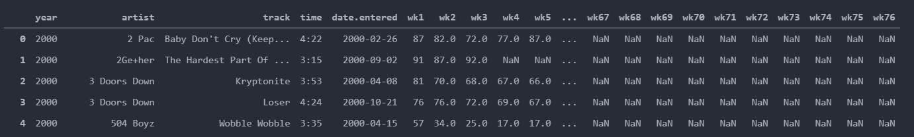
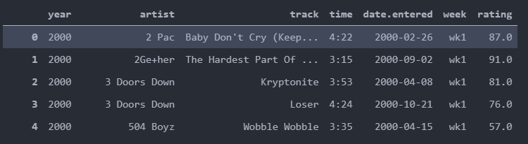
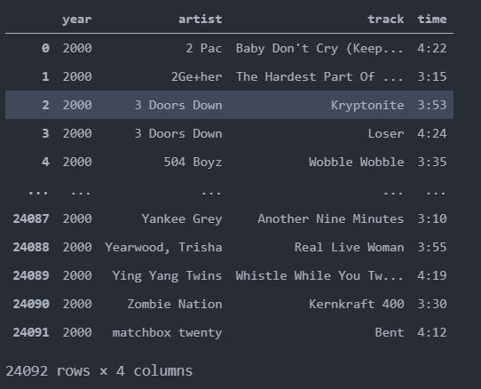
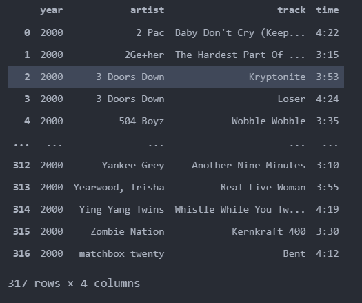

# 0915

## 데이터 프레임 재구조화

>melt
>
>drop_duplicates
>
>set_index
>
>reset_index
>
>stack, vstack, hstack
>
>tile
>
>MulitiIndex
>
>stack, unstack
>
>- 상품 추천 기법 

#### [Pandas] melt 

melt : 데이터의 연속되는 columns를 행으로 바꿔준다. 

pd.melt(data, id_vars =[], var_name =str, value_name = str)

- 옵션
  - id_vars : 워치를 그대로 유지할 열 이름을 지정
  - var_name : 위치 변경할 열 이름 지정
  - value_name : var_name으로 위치 변경할 열데이터를 저장할 열 이름 지정


```
billboard
```



```
billboardlong = pd.melt(billboard,id_vars=['year','artist','track','time','date.entered'],var_name ='week' ,value_name='rating')
billboardlong
```




#### [pandas] drop_duplicates()

drop_duplicates: 데이터 프레임 안에 중복값을 제거한다.

```
billboardsong
```



```
billboardsong = billboardsong.drop_duplicates()
billboardsong 
```



24092 rows x 4 columns => 317 rows x 4 columns 중복된 행 제거


#### [pandas] set_index, reset_index


>데이터 프레임 인덱스 조작 ( 설정/ 제거 )
>
>set_index : 기존에 있는 행 인덱스를 제거한다. 데이터 컬럼 중 어느 하나를 인덱스로 설정
>
>reset_index : 기존에 있는 행 인덱스를 제거한다. 제거된 인덱스를 데이터 컬럼으로 추가 

```
df1 = pd.DataFrame(np.vstack([mylist,myarr]).T,columns =['c1','c2','c3','c4'])
df1
```

```
	c1	c2		c3		c4
0	A	0.25	0.42	0.16
1	B	0.51	0.85	0.42
2	C	0.26	0.2		0.56
3	D	0.54	0.57	0.01
4	E	0.06	0.7		0.14
```

- set_index

```
df2=df1.set_index('c1')
df2
```

```
		c2	c3		c4
c1			
A	0.25	0.42	0.16
B	0.51	0.85	0.42
C	0.26	0.2		0.56
D	0.54	0.57	0.01
E	0.06	0.7		0.14
```

- reset_index

```
df2.reset_index()
```

```
	c1	c2		c3		c4
0	A	0.25	0.42	0.16
1	B	0.51	0.85	0.42
2	C	0.26	0.2		0.56
3	D	0.54	0.57	0.01
4	E	0.06	0.7		0.14
```


#### [numpy] Stack, vstack, hstack

hstack(horizontal) : 행의 수가 같은 두 개 이상의 배열을 연결

```
import numpy as np 
a1 = np.ones((2,3))
a2 = np.zeros((2,2))
```

```
np.hstack([a1,a2])
```

```
array([[1., 1., 1., 0., 0.],
       [1., 1., 1., 0., 0.]])
```

2행 x 3열 + 2행 x 2열 == 2행  x 5열 *열 개수 증가*


*vstack : 열의 수가 같은 두 개 이상의 배열을 연결 행이 증가*

```
a1 = np.ones((2,3))
a2 = np.zeros((3,3))
np.vstack([a1,a2])
```

```
array([[1., 1., 1.],
       [1., 1., 1.],
       [0., 0., 0.],
       [0., 0., 0.],
       [0., 0., 0.]])
```

2행 x 3열 + 3행 x 3열 = 5행 3열 *행 개수 증가*


*dstack : depth 깊이 방향으로 배열을 연결*

```
a1 = np.ones((3,4))
a2 = np.zeros((3,4))
print(np.dstack([a1,a2]))
print(np.dstack([a1,a2]).shape)
```

```
[[[1. 0.]
  [1. 0.]
  [1. 0.]
  [1. 0.]]

 [[1. 0.]
  [1. 0.]
  [1. 0.]
  [1. 0.]]

 [[1. 0.]
  [1. 0.]
  [1. 0.]
  [1. 0.]]]
(3, 4, 2)
```

*(3 x 4) (3 x 4) => dstack => (3 x 4 x 2)*

2차원 배열 2개 연결하여 3차원 배열 1개 생성


*stack* :  dstack의 기능을 확장, dstack은 마지막 차원으로 연결

stack은 사용자가 지정한 축으로 배열을 연결 ( axis = 0 디폴트, 가장 앞쪽에 차원이 추가 )

```
print(np.stack([a1,a2]))
print(np.stack([a1,a2]).shape)
```

```
[[[1. 1. 1. 1.]
  [1. 1. 1. 1.]
  [1. 1. 1. 1.]]

 [[0. 0. 0. 0.]
  [0. 0. 0. 0.]
  [0. 0. 0. 0.]]]
(2, 3, 4)
```

- 옵션 axis = 1 : 행으로 중간에 추가된다. ( 디폴트는 axis = 0)

```
print(np.stack([a1,a2],axis = 1)) # 중간에 추가된다
print(np.stack([a1,a2],axis = 1).shape)
```

```
[[[1. 1. 1. 1.]
  [0. 0. 0. 0.]]

 [[1. 1. 1. 1.]
  [0. 0. 0. 0.]]

 [[1. 1. 1. 1.]
  [0. 0. 0. 0.]]]
(3, 2, 4)
```

옵션 axis = 2 : 행으로 중간에 추가된다

```
print(np.stack([a1,a2],axis = 2)) # 중간에 추가된다
print(np.stack([a1,a2],axis = 2).shape)
```

```
[[[1. 0.]
  [1. 0.]
  [1. 0.]
  [1. 0.]]

 [[1. 0.]
  [1. 0.]
  [1. 0.]
  [1. 0.]]

 [[1. 0.]
  [1. 0.]
  [1. 0.]
  [1. 0.]]]
(3, 4, 2)
```


#### [numpy] r\_,c\_ [ 인덱서 ]

r\_ : 두 배열을 좌우로 연결 hstack과 비슷

```
np.r_[np.array([1,2,3]),np.array([4,5,6])] # 1차원
```

```
array([1, 2, 3, 4, 5, 6])
```

c\_ : 두 배열을 차원 증가시킨후 좌우로 연결 ( 차원 증가 -> hstack )

```
np.c_[np.array([1,2,3]),np.array([4,5,6])] # 2차원 배열 
```

```
array([[1, 4],
       [2, 5],
       [3, 6]])
```


#### [numpy] tile

tile : 동일한 배열을 반복시켜 연결

```
a= np.array([[0,1,2],[3,4,5]])
np.tile(a,2)
```

```
array([[0, 1, 2, 0, 1, 2],
       [3, 4, 5, 3, 4, 5]])
```

```
np.tile(a,(3,2))
```

*3 위 아래로 반복, 2 좌우로 반복 ( 행, 열 )*

```
array([[0, 1, 2, 0, 1, 2],
       [3, 4, 5, 3, 4, 5],
       [0, 1, 2, 0, 1, 2],
       [3, 4, 5, 3, 4, 5],
       [0, 1, 2, 0, 1, 2],
       [3, 4, 5, 3, 4, 5]])
```


#### [pandas] MultiIndex.from([(str,str)])

데이터 프레임의 columns 인수를 행렬로 주게되면 다중인덱스 ( index로 줘도 됨)

```
multi = pd.MultiIndex.from_tuples([('A','C1'),('A','C2'),('B','C3'),('B','C4')])
pd.DataFrame(np.random.randn(5,4),columns = multi)
```

```
	A						B
	C1			C2			C3			C4
0	0.285022	0.323911	0.161773	-1.950171
1	0.216222	0.599774	-0.387520	1.188712
2	0.500097	0.190455	0.232110	-0.833150
3	1.686299	1.580736	1.364631	-0.914515
4	0.176486	-2.202025	0.999371	-1.645720
```


- columns =  [['A','A','B','B'],['C1','C2','C3','C4']] 이렇게 줘도 다중 인덱스 가능 첫번째 리스트가 대분류 두번째 리스트가 중분류이다.

```
df3 = pd.DataFrame(np.random.randn(5,4),columns = [['A','A','B','B'],['C1','C2','C3','C4']])
df3
```

```
	A						B
	C1			C2			C3			C4
0	0.285022	0.323911	0.161773	-1.950171
1	0.216222	0.599774	-0.387520	1.188712
2	0.500097	0.190455	0.232110	-0.833150
3	1.686299	1.580736	1.364631	-0.914515
4	0.176486	-2.202025	0.999371	-1.645720
```


#### [pandas] stack, unstack

>stack() : 열 인덱스 -> 행 인덱스, 반시계방향으로 90도 회전
>
>unstack() : 행 인덱스 -> 열 인덱스, 시계방향으로 90도 회전

```

		cidx1	A					B
		cidx2	C			D		C			D
ridx1	ridx2				
M		id1	-1.129361	-0.841519	1.409195	-0.828737
		id2	0.096761	-0.747516	-0.834408	0.887375
		id3	-1.688198	-1.405749	-0.497883	-0.596524
F		id1	-0.617443	2.149070	-1.000290	-0.597945
		id2	1.158646	2.309272	-0.487677	-0.808409
		id3	2.181509	0.840960	0.146520	0.816120
```

- cidx2 열을 반시계 방향으로 90도 회전

```
df4.stack("cidx2")
```

```
				cidx1	A		B
ridx1	ridx2	cidx2		
	M	id1		C	-1.129361	1.409195
				D	-0.841519	-0.828737
		id2		C	0.096761	-0.834408
				D	-0.747516	0.887375
		id3		C	-1.688198	-0.497883
				D	-1.405749	-0.596524
	F	id1		C	-0.617443	-1.000290
				D	2.149070	-0.597945
		id2		C	1.158646	-0.487677
				D	2.309272	-0.808409
		id3		C	2.181509	0.146520
				D	0.840960	0.816120
```

- df4.stack(0) 하면 대분류 열 cidx1을 반시계 방향 90 회전 // 1이면 중분류 cidx2 반시계 90도 회전

```

				cidx2	C			D
ridx1	ridx2	cidx1		
M		id1		A		-1.129361	-0.841519
				B		1.409195	-0.828737
		id2		A		0.096761	-0.747516
				B		-0.834408	0.887375
		id3		A		-1.688198	-1.405749
				B		-0.497883	-0.596524
F		id1		A		-0.617443	2.149070
				B		-1.000290	-0.597945
		id2		A		1.158646	2.309272
				B		-0.487677	-0.808409
		id3		A		2.181509	0.840960
				B		0.146520	0.816120
```


- df4.unstack('ridx2')  ridx2행 시계방향 90도 회전

```
df4.unstack('ridx2')
```

```
cidx1	A						B
cidx2	C			D			C			D
ridx2	id1	id2	id3	id1	id2	id3	id1	id2	id3	id1	id2	id3
ridx1												
F	-0.617443	1.158646	2.181509	2.149070	2.309272	0.840960	-1.000290	-0.487677	0.146520	-0.597945	-0.808409	0.816120
M	-1.129361	0.096761	-1.688198	-0.841519	-0.747516	-1.405749	1.409195	-0.834408	-0.497883	-0.828737	0.887375	-0.596524
```

>stack과 동일하게 unstack 도 숫자를 넣으면 대분류(0)부터 시계방향 90도로 회전
>
>df4.unstack(0)  == df4.unstack('ridx1')
>
>df4.unstack(1) == df4.unstack('ridx2')


#### 상품 추천 기법

1) 연관규칙분석(장바구니분석) : 기존 고객의 대규모 거래 데이터 존재 -> 함께 구매가 발생하는 규칙을 발견

=>고객이 특정 상품 구매시 이와 연관성이 높은 다른 상품을 추천

2) 협업필터링 : 고객의 상품 구매 이력 데이터를 수치화 -> 추천 대상 고객 A와

다른 고객 B에 대한 상관계수 => 서로 높은 상관관계에 해당되는 고객 B가 구매한 상품중에

고객 A가 구매한적 없는 상품을 고객 A에게 추천(유사고객기반추천)

고객AB, AC, AD, ... AZ

3)컨텐츠 기반 추천시스템 : 고객이 과거에 구매했던 상품들의 속성과 유사한 다른

상품 아이템 중에서 미구매 상품을 추천(상품속성기반추천)

- 연관 규칙

규칙?(rules) : if 조건식 then 결과  (if A -> B)

연관규칙 : 특정 사건 발생 -> 함께 발생하는 또 다른 사건 간의 규칙

항목집합(item set):전체 항목 집합으로부터 만들어 질 수 있는 모든 각각의 부분 집합

X={a,b,c}= 2의 3승

  2*2*2

X의 부분집합? 공집합...전체집합

공집합, a, b, c, ab, ac, bc, abc

a->b

ac->b

...

이마트 : item이 1만가지 => 이마트전체상품집합={a1,a2,...a10000}=>2의 10000승

=> 돈 워리 => 연관규칙(apriori) => pruning(prune, 가지치기)


연관규칙?특정 항목 집합이 발생했을 때 또 다른 항목 집합이 발생하는 규칙

연관규칙의 예 : {채소} -> {마요네즈}, {채소, 음료} -> {마요네즈}, ...

{채소}->{시럽, 식초}, ...


*의미있는 연관 규칙을 발견 -> 기준(support(지지도),confidence(신뢰도),lift(향상도))에 부합되는 연관 규칙을 필터링

=> 특히 향상도가 중요함.


{맥주}->{땅콩}

{물티슈}->{강아지사료}

{물티슈}->{컵라면}?물티슈를 사고, 강아지와 함께 산책을 나가고, 공원에서 컵라면

{건전지}->{컵라면}?서귀포점 이마트 -> adaptive recommender system


X,Y : 공통 원소가 없는 항목 집합

ex)X -> Y : {건전지}->{컵라면} 

X->Y : if X then Y라는 연관 규칙

N : 전체 거래 건수

n(X) : 항목 집합 X의 거래 건수

n(Y) : 항목 집합 Y의 거래 건수


1) 지지도?

두 항목 집합 X와 Y의 지지도? 전체 거래 건수 중에서 항목 집합 X와 Y를 모두 포함하는

거래건수의 비율.

표기 예) s(X->Y) : X를 구매하면 Y를 구매한다 라는 규칙에 대한 지지도

s(X->Y) = X와 Y를 모두 포함하는 거래 건수 / 전체 거래 건수


2)신뢰도?

항목 집합 X를 포함하는 거래(n(X)) 중에서, 항목 집합 Y를 포함하고 있는 거래의 비율

(조건부 확률).

표기 예) c(X->Y) : X를 구매하면 Y를 구매한다 라는 규칙에 대한 신뢰도

c(X->Y) = X와 Y를 모두 포함하는 거래 건수 / 항목 집합 X가 포함된 거래 건수


3)향상도?

항목 집합 X가 주어지지 않았을때의 항목집합 Y의 확률 대비 

항목 집합 X가 주어졌을때의 항목집합 Y의 확률 증가 비율.

=> 향상도가 1보다 크거나(+관계) 작다면(-관계) 우연적 기회(random chance)보다

우수함을 의미. (X와 Y가 서로 독립이면 Lift=1)


표기 예) Lift(X->Y) : 연관규칙의 신뢰도 / 지지도 = c(X->Y) / s(Y)

\-------------------------------------------------------------------------------------

*예시 데이터( 총 5건, 각 아이템이 2개 이상 중복되는 경우에도 아이템 1개로 간주)*

거래번호  아이템

1     계란, 우유

2     계란, 기저귀, 맥주, 사과

3     우유, 기저귀, 맥주, 콜라

4     계란, 우유, 맥주, 기저귀 

5     계란, 우유, 맥주, 콜라

N=5(전체 거래 건수)

n(기저귀)=3

n({계란,우유})=3


X={계란, 맥주}, Y={기저귀} 인 경우.

1)지지도 계산(s(X->Y))

  2 / 5 = 0.4

2)신뢰도 계산(c(X->Y))  

   2 / 3 = 0.667

3)향상도 계산(Lift(X->Y)) = c(X->Y) / s(Y)

s(Y): 전체 거래 중에서 Y거래 건수의 비율

Lift(X->Y) ? Lift({계란, 맥주} -> {기저귀})

=              ( 2 / 3 )         / (  3   /  5  )

= (계란,맥주,기저귀가 모두 포함된수/계란,맥주가 모두 포함된수)/ (기저귀건수/전체건수)

=  0.333 / 0.6 => 1보다 약간 큼

= 0.01 / 0.2

c(X->Y) = X와 Y를 모두 포함하는 거래 건수 / 항목 집합 X가 포함된 거래 건수