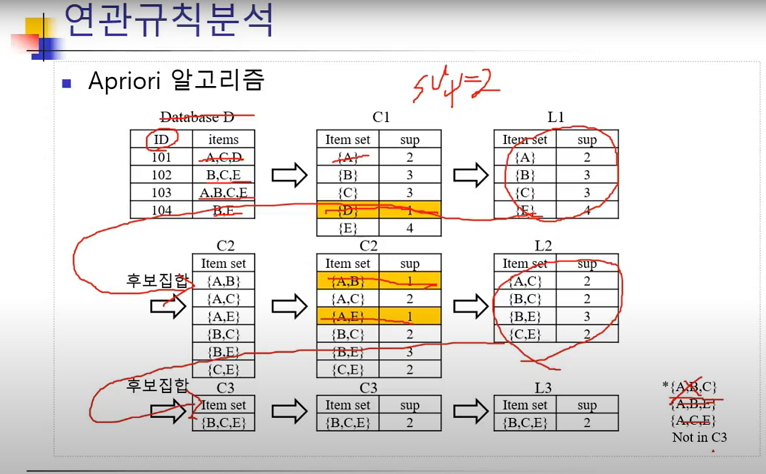
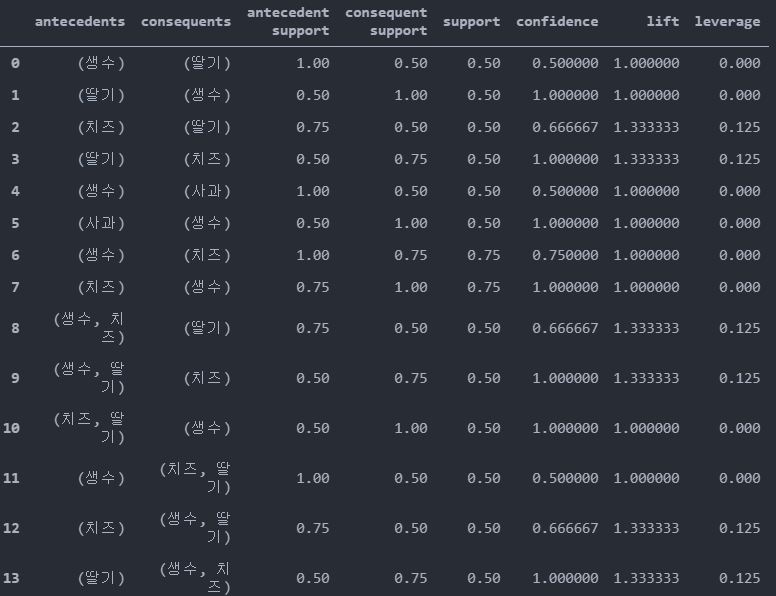
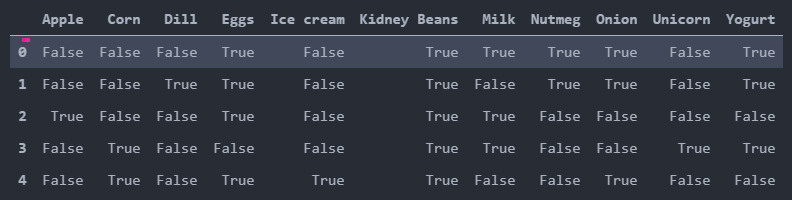
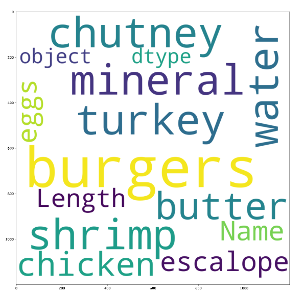
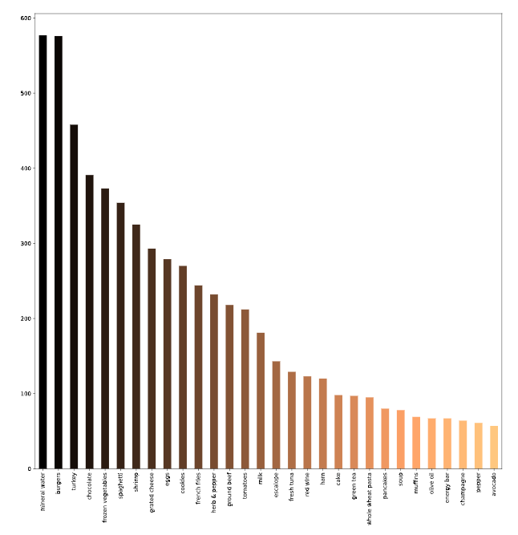

# 0916

- 연관규칙
  - TransactionEncoder
  - apriori
  - association_rules
  - sparse
  - conviction
- wordcloud

> **연관 규칙**

- 구매 데이터로 연관규칙 적용
- 구매 데이터는 거래에 대한 열이 다르다. 

### [sklearn]TransactionEncoder


- 머신러닝에 적절한 array로 바꿔주는 transactionEncoder
  - fit(data).transform(data) == fittransform(data)

```
from mlxtend.preprocessing import TransactionEncoder
```

```
dataset = [['Apple', 'Beer', 'Rice', 'Chicken'], 
['Apple', 'Beer', 'Rice'],
 ['Apple', 'Beer'], 
['Apple', 'Bananas'], 
['Milk', 'Beer', 'Rice', 'Chicken'],
 ['Milk', 'Beer', 'Rice'], 
 ['Milk', 'Beer'], 
 ['Apple', 'Bananas']]
```

```
te = TransactionEncoder()
te_array = te.fit(dataset).transform(dataset)
te_array
```

```
array([[ True, False,  True,  True, False,  True],
       [ True, False,  True, False, False,  True],
       [ True, False,  True, False, False, False],
       [ True,  True, False, False, False, False],
       [False, False,  True,  True,  True,  True],
       [False, False,  True, False,  True,  True],
       [False, False,  True, False,  True, False],
       [ True,  True, False, False, False, False]])
```

- TransactionEncoder(객체).columns_
  - 바뀐 array의 열 이름을 알고 싶다. ( 행은 구매자, 열을 구매 물품)

```
te.columns_
```


- TransactionEncoder().inverse_transform(array)
  - TransationEncoder로 변환한 데이터를 되돌릴때 

```
te.inverse_transform(te_array)
```

```
[['Apple', 'Beer', 'Chicken', 'Rice'],
 ['Apple', 'Beer', 'Rice'],
 ['Apple', 'Beer'],
 ['Apple', 'Bananas'],
 ['Beer', 'Chicken', 'Milk', 'Rice'],
 ['Beer', 'Milk', 'Rice'],
 ['Beer', 'Milk'],
 ['Apple', 'Bananas']]
```


### [sklearn] apriori

> apriori 알고리즘
>
> 자세한 설명은 TIL > 알고리즘 > for 딥러닝 > 연관규칙 저장소 확인



>- Database를 통해 모든 항목을 포함한 집합군 검색 {A, B, C, D, E}
>- 앞의 표에서 최소지지도 2
>- 단일항목 지지도 계산 -> L1에서 {D} 제거
>- {D} 를 제외한 2개 항목 집합군을 생성한 후 지지도 계산 -> L2에서 {A, B}, {A, E} 제거
>- 3개 항목 집합군 생성 -> {A, B, C}, {A, B, E}, {A, C, E} 는 {A, B} = 1, {A, C} = 1, {A,E} = 1 이므로 후보군에서 제외


- 최소 지지도 기준으로 데이터 분류 

```
from mlxtend.frequent_patterns import apriori
```

```
dataset = [['사과','치즈','생수'],
['생수','딸기','치즈','고등어'],
['수박','사과','생수'],
['생수','딸기','치즈','감자']]
```

```
d = te.fit(dataset).transform(dataset)
te.columns_
df = pd.DataFrame(d,columns = te.columns_)
```

```
freq_itemsets = apriori(df,min_support=0.5,use_colnames=True)
freq_itemsets 
```

최소 지지도(min_support)가 0.5 이상만 나온다.(빈발 항목 집합)

```
	support	itemsets
0	0.50	(딸기)
1	0.50	(사과)
2	1.00	(생수)
3	0.75	(치즈)
4	0.50	(생수, 딸기)
5	0.50	(치즈, 딸기)
6	0.50	(생수, 사과)
7	0.75	(생수, 치즈)
8	0.50	(생수, 치즈, 딸기)
```


### [sklearn] association_rules

연관 규칙을 찾아내는데 사용되는 함수

- 자세한 설명은 TIL > 알고리즘 > for 딥러닝 > 연관규칙 저장소 또는 0915 README 참고

```
association_rules(freq_itemsets,metric='confidence', min_threshold=0.3)
```



- 옵션을 이용해서 신뢰도, 지지도 향상도 값을 설정가능
  - convictrion(신뢰도)가 최소 0.3 이상 값들만 출력

  

#### TransactionEncoder의 메모리 사이즈가 클 때 메모리를 절약하는 방법 (sparse)

> 희소행렬 
>
> 행렬의 원소에 비교적 0이 많은 행렬. 비제로 요소의 수가 적은 행렬. 편미분 방정식을 차분 법이나 [유한 요소법](https://terms.naver.com/entry.nhn?docId=851722&ref=y)으로 이산화했을 때 나타난다. 상세 테이블에서 요약 테이블을 만들 때 선택한 자원의 모든 경우의 수로 요약을 하면 실제로 [데이터](https://terms.naver.com/entry.nhn?docId=847441&ref=y)가 발생하지 않는 자원에 대해서도 공간이 잡히므로 낭비가 될 수 있다. 그러므로 이런 낭비를 없애기 위해서 발생하지 않는 경우의 수에 대해서는 요약을 하지 않는 말 그대로 성긴 요약을 해놓은 테이블을 의미한다.
>
> **[네이버 지식백과]** [희소 행렬](https://terms.naver.com/entry.nhn?docId=837740) [sparse matrix] (컴퓨터인터넷IT용어대사전, 2011. 1. 20., 전산용어사전편찬위원회)

```
dataset = [['Milk', 'Onion', 'Nutmeg', 'Kidney Beans', 'Eggs', 'Yogurt'], 
['Dill', 'Onion', 'Nutmeg', 'Kidney Beans', 'Eggs', 'Yogurt'],
 ['Milk', 'Apple', 'Kidney Beans', 'Eggs'], 
 ['Milk', 'Unicorn', 'Corn', 'Kidney Beans', 'Yogurt'],
  ['Corn', 'Onion', 'Onion', 'Kidney Beans', 'Ice cream', 'Eggs']]
```

```
ohtArray = te.fit(dataset).transform(dataset,sparse=True)
```

```
<5x11 sparse matrix of type ''
	with 26 stored elements in Compressed Sparse Row format>
```


- 데이터 프레임에 넣기( 넣을 때는.sparse.from_spmatrix 사용)

```
sparsedf=pd.DataFrame.sparse.from_spmatrix(ohtArray, columns=te.columns_)
sparsedf
```




### 연관규칙 추가 내용

#### conviction 

conv(X->Y) = (1-s(Y)) / (1-c(X->Y))

Y없이 X가 발생한 비율(찾아낸 규칙이 얼마나 잘못되었는지를 확인)

(1-c(X->Y)) = (s(X)-s(X합집합Y)) / s(X)

(1-s(Y)):Y가 발생하지 않은 비율

conv(X->Y)는 Y가 발생되지 않은(1-s(Y)) 비율이 X가 발생된것 중 Y와 동시에 일어나지 않은

(1-c(X->Y))사건의 비율의 몇 배인가를 의미

EX) 웹문서

conv(코딩 -> 파이썬) : 전체 웹 문서에서 코딩이 없는 비율은 매우 높을 것이다.

파이썬이 있는 문서에서 코딩이 없는 문서는 그다지 많지 않을 것이다.

따라서, conv(코딩 -> 파이썬)은 1보다 매우 큰 값을 갖게 될 것이다.

따라서 코딩과 파이썬의 상관 관계는 매우 높을 것이다.


### [wordcloud] wordcloud

> 단어 빈도에 따라 크기가 달라지는 그래프 

```
from wordcloud import WordCloud 
```

- 사용하기 위해서 pip install wordcloud 필요

```
plt.rcParams['figure.figsize']=(15,15) 
wordcloud=WordCloud(background_color='white', width=1200, 
          height=1200, max_words=120).generate(str(data[0]))
plt.imshow(wordcloud)
```





- 빈도 그래프 

```
import numpy as np
data[0].value_counts().head(30).plot.bar(color=plt.cm.copper(np.linspace(0,1,30)))
```

