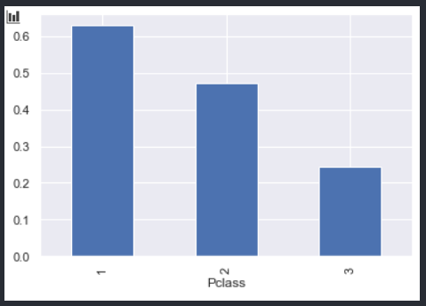
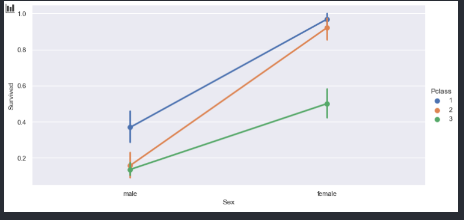
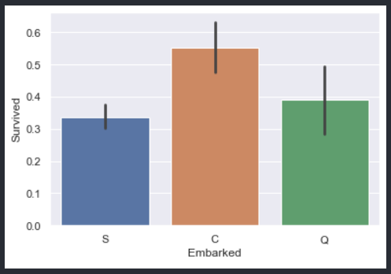
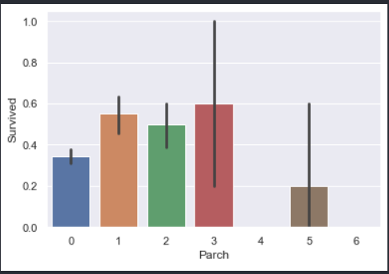
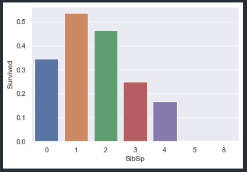
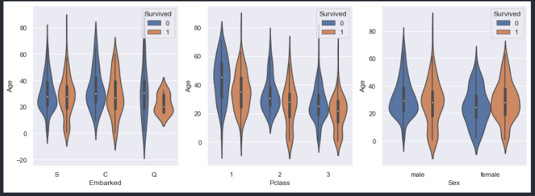
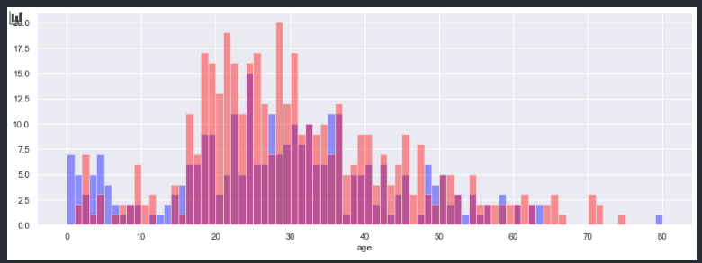
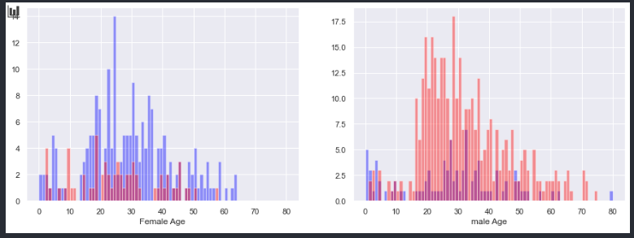
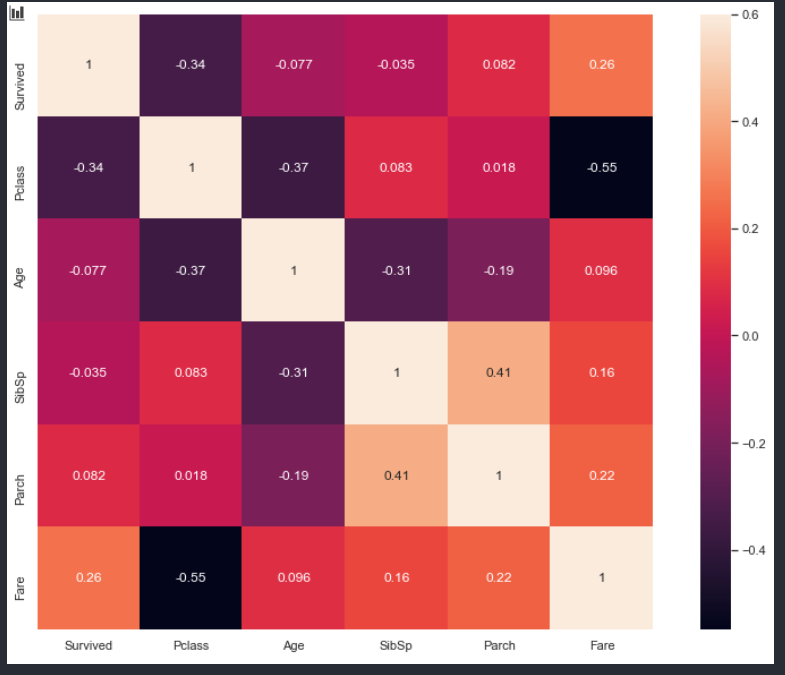

# 0923 수업 요약

## 의사 결정 트리

### 데이터 분석 절차

- 시각화 -> EDA(탐색적 데이터 분석) -> 특성공학(변수추가/ 선택) -> 모델링 -> 평가

####  

#### 데이터 받으면 가장 먼저 할 일

>데이터 모양, 열, 형식 등 확인
>
>data.head()
>
>- 범주형 데이터, 연속형 데이터 등 columns을 확인한다.
>
>data.shape
>
>- 데이터 개수확인
>
>data.describe()
>
>- 평균과 중위수 비교
>- 극단값 확인
>
>data.info()
>
>- 결측값 갯수확인
>- 데이터 타입 확인 ( 날짜 데이터는 datetime으로 바꿔주면 연산할 때 간편 )
>
>data.isnull().sum()
>
>- 데이터 결측값 갯수 정확하게 확인


#### 원하는 데이터를 얻기 위해서 주어진 데이터(features) 사이 어떤 관계가 있을까?

- train data / test data 가 주어진다.
- train data를 기반으로 특성을 찾아낸다.

> groupby를 활용하여 데이터 특성 확인

- 생존과 Pclass 간의 관계

```
train.groupby(['Pclass','Survived']).size()
```

```
Pclass  Survived
1       0            80
        1           136
2       0            97
        1            87
3       0           372
        1           119
dtype: int64
```


> groupby를 이용하여 데이터 시각화
>
> (Pclass는 데이터 타입이 1,2,3 -> barplot)

```
train.groupby('Pclass').Survived.mean().plot(kind = 'bar')
```




- Pclass 생존율 ( 1 > 2 > 3 ) 

> Pclass의 성비는 어떻게 될까?

```
pd.crosstab(train['Pclass'],train['Sex'])
```

```
Sex		female	male
Pclass		
1		94		122
2		76		108
3		144		347

```

==>남성의 비율이 전반적으로 많고 Pclass 3은 남성이 여성의 2배인 것을 확인 


- Pclass에 따른 남녀의 생존률

```
sns.factorplot('Sex','Survived',hue = 'Pclass',data= train,aspect =2)
```




==> Pclass 등급이 높을 수록( 1 > 2 > 3 ), 여성일 수록 생존률이 높은 것을 확인


- 승선 항구에 따른 생존 여부

```
train.groupby('Embarked').Survived.value_counts()
```

```
Embarked  Survived
C         1            93
          0            75
Q         0            47
          1            30
S         0           427
          1           217
Name: Survived, dtype: int64
```

- 시각화 ( Embarked의 데이터 종류는 SCQ 3가지 == barplot)

```
sns.barplot('Embarked','Survived',data = train)
```



==> C항구에서 탑승한 인원의 생존률이 높았다. 


- Parch와의 생존여부

```
train.groupby('Parch').Survived.value_counts()
```

```

Parch  Survived
0      0           445
       1           233
1      1            65
       0            53
2      0            40
       1            40
3      1             3
       0             2
4      0             4
5      0             4
       1             1
6      0             1
Name: Survived, dtype: int64
```


- parch의 데이터 종류의 갯수는 7개 ==> barplot

```
sns.barplot('Parch','Survived',data= train)
```




==> parch 1 ,2, 3 의 생존률이 50% 이상임을 확인


- SibSp와의 관계

```
train.groupby('SibSp').Survived.value_counts()
```

```

SibSp  Survived
0      0           398
       1           210
1      1           112
       0            97
2      0            15
       1            13
3      0            12
       1             4
4      0            15
       1             3
5      0             5
8      0             7
Name: Survived, dtype: int64
```


- SibSp 데이터 종류의 갯수 7개 => barplot

```
sns.barplot('SibSp','Survived',data= train,ci =None)
```



==> SibSp는 1,2,3,4 오름차순으로 생존률이 높다.


- 연령별 & 항구별/pclass별/성별 ----- [  생존여부(범례)  ]
-  바이롤린 plot

```
fig = plt.figure(figsize=(15,5))
ax1 = fig.add_subplot(131) # 1줄 3칸으로 나눈다음 1번째 위치
ax2 = fig.add_subplot(132)
ax3 = fig.add_subplot(133)

sns.violinplot('Embarked','Age',hue= 'Survived',data=train,ax = ax1)
sns.violinplot('Pclass','Age',hue= 'Survived',data=train,ax = ax2)
sns.violinplot('Sex','Age',hue= 'Survived',data=train,ax = ax3)
```




==> Embarked의 경우 S,C 항구 탑승객은 생존자 사망자의 비율이 비슷하다. Q항구에 탑승했던 사람들 중 15~ 40 세 생존률이 높고 사망률은 전 연령대에 고르게 분포

==> Pclass의 경우 약 15세 이하에서 높은 생존률을 보여줌

==> 남성의 경우 생존률이 15세 이하에서 두드러지게 많은 것을 볼 수 있고 여성의 경우 생존률 사망률이 비슷해 보인다.


- 성별 연령별 생존자 사망자 히스토그램 ( 수치형 데이터의 빈도를 시각화)

=> 특성공학 -> 데이터 빈도수 변환

```
total_survived = train[train['Survived'] ==1]
total_not_survived = train[train['Survived'] ==0]
male_survived = train[(train['Survived'] ==1) &(train['Sex'] == 'male')]
male_not_survived = train[(train['Survived'] ==0) &(train['Sex'] == 'male')]
female_survived = train[(train['Survived'] ==1) &(train['Sex'] == 'female')]
female_not_survived = train[(train['Survived'] ==0) &(train['Sex'] == 'female')]
```


- 히스토그램 연령대별 생존자 사망자 히스토그램

```
plt.figure(figsize= (15,5))
plt.subplot(111)
sns.distplot(total_survived['Age'].dropna().values,kde=False,bins = range(0,81,1),color='blue') # kde : (True) 밀집도 그래프(선 그래프)
sns.distplot(total_not_survived['Age'].dropna().values,kde=False,bins = range(0,81,1),color='red',axlabel='age')
```

- 생존자 blue / 사망자 red



==> 0 ~ 15 세는 생존자가 많고 15 ~ 70 세는 사망자가 많다.

- 남녀에 따른 생존 사망자 히스토그램

```
plt.figure(figsize= (15,5))
plt.subplot(121) #1줄 2칸 1번칸 출력
sns.distplot(female_survived['Age'].dropna().values,kde=False,bins = range(0,81,1),color='blue',axlabel='Female Age')
sns.distplot(female_not_survived['Age'].dropna().values,kde=False,bins = range(0,81,1),color='red',axlabel='Female Age')

plt.subplot(122) #1줄 2칸 1번칸 출력
sns.distplot(male_survived['Age'].dropna().values,kde=False,bins = range(0,81,1),color='blue',axlabel='male Age')
sns.distplot(male_not_survived['Age'].dropna().values,kde=False,bins = range(0,81,1),color='red',axlabel='male Age')
```

- 생존자 blue, 사망자 red




==> 여성은 사망자 수에 비해 생존자 수가 많은 것을 확인, 남성은 생존자 수에 비해 사망자 수가 많은 것을 확인.( 0~ 10 세 부근은 남성의 생존자 수가 많다.)


- 상관계수 파악

```
train.drop(columns='PassengerId').corr()
```

```
		 Survived	Pclass		Age		  SibSp			Parch		Fare
Survived 1.000000	-0.338481	-0.077221 	-0.035322	0.081629	0.257307
Pclass	-0.338481	1.000000	-0.369226 	0.083081	0.018443	-0.549500
Age		-0.077221	-0.369226	1.000000	-0.308247	-0.189119	0.096067
SibSp	-0.035322	0.083081	-0.308247	1.000000	0.414838	0.159651
Parch	0.081629	0.018443	-0.189119	0.414838	1.000000	0.216225
Fare	0.257307	-0.549500	0.096067	0.159651	0.216225	1.000000
```


- 시각화 Heatmap

```
plt.figure(figsize=(15,10))
sns.heatmap(train.drop(columns='PassengerId').corr(),square = True,annot = True,vmax = 0.6) 
```





#### 특성공학

- 변수 추가 / 선택

- 이름에 있는 호칭 추출

```
for dataset in train_test_data:
    dataset['title'] = dataset.Name.str.extract("([A-Za-z]+)\.")
    
```

- 성별로 호칭을 그룹화

```
train.groupby(['title','Sex']).size().unstack().fillna(0)
```

```
Sex		female	male
title		
Capt	0.0		1.0
Col		0.0		2.0
Countess1.0		0.0
Don		0.0		1.0
Dr		1.0		6.0
Jonkheer0.0		1.0
Lady	1.0		0.0
Major	0.0		2.0
Master	0.0		40.0
Miss	182.0	0.0
Mlle	2.0		0.0
Mme		1.0		0.0
Mr		0.0		517.0
Mrs		125.0	0.0
Ms		1.0		0.0
Rev		0.0		6.0
Sir		0.0		1.0
```


- 비슷한 호칭 정리

```
for dataset in train_test_data:
    dataset['title'] = dataset['title'].replace('Mlle','Miss')
    dataset['title'] = dataset['title'].replace('Ms','Miss')
    dataset['title'] = dataset['title'].replace('Mme','Mrs')
    dataset['title'] = dataset['title'].replace('Lady','Mrs')
    dataset['title'] = dataset['title'].replace(['Countess','Don','Sir','Jonkheer','Capt','Col','Rev','Dr','Major'],'Other')
```


```
Sex	female	male
title		
Master	0	40
Miss	185	0
Mr		0	517
Mrs		127	0
Other	2	20
```


- 호칭별 생존률

```
train[['title','Survived']].groupby('title',as_index = False).mean()
```

```
	title	Survived
0	Master	0.575000
1	Miss	0.702703
2	Mr		0.156673
3	Mrs		0.795276
4	Other	0.318182
```

==> Mrs와 Miss의 생존율이 70%이상임을 확인


- 호칭을 숫자로 변환 (1,2,3,4,5)

```
title_mapping ={'Mr':1,
'Miss':2,
'Mrs':3,
'Master':4,
'Other':5}
for dataset in train_test_data:
    dataset['title'] = dataset['title'].map(title_mapping)
    dataset['title'] = dataset['title'].fillna(0)
```


- 성별도 숫자로 변환 (1,0)

```
for dataset in train_test_data:
    dataset['Sex'] = dataset['Sex'].map({'female':1,'male':0})
    dataset['Sex'] = dataset['Sex'].fillna(0)
train.head()
```


- 탑승인 항구도 숫자로 변환 (0 ,1 ,2 )

```
for dataset in train_test_data:
    dataset['Embarked'] = dataset['Embarked'].map({'S':0,'C':1,'Q':2})
```


- 나이 결측값 생성

> 다양한 방법이 있지만 여기서는 나이의 평균에 표준편차를 더하고 뺀 범위의 수를 무작위로 대입한다. 
>
> 평균 - 표준편차 < 난수 < 평균 + 표준편차

```
for dataset in train_test_data:
    age_avg = dataset['Age'].mean()
    age_std = dataset['Age'].std()
    age_null_count = dataset['Age'].isnull().sum() # 결측값 갯수 만큼 난수 생성
    age_null_random_list = np.random.randint(age_avg-age_std,age_avg+age_std,size=age_null_count)
    dataset['Age'][np.isnan(dataset['Age'])] = age_null_random_list
    
```


- 나이를 범위 데이터로 변환 (동일한 5개의 범위)

```
train['AgeBand'] = pd.cut(train['Age'],5)
```

```
for dataset in train_test_data:
    dataset.loc[dataset['Age'] <=16,'Age'] = 0
    dataset.loc[(dataset['Age'] >16) & (dataset['Age'] <=32),'Age'] = 1
    dataset.loc[(dataset['Age'] >32) & (dataset['Age'] <=48),'Age'] = 2
    dataset.loc[(dataset['Age'] >48) & (dataset['Age'] <=64),'Age'] = 3
    dataset.loc[dataset['Age'] >64,'Age'] = 4
```


- 요금의 결측값 처리 중앙값 대입

```
for dataset in train_test_data:
   dataset['Fare'] = dataset['Fare'].fillna(train['Fare'].median())
```


- 요금을 동일한 데이터 갯수 만큼의 범위로 변환 ( 4개 범위)

```
train['Fareband'] = pd.qcut(train['Fare'],4)  # pd.cut : 동일 길이로 나누어서 범주로 만듬 pd.qcut()은 동일한 갯수로 나눈다.
train[['Fareband','Survived']].groupby('Fareband',as_index= False).mean()
```

```
		Fareband	Survived
0	(-0.001, 7.91]	0.197309
1	(7.91, 14.454]	0.303571
2	(14.454, 31.0]	0.454955
3	(31.0, 512.329]	0.581081
```

- 4개 범위로 변환 

```
for dataset in train_test_data:
    dataset.loc[dataset['Fare'] <=7.91,'Age'] = 0
    dataset.loc[(dataset['Fare'] >7.91) & (dataset['Fare'] <=14.454),'Fare'] = 1
    dataset.loc[(dataset['Fare'] >14.454) & (dataset['Fare'] <=31.0),'Fare'] = 2
    dataset.loc[(dataset['Fare'] >31.0) ,'Fare'] = 3
    dataset['Fare'] = dataset['Fare'].astype('int')
train.info()
```


- Family size 열 생성 : SibSp + Parch 

---> 자녀 및 조카의 수

```
for dataset in train_test_data:
    dataset['Familysize'] = dataset['SibSp']+dataset['Parch']+1
train[['Familysize','Survived']].groupby('Familysize',as_index= False).mean()
```

```

Familysize	Survived
0	1	0.303538
1	2	0.552795
2	3	0.578431
3	4	0.724138
4	5	0.200000
5	6	0.136364
6	7	0.333333
7	8	0.000000
8	11	0.000000
```


- Familysize를 이용해 혼자 여행한 경우 생존률 계산

```
for dataset in train_test_data:
    dataset['IsAlone'] =0 # 혼자가 아님 (디폴트)
    dataset.loc[dataset['Familysize'] == 1,'IsAlone']=1
train[['IsAlone','Survived']].groupby('IsAlone',as_index = False).mean()
```


- featrue에 필요없는 columns 제거

```
features_drop =['Name','SibSp','Parch','Cabin', 'Ticket','Familysize']
train = train.drop(features_drop,axis =1 )
test = test.drop(features_drop,axis =1 )
train = train.drop(['PassengerId','AgeBand','Fareband'],axis =1 )
```


- train.column 확인

```
train.columns
```

```
Index(['Survived', 'Pclass', 'Sex', 'Age', 'Fare', 'Embarked', 'title',
       'IsAlone'],
      dtype='object')
```


- 교사학습을 위해 입력과 출력을 나눈다 

```
xTrain = train.drop('Survived',axis = 1)
yTrain = train['Survived']
xTest = test.drop('PassengerId',axis = 1).copy()
xTrain.shape,yTrain.shape,xTest.shape
```

--> 모양 확인

```
((891, 7), (891,), (418, 7))
```


#### 의사 결정 트리

- 사이킷런에서 DecisionTreeClassifirer import 후 학습

```
model = DecisionTreeClassifier()
model.fit(xTrain,yTrain)
y_pred_df = model.predict(xTest)


mysubmit = pd.DataFrame({
    'PassengerId' :test['PassengerId'],
    'Survived' : y_pred_df
})
```


- 결과 

```
round(model.score(xTrain,yTrain)*100,2)
```

```
86.87
```

