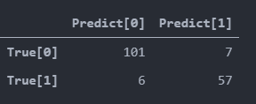
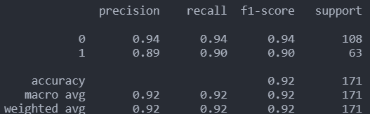
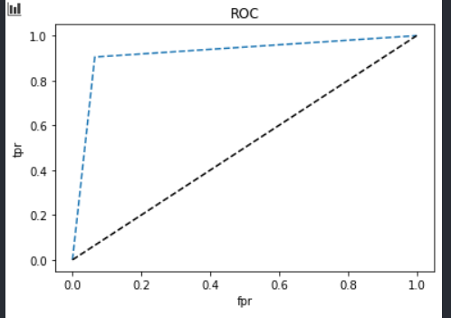
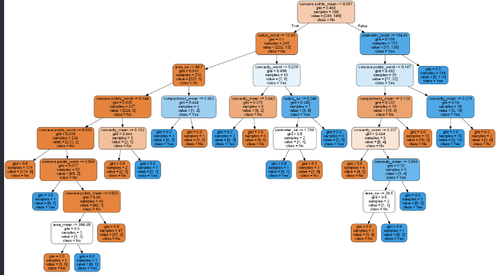
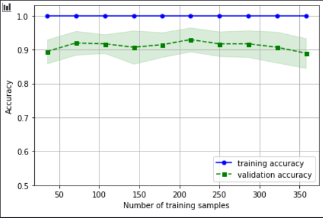
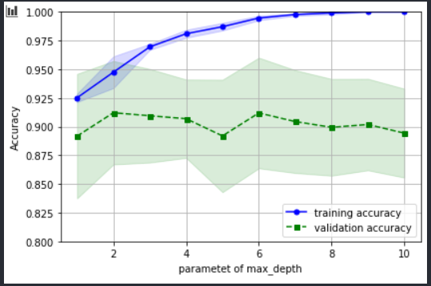

# 의사결정트리 정리

## 패키지 

```
# 기본 
import matplotlib.pyplot as plt 
import numpy as np 

# 데이터 가져오기 
import pandas as pd 
from sklearn import datasets

# 데이터 전처리 
from sklearn.preprocessing import StandardScaler
from sklearn.preprocessing import LabelEncoder

# 훈련 검증용 데이터 분리
from sklearn.model_selection import train_test_split

# 분류 모델 구축 
from sklearn.tree import DecisionTreeClassifier 

# 모델 검정 
from sklearn.metrics import  confusion_matrix, classification_report # 정오 분류표
from sklearn.metrics import accuracy_score,precision_score,f1_score, recall_score
from sklearn.metrics import roc_curve # roc 곡선  

# 최적화
from sklearn.model_selection import cross_validate # 교차 타당도
from sklearn.pipeline import make_pipeline
from sklearn.model_selection import learning_curve, validation_curve # 학습 곡선, 검증 곡선
from sklearn.model_selection import GridSearchCV
```


## 데이터 전처리

> - 문자형 자료를 숫자로 인코딩
> - 숫자형 자료를 표준화
> - 의사결정나무, 랜덤 포레스트, 나이브 베이즈 분류 : 원본 데이터 그대로 유지

## 모델 구축

```
dt = DecisionTreeClassifier(criterion='gini',max_depth=None,random_state=1)
dt.fit(x_train,y_train)
```


## 모델 검증

```
y_pred = dt.predict(x_test)
```


#### 정오 분류표

```
confmat = pd.DataFrame(confusion_matrix(y_test,y_pred),
index = ['True[0]','True[1]'],
columns =['Predict[0]','Predict[1]'])
```




```
print(classification_report(y_test,y_pred))
```



### 정확도 민감도 확인

```
print('잘못 분류된 샘플 개수 : %d' %(y_test != y_pred).sum())
print('정확도 : %.3f'% accuracy_score(y_test,y_pred))
print('정밀도 : %.3f'% precision_score(y_test,y_pred))
print('재현율 : %.3f'% recall_score(y_test,y_pred))
print('F1 : %.3f'% f1_score(y_test,y_pred))
```

```
잘못 분류된 샘플 개수 : 13
정확도 : 0.924
정밀도 : 0.891
재현율 : 0.905
F1 : 0.898
```


#### ROC 곡선

```
fpr,tpr,thresholds = roc_curve(y_test,dt.predict_proba(x_test)[:,1])
plt.plot(fpr,tpr,'--',label = 'decision Tree')
plt.plot([0,1],[0,1],'k--',label = 'random guess')
plt.plot([fpr],[tpr],'r-',ms = 10)
plt.xlabel('fpr')
plt.ylabel('tpr')
plt.title('ROC')
plt.show()
```



#### 가지치기!

```
from pydotplus import graph_from_dot_data
from sklearn.tree import export_graphviz
from IPython.display import Image # DT 에서만 쓰임 // CART tree 그림
import pydotplus # DT 에서만 쓰임
import os # DT 에서만 쓰임

os.environ['PATH'] += os.pathsep + "C:/Program Files (x86)/Graphviz2.38/bin/
feature_name = x.columns.tolist()
target_name = np.array(['No','Yes'])
dot_data = export_graphviz(dt,
filled = True,
rounded= True,
class_names=target_name,
feature_names= feature_name,
out_file= None)
graph = graph_from_dot_data(dot_data)
graph.write_png('tree.png') ## 그래프 저장 => png 파일 
dt_graph = pydotplus.graph_from_dot_data(dot_data) # png 파일을 가져와서
Image(dt_graph.create_png()) # VS에서 보여준다. 
```





## 교차 검정

```
scores = cross_validate(estimator= dt, X = x_train,y=y_train,
scoring=['accuracy'],# 클래스가 2개 이상일 경우 accuracy만 사용가능 (여러가지 제한이 있다. ) dt로 모델을 돌렸을 때 정확도
 cv = 10, # 훈련용 데이터를 10개로 나눠서 쓰겠다. (9훈, 1테)
 n_jobs = -1,
 return_train_score= False)

print('CV 정확도 점수 : %s'% scores['test_accuracy']) # 교차검증한 값의 정확도
print('CV 정확도 : %.3f +/- %.3f' %(np.mean(scores['test_accuracy']),np.std(scores['test_accuracy'])))
```

```
CV 정확도 점수 : [0.9        0.95       0.825      0.925      0.875      0.9
 0.95       0.9        0.92307692 0.87179487]
CV 정확도 : 0.902 +/- 0.036
```


## 파이프라인 모델

> - 파이프라인을 이용하여 최적 모델 만들기
> - 기본 모형은 아무 옵션이 없는 모델 부터 시작
> - 파라미터 옵션 확인 : pipe_tree.get_params().keys()
> - 하이퍼 파라미터 세팅 시 이용

```
pipe_tree = make_pipeline(DecisionTreeClassifier())
pipe_tree.get_params().keys()
```

```
dict_keys(['memory', 'steps', 'verbose', 'decisiontreeclassifier', 'decisiontreeclassifier__ccp_alpha', 'decisiontreeclassifier__class_weight', 'decisiontreeclassifier__criterion', 'decisiontreeclassifier__max_depth', 'decisiontreeclassifier__max_features', 'decisiontreeclassifier__max_leaf_nodes', 'decisiontreeclassifier__min_impurity_decrease', 'decisiontreeclassifier__min_impurity_split', 'decisiontreeclassifier__min_samples_leaf', 'decisiontreeclassifier__min_samples_split', 'decisiontreeclassifier__min_weight_fraction_leaf', 'decisiontreeclassifier__presort', 'decisiontreeclassifier__random_state', 'decisiontreeclassifier__splitter'])
```


## 학습 곡선

> - 훈련 샘플링 수를 이용하여 편향과 분산 검정
> - 편향 : 정확도가 높은지 검정
> - 분산 : 훈련 / 검정 데이터의 정확도 차이가 적은지

```
train_sizes, train_scores, test_scores = learning_curve( estimator = pipe_tree, # 변경
X = x_train, y= y_train, train_sizes = np.linspace(0.1,1.0,10),
cv = 10,
n_jobs = -1)

train_mean = np.mean(train_scores, axis = 1)
train_std = np.std(train_scores , axis = 1)
test_mean = np.mean(test_scores , axis = 1)
test_std = np.std(test_scores,axis = 1)

plt.plot(train_sizes,train_mean, color = 'blue', marker = 'o',markersize = 5, label = 'training accuracy')

plt.fill_between(train_sizes, train_mean + train_std,train_mean - train_std, alpha = 0.15, color = 'blue')

plt.plot(train_sizes,test_mean, color = 'green',linestyle = '--', marker = 's',markersize = 5, label = 'validation accuracy')

plt.fill_between(train_sizes, test_mean + test_std,test_mean - test_std, alpha = 0.15, color = 'green')

plt.grid()
plt.xlabel('Number of training samples')
plt.ylabel('Accuracy')
plt.legend(loc = 'lower right')
plt.ylim([0.5,1.03]) # 변경
plt.tight_layout()
plt.show()
```




```

param_range =[ 1,2,3,4,5,6,7,8,9,10 ] # 변경
train_scores, test_scores = validation_curve(
estimator= pipe_tree,# 변경
X = x_train,
y= y_train,
param_name= 'decisiontreeclassifier__max_depth',# 변경
param_range= param_range,
cv = 10
)

train_mean = np.mean(train_scores, axis = 1)
train_std = np.std(train_scores,axis= 1)
test_mean = np.mean(test_scores , axis= 1)
test_std = np.std(test_scores,axis= 1)

plt.plot(param_range,train_mean, color = 'blue', marker = 'o',markersize = 5, label = 'training accuracy')

plt.fill_between(param_range, train_mean + train_std,train_mean - train_std, alpha = 0.15, color = 'blue')

plt.plot(param_range,test_mean, color = 'green',linestyle = '--', marker = 's',markersize = 5, label = 'validation accuracy')

plt.fill_between(param_range, test_mean + test_std,test_mean - test_std, alpha = 0.15, color = 'green')

plt.grid()
plt.xlabel('Number of max_depth')
plt.legend(loc = 'lower right')
plt.xlabel('parametet of max_depth')
plt.ylabel('Accuracy')
plt.ylim([0.8,1.00]) # 변경
plt.tight_layout()
plt.show()
```




### 최적 파라미터

```
param_range1 = list(range(1,11)) # 변경
param_range2 = list(range(10,60,10)) # 변경

param_grid = [{'decisiontreeclassifier__max_depth':param_range1, # 변경
'decisiontreeclassifier__min_samples_leaf':param_range2}] # 변경

gs = GridSearchCV(estimator= pipe_tree,# 변경
param_grid= param_grid,
scoring= 'accuracy',
cv= 10,
n_jobs= -1)

gs = gs.fit(x_train,y_train)
print(gs.best_score_)
print(gs.best_params_)
```

```
0.9171153846153846
{'decisiontreeclassifier__max_depth': 4, 'decisiontreeclassifier__min_samples_leaf': 10}
```


