# 0928 

## 데이터 재구조화 

> pivot -> pivot_table
>
> stack / unstack
>
> melt
>
> crosstab

[pandas] **crosstab**

데이터 정의

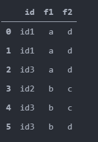


crosstab(인덱스,컬럼)

```
pd.crosstab(data.f1,data.f2)
```

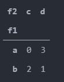

다중인덱스, 다중 레벨

crosstab(인덱스,[대분류,중분류...])

```
pd.crosstab(data.id,[data.f1,data.f2])
```

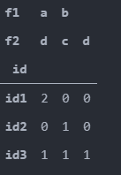

행과 열 이름 변경 **rownames colnames **

crosstab(인덱스,컬럼,rownames = [이름],colnames = [이름])

```
pd.crosstab(data.id,[data.f1,data.f2],rownames=['id_num'],colnames=['col1','col2'])
```

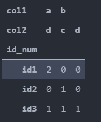

행과 열의 합을 구한다. **margins**

crosstab(인덱스,컬럼,*margins*=True) 

```
pd.crosstab(data.id,[data.f1,data.f2],margins=True)
```

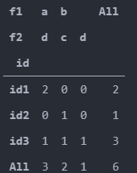

데이터의 구성 비율 **normalize**

crosstab(인덱스,컬럼,normalize=True) 

```
pd.crosstab(data.id,[data.f1,data.f2],normalize = True)
```

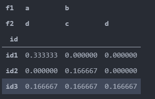


[Pandas] **DataFrame**

- df에서 r1 r2를 추출해서 새로운 데이터 프레임 생성

```
df = pd.DataFrame({
    'c1':range(4),
    'c2':range(4,8),
    'c3':[8,9,10,np.nan]},
    index = ['r1','r2','r3','r4']
)
```

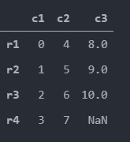

```
df_r1r3 = pd.DataFrame(df,index = ['r1','r3'])
df_r1r3
```

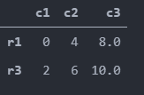


df에서 c1,c3 r1,r3 추출하여 데이터 프레임 생성 

```
pd.DataFrame(df,index = ['r1','r3'],columns = ['c1','c3'])
```

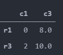


- 새로운 데이터 프레임 생성 **[]**

```
df['c4'] = df.c1 * df.c2
```

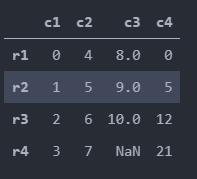


**assign(컬럼이름 = 연산)**

```
df = df.assign(c5=df.c1 * df.c2)
```

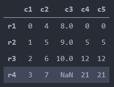

**assign(컬럼이름 = 람다함수)**

```
df.assign(c6 = lambda x:x.c1*x.c2 ) 
```

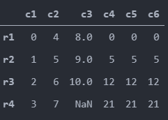

- 컬럼 제거 

**drop([컬럼이름],axis = 1)**

```
df45 = df.drop(['c4','c5'],axis = 1) 
df45
```

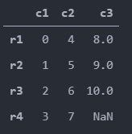

**del 데이터프레임[컬럼이름]**

```
del df['c4']
```

==> drop과 del의 차이는 drop은 원본데이터는 변경하지 않는다. del은 원본데이터가 제거


[Numpy] **zeros,ones,empty**

배열 초기화

```
np.zeros(5) , np.ones(5)
```

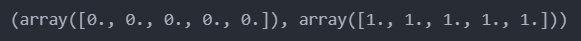

```
np.empty(10)
```

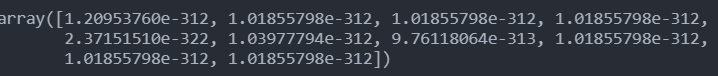


구조에 맞춰 0값(또는 1또는 랜덤값)으로 초기화하고 싶은 경우 / zeros_like // ones_like, empty_like

```
f = np.arange(10)
f25 = f.reshape(2,5)
np.zeros_like(f25) # zeros_like ones_like empty_like
```

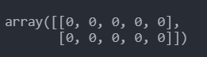


[Numpy] **less_equal,less,greater,greater_equal, array_equal**

배열간 크기 비교 ( 반환값은 True False )

```
x = np.array([1,2,2,1,3])
y = np.array([2,3,4,1,7])
np.less_equal(x,y), np.less(x,y)
```

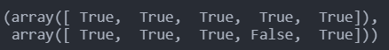


[Numpy] **logical_and,logical_or,logical_xor **

배열간 논리 연산 1 = True, 0 = False

logical_and(배열, 배열) 값은 True, False로 출력

```
a = np.array([1,1,0,0])
b = np.array([1,0,1,0])
np.logical_and(a,b),np.logical_or(a,b),np.logical_xor(a,b)
```

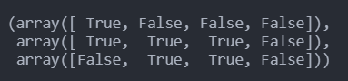

[Numpy] **trunc, floor, ceil**

floor : 소수점 내림

ceil : 소수점 올림

trunc : 정수부분만 출력

```
a = np.array([-4.62,-2.19,1.57,3.4,0])
np.trunc(a) 
```

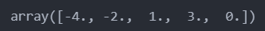


[Numpy] **prod, nanprod,nansum** 

배열 요소간 곱셈 차원상관 없이 다 곱해버린다.

```
b = np.array([1,2,3,4])
c = np.array([[1,2],[3,4]])
np.prod(b), np.prod(c)
```

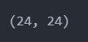

```
d = np.array([[1,2],[3,np.nan]])
np.nanprod(d,axis=0), np.nansum(d,axis=0)
# nan을 1 취급한다.      nan을 0 취급한다.
```

