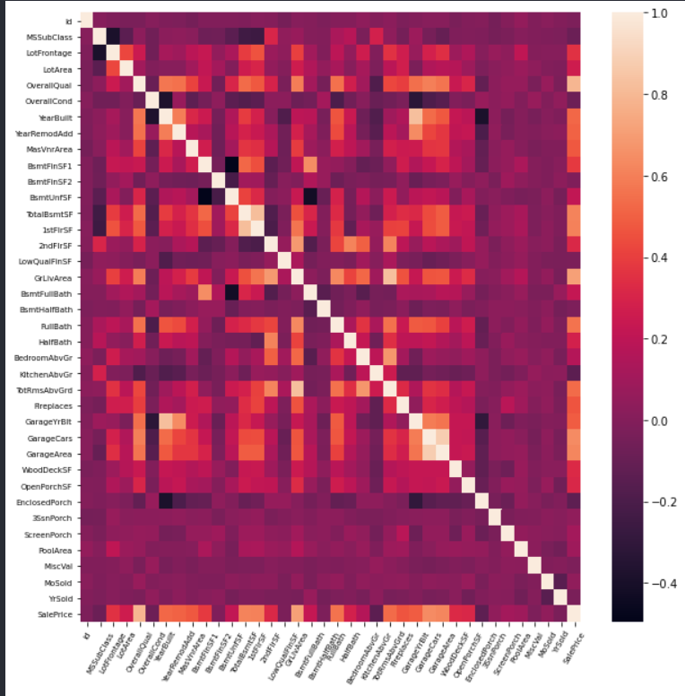

# 0929

복습 복습!

> 요약 : 그래프 & 상관계수& 데이터 전처리 &  회기분석

*** 약어들  plt = matplotlib.pyplot

​					sns = seaborn

​					np = numpy

​					pd = pandas

[seaborn] **heatmap**

도화지 사이즈를 정한다. plt.figure(figsize = (가로,세로))

heatmap을 그린다. sns.heatmap(데이터프레임,annot = True,annot_kws = {'size' : 숫자 })

옵션 

> annot : heatmap 내부 값 표현
>
> annot_kws : annot 값 글자 크기 조절

그래프 x범주 회전 plt.xticks(rotation = 각도, size = 글씨 크기)

그래프 y범주 회전 plt.yticks(rotation = 각도, size = 글씨 크기) 

```
plt.figure(figsize=(10,10))
sns.heatmap(corr)
plt.xticks(rotation=60, size=7)
plt.yticks(rotation=0, size=7)
```




[matplotlib.pyplot] **plot**

> 그래프를 겹처서 비교하고 싶을 때는 차례대로 그래프를 적으면 된다.

- 모델 결과 데이터와 테스트 데이터를 그래프를 통해 비교

```
ypred=model.predict(xtest)
plt.plot(ytest, color='red')
plt.plot(ypred, color='blue')
```


### 상관계수

>상관계수 0.7 이상 : 상관관계가 매우 강함
>
>상관계수 0.3 이상 : 상관관계가 있다
>
>상관계수 0.1 ~ 0.3 사이 : 매우 약한 상관관계가 있음
>
>상관계수 0 ~ 0.1 사이 : 무상관

- 전처리할 때 데이터 간 관계를 수치로 표현하여 사용 유무를 판단할 수 있다.
- 연속형과 연속형 데이터 사이에서 상관계수를 구할 수 있다.
  - 두 변수가 모두 정규성을 따른다라는 가정이 필요하다.( 모수적 방법 )

*모수적 방법*

- 모수 : 모집단 통계치 ( 평균, 표준편차, 분산 등 )

- 피어슨 상관분석

*비모수적 방법*

- 스피어만 상관분석, 켄달
- 정규분포를 따르지 않는다고 증명 or 표본이 ( 30개 미만, 10개 미만), 소규모인 경우에는 정규분포임을 가정할 수 없을 때 비모수적 방법을 사용한다.
- 자료를 크기 순으로 배열 -> 순위(서열) 매김 -> 순위 합계를 구해서 합계간 차이를 비교

*명목형(이산형)과 명목형(이산형)*

- 파이계수 : 두 변수가 모두 binary일 때 두 변수간의 상관계수


### 척도

+ 값을 표현하는 수준
  + 명명척도 ( ex) 혈액형 ) 값 사이의 연관성 x 
  + 서열 척도 ( ex) 순서형, 직급 ) 값 사이 순서가 있다.
  + 등간 척도 : 순서와 간격이 일정하다. 연산이 가능하다.


### 공분산 cov(x,y)

- 두 변수가 함께 변화하는 정도를 나타내는 지표

>\+  :  두 변수가 같은 방향으로 변화
>
>\- :  두 변수가 반대 방향으로 변화
>
>0 : 두 변수가 독립


그래프의 공분산 cov

```
np.cov(x,y),np.cov(x,y)[0,1] 
```

```
[[5.38888889 5.5       ]
 [5.5        6.98888889]]
5.5
```

- 행렬 해석 
  - (1,1) : x의 분산 
  - (1,2) & (2,1) : x y의 공분산
  - (2,2) : y의 분산


그렇다면 공분산끼리 비교할 수 있을까? No 

집단의 scale이 다르면 분산도 크거나 작게 나올 수 있기 때문

ex) 키 집단의 분산과 집값 집단의 분산 

분산의 표준화가 필요! => 상관계수!

상관계수 = 분산 / ( x집단의 표준편차 * y집단의 표준편차 )

상관계수의 범위는 -1 ~ 1

- 피어슨 상관계수!

```
np.corrcoef(x,y) , np.corrcoef(x,y)[0,1]
```

```
(array([[1.        , 0.89620839],
        [0.89620839, 1.        ]]),
 0.8962083932927005)
```

- 상관계수 해석
  - (1,1) x와 x의 상관계수 //자기 자신의 상관계수를 구했으니 값 1 
  - (1,2) (2,1) x와 y, y와 x의 상관계수 0.89620839
  - (2,2) y와 y의 상관계수 //자기 자신의 상관계수를 구했으니 값 1 

- 상관계수를 구할 때 표본 표준 편차 ( n-  1 )를 사용

  - ```
    xstd = np.std(x,ddof = 1 ) # 표본 표준편차 ddof = 1
    ystd = np.std(y,ddof = 1)
    cov/(xstd*ystd)
    ```

  - ```
    0.8962083932927002
    ```


## 스피어만, 켄달 상관계수

피어슨 상관계수는 선형적인 관계를 측정하지만 비선형적 변화는 잘 측정하지 못한다.

- 스피어만 상관계수

  - 서열 척도, 비선형적인 상관관계 

    ```
    import scipy.stats
    scipy.stats.spearmanr(x,y).correlation
    ```

    ```
    0.8972354465472708
    ```

    

- 켄달 상관계수

  - 비선형적 상관관계, 서열척도 ( 표본이 작을 때 이용)

    ```
    scipy.stats.kendalltau(x,y).correlation
    ```

    ```
    0.8051175601825398
    ```


### 상관계수 통계적 검증

> scipy에 피어슨 상관계수 함수를 사용하면 상관계수와 P value값이 나온다. 
>
> p value값은 무엇?

```
import scipy.stats
scipy.stats.pearsonr(x,y)
```

```
(0.8962083932927005, 0.000447180524884891)
```

- p value 는 피어슨 상관계수의 **유의확률**을 보여준다. 

### 유의 확률, 유의 수준

#### 유의 수준

> 1종 오류를 범할 수 있는 최대 허용한계 
>
> ex) 유의 수준을 0.05 ( 5% )로 정함 -> 100번 실험했을 때 1종 오류를 범할 수 있는 최대 허용한계는 5번이다.
>
> => 정밀도가 요구되는 실험에서는 유의 수준이 0.01 (1%)이다.

#### 유의 확률

>p value , 1종 오류를 범할 확률
>
>ex) 0.05 (5%) : 100번 실험했을 때 1종 오류를 5번 범한 경우.
>
>- 95% 신뢰도로 **귀무가설을 기각**한다는 의미
>
>0<= p value <= 1


그렇다면 **1종오류**는 무엇일까?

1종 오류 : **귀무 가설**이 참인데 기각한 경우 

- ex) 죄가 없는 범인이 죄가 있다고 말한 경우

*참고*

2종 오류 : **귀무 가설**이 거짓인데 기각하지  않은 경우 

- ex) 죄가 있는 범인이 죄가 없다고 말한 경우


*귀무/대랍가설*

" 20대 남자들의 키와 30대 남자들의 키가 다르다"

가설 입증과정 

20대와 30대 남자 각 30명씩 -> 키 측정 -> 각 집단 평균 (기술통계) -> 표본으로 추론 -> 추론 통계: 가설을 세우고 그 가설을 입증


\***귀무가설** : 처음 세운 가설

ex )  20 대 남자들과 30대 남자들의 키가 같을 것이다.

*대립가설 : 실험자가 입증해야하는 가설

ex) 20 대 남자들의 키와 30대 남자들의 키가 다를것이다.


*추론통계*

- ~~귀무 가설을 기각~~  ? 
- 샘플을 통해서 모집단을 추론하는데 관심

- 샘플에서 샘플 통계량을 계산하고 p-value를 계산하는 등의 과정을 거쳐서 가설을 검정하는 등의 방법으로 모집단을 추론

- 샘플을 가지고 모집단의 속성을 '추론'하고자 할 때 모집단의 속성을 대변한다고 할 수 있을지를 결정하기 위한 기법 ( 유의 수준과 효과 크기가 중요한 판단의 기준)


## 데이터 전처리

- 교사학습 => 입력 데이터, 출력 데이터가 주어진다.

주어진 출력 데이터 SalePrice

SalePrice 열 데이터 분석

기술통계 확인

```
df['SalePrice'].describe()
```


그래프로 빈도 확인

```
sns.distplot(df['SalePrice'])
```


자료의 분포, 치우친 정도 확인

```
print("왜도:%f" % df['SalePrice'].skew())
print("첨도:%f" % df['SalePrice'].kurt())
```

```
왜도:1.882876
첨도:6.536282
```


> 극단치가 있어 중위수보다 평균이 더 큼 (왜도가 1.88로 양수 극단치는 큰 값에 분포)
>
> 그러나 중위수 근처 값이 많아 평균과 중위수 차이가 크지 않았다. ( 첨도가 크다.)


예측값과 다른 변수 사이 관계를 그래프를 통해 확인

- 연속형 데이터

```
var='GrLivArea'
data=pd.concat([df['SalePrice'],df[var]],axis=1)
data.plot.scatter(x=var, y='SalePrice')
```


- 범주형 데이터

```
var='OverallQual'
data=pd.concat([df['SalePrice'],df[var]],axis=1)
f, ax=plt.subplots(figsize=(8,6))
fig=sns.boxplot(x=var, y='SalePrice', data=data)
```


- 상관행렬을 이용 ( 연속형 데이터 )

```
corrmat=df.corr()
k=10 #히트맵에 출력할 변수의 개수
cols=corrmat.nlargest(k,'SalePrice')['SalePrice'].index
cm=np.corrcoef(df[cols].T)
sns.set(font_scale=1.25)
sns.heatmap(cm, annot=True, square=True, annot_kws={'size':9}, xticklabels=cols.values,
           yticklabels=cols.values, fmt='.2f')
```


- 높은 상관관계를 보인 columns를 추려 pairplot 사용 관계

```
cols=['SalePrice', 'OverallQual', 'GrLivArea', 'GarageCars', 'TotalBsmtSF','FullBath','YearBuilt']
sns.pairplot(df[cols], size=2.5)
```


### 결측치 처리

- 데이터 결측치 비율 확인

```
total=df.isnull().sum().sort_values(ascending=False)
percent=(df.isnull().sum() df.isnull().count()).sort_values(ascending=False)
missing_data=pd.concat([total, percent], axis=1, keys=['Total', 'Percent'])
missing_data
```

```
				Total		Percent
PoolQC			1453		0.995205
MiscFeature		1406		0.963014
Alley			1369		0.937671
Fence			1179		0.807534
FireplaceQu		690			0.472603
...	...	...
CentralAir		0			0.000000
SaleCondition	0			0.000000
Heating			0			0.000000
TotalBsmtSF		0			0.000000
Id				0			0.000000
```


결측값 갯수가 1보다 많은 열이 있는 열 제거

```
df=df.drop((missing_data[missing_data['Total']>1]).index,1) #열 제거
```

결측값 갯수가 1개인 열은 행 값만 제거

```
df=df.drop(df.loc[df['Electrical'].isnull()].index) #결측치에 해당되는
```

데이터 결측치 확인

```
df.isnull().sum().max()
```

```
0
```


### 데이터 표준화

**StandardScaler**

```
from sklearn.preprocessing import StandardScaler
saleprice_scaled=StandardScaler().fit_transform(df['SalePrice'][:,np.newaxis])
saleprice_scaled
```

> fit_transform함수는 2차원 데이터에 대해 변환(표준화)
>
> np.newaxis:새로운 축 추가(차원 증가)

```
array([[ 0.34704187],
       [ 0.0071701 ],
       [ 0.53585953],
       ...,
       [ 1.07713679],
       [-0.48847623],
       [-0.42081658]])
```


- 행 데이터 제거

```
df.sort_values(by='GrLivArea', ascending=False)[:2] #1299, 524
df=df.drop(df[df['Id']==1299].index)
df=df.drop(df[df['Id']==524].index)
```


- 데이터 정규분포 확인

```
sns.distplot(df['SalePrice'], fit=norm)
fig=plt.figure()
res=stats.probplot(df['SalePrice'], plot=plt)
```

>파랑색 : 커널분포
>
>검은색 : 정규분포


- 데이터에 로그를 취해본다.

```
df['SalePrice']=np.log(df['SalePrice'])
```

```
sns.distplot(df['SalePrice'], fit=norm)
fig=plt.figure()
res=stats.probplot(df['SalePrice'], plot=plt)
```


- 0이 포함된 데이터에서 적용

```
sns.distplot(df['TotalBsmtSF'], fit=norm)
fig=plt.figure()
res=stats.probplot(df['TotalBsmtSF'], plot=plt)
```


```
df['HasBsmt']=pd.Series(len(df['TotalBsmtSF']), index=df.index)
df['HasBsmt']=0
df.loc[df['TotalBsmtSF']>0, 'HasBsmt']=1
```

> 새로운 HasBsmt 열 생성 역할 1이상 값을 가지고 있는 데이터와 아닌 데이터 구별

```
df.loc[df['HasBsmt']==1, 'TotalBsmtSF']=np.log(df['TotalBsmtSF'])
```

> HasBsmt 열에 1인 데이터에만 log를 취해 데이터 정규화

```
sns.distplot(df[df['TotalBsmtSF']>0]['TotalBsmtSF'] , fit=norm)
fig=plt.figure()
res=stats.probplot(df[df['TotalBsmtSF']>0]['TotalBsmtSF'], plot=plt)
```


## object 데이터 수치화 

> dummies : 데이터 형태가 문자형을 숫자 변수화 
>
> 컬럼 확장

```
season=pd.DataFrame({'ss':['spr', 'sum', 'fal', 'wint', np.nan],
                     'ss2':['spr', 'sum', 'fal', 'wint', np.nan],
                    'num':[1,2,3,4,5]})
season.info()
pd.get_dummies(season)
```

결과

```
<class 'pandas.core.frame.DataFrame'>
RangeIndex: 5 entries, 0 to 4
Data columns (total 3 columns):
 #   Column  Non-Null Count  Dtype 
---  ------  --------------  ----- 
 0   ss      4 non-null      object
 1   ss2     4 non-null      object
 2   num     5 non-null      int64 
dtypes: int64(1), object(2)
memory usage: 248.0+ bytes
num	ss_fal	ss_spr	ss_sum	ss_wint	ss2_fal	ss2_spr	ss2_sum	ss2_wint
0	1	0	1	0	0	0	1	0	0
1	2	0	0	1	0	0	0	1	0
2	3	1	0	0	0	1	0	0	0
3	4	0	0	0	1	0	0	0	1
4	5	0	0	0	0	0	0	0	0
```

