# Ensenble ( House Prices: Advanced Regression Techniques )

1. Voting
2. Bagging
3. Boosting
4. Randomforest


## House Prices: Advanced Regression Techniques 

> https://www.kaggle.com/c/house-prices-advanced-regression-techniques/overview
>
> 케글 집값 예측을 주제로한 머신러닝


## Voting (과반수 투표)

### 원리

하나의 훈련 데이터로 학습

다양한 훈련 모델 적용 가능

여러 훈련 모델이 예측한 결과를 다수결의 원칙에 따라 최종 예측치 결정!

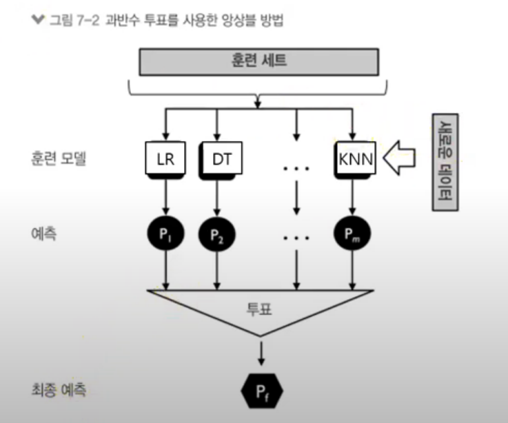


데이터 전처리는 동일하게 진행되었습니다. 자세한 과정은 파일 참고해주세요.

분류 모델

```
from sklearn.tree import DecisionTreeRegressor
from sklearn.neighbors import KNeighborsRegressor
```

앙상블 모델 

```
from sklearn.ensemble import VotingRegressor
```

```
dtr = DecisionTreeRegressor(random_state=42)
knn = KNeighborsRegressor(n_jobs = -1,metric = 'minkowski')
voting_estimator = [('tree',tree),('knn',knn)]
voting = VotingRegressor(estimators=voting_estimator)
```


분류 모델의 최적 파라미터 탐색

- GridSearchCV를 이용하여 DecisionTreeRegressor의 파라미터 max_depth와 min_samples_split의 최적값 탐색

```
param_range1 = list(range(1,9))
param_range2 = list(range(4,10))

param_grid = [{'max_depth':param_range1,'min_samples_split':param_range2}] 

gs1 =  GridSearchCV(dtr,param_grid= param_grid,scoring= score_rmse,cv= 10,n_jobs= -1)
gs1.fit(xtrain,ytrain)
print(gs.best_params_)
```

```
{'max_depth': 8, 'min_samples_split': 5}
```


- GridSearchCV를 이용하여 KNeighborsRegressor의 파라미터 n_neighbors와 p의 최적값 탐색

```
param_range1 = list(range(1,11)) 
param_range2 = list(range(1,5))

param_grid = [{'n_neighbors':param_range1,'p':param_range2}] 

gs2 =  GridSearchCV(knn,param_grid= param_grid,scoring= score_rmse,cv= 10,n_jobs= -1)
gs2.fit(xtrain,ytrain)
print(gs2.best_params_)
```

```
{'n_neighbors': 5, 'p': 1}
```


VotingRegressor로 분류 모델 생성

```
dtr = DecisionTreeRegressor(max_depth=8,min_samples_split=5,random_state=42)
knn = KNeighborsRegressor(n_neighbors=5,p = 1,n_jobs = -1,metric = 'minkowski')
voting_estimator = [('dtr',dtr),('knn',knn)]
voting = VotingRegressor(estimators=voting_estimator,n_jobs=-1)
y_pred = voting.fit(xtrain,ytrain).predict(xtest)
```


평가 RMSE로 scoring 하여 교차검증 CV = 10

 ```
score = np.sqrt(-cross_val_score(estimator=voting,X = xtrain,y = ytrain,cv = 10,scoring= score_rmse))
print(score)
print(score.mean())
 ```

```
[0.1551865  0.153229   0.1396581  0.1720921  0.14683745 0.16425122
 0.18564509 0.21034807 0.1720763  0.1377043 ]
0.1637028128191585
```


테스트 데이터와 예측 데이터 비교

```
plt.figure(figsize=(15,10))
sns.regplot(ytest,y_pred,ci=100)
plt.xlabel('ytest')
plt.ylabel('y_pred')
```

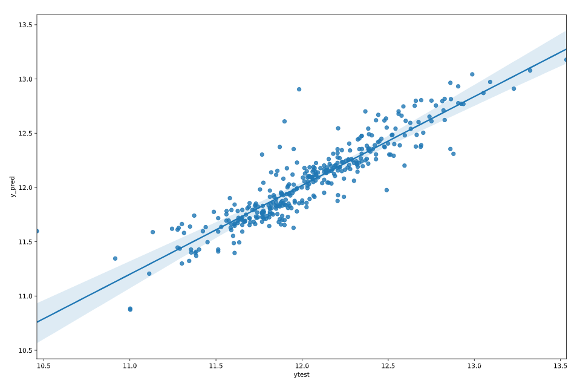


생성된 voting 모델로 예측 데이터 생성 후 케글에 제출

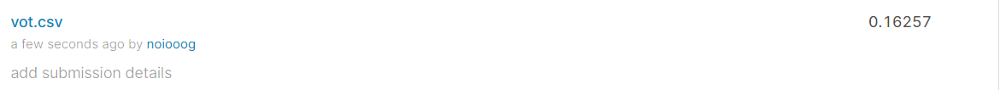

위에서 교차 검증한 값(0.1637028128191585)과 비슷하게 나왔다.


## BAGGING 

### 원리

하나의 분류 모델로 여러가지 옵션을 준다.

여러 개의 샘플을 모델에 넣고 돌려 결과값을 얻어내고 다수의 결과값을 가지고 모델을 만든다.

부트스트랩 실시: 데이터로 부터 복원 추출을(중복 허용)을 이용

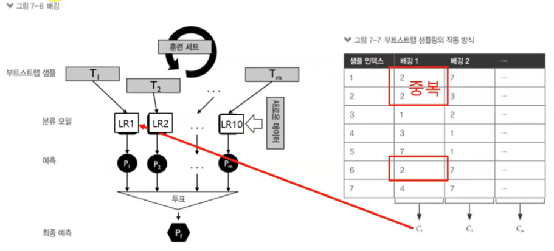


분류 모델 앙상블 모델

```
from sklearn.tree import DecisionTreeRegressor
from sklearn.ensemble import BaggingRegressor
```


BaggingRegressor 분류 모델 구축

```
dtr = DecisionTreeRegressor(random_state=42)
bg = BaggingRegressor(base_estimator=dtr,n_estimators=1000,max_samples=1.0,max_features=1.0, bootstrap=True,bootstrap_features=False,n_jobs=-1,random_state= 42)
```

```
y_pred = bg.fit(xtrain,ytrain).predict(xtest)
```


평가 RMSE로 scoring 하여 교차검증 CV = 10

```
score = np.sqrt(-cross_val_score(estimator=bg,X = xtrain,y = ytrain,cv = 10,scoring= score_rmse))
print(score)
print(score.mean())
```

```
[0.14966855 0.13708893 0.15025119 0.15149465 0.15412346 0.10907802
 0.10521998 0.1604707  0.12140113 0.17443093]
0.14132275325880056
```


테스트 데이터와 예측 데이터 비교

```
plt.figure(figsize=(15,10))
sns.regplot(ytest,y_pred,ci=100)
plt.xlabel('ytest')
plt.ylabel('y_pred')
```

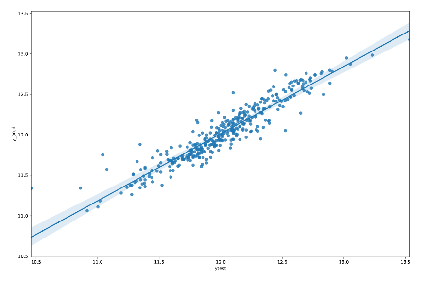

생성된 voting 모델로 예측 데이터 생성 후 케글에 제출

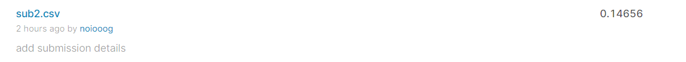

위에서 교차 검증한 값(0.14132275325880056)보다 값이 크게 나왔다.

-> 또 다른 처리가 필요해 보인다.


## 부스팅

### 원리

샘플 뽑을 때 잘못 분류된 data 50%를 재학습

AdaBoost : 전체 훈련 샘플 사용하고, 잘못 분류된 data에 가중치

가장 정확도가 높게 나오는 것은 부스팅  but 실제 시스템에서 사용하기에 복잡하고 어렵다... ( 잘못된 것에 가중치를 준다. )

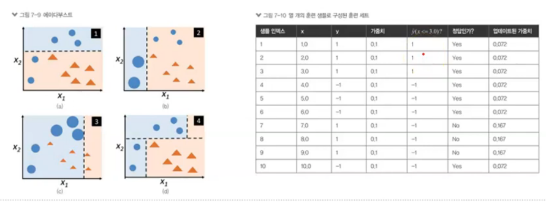


분류모델과 앙상블 모델

```
from sklearn.tree import DecisionTreeRegressor
from sklearn.ensemble import AdaBoostRegressor
```


GridSearchCV를 이용하여 DecisionTreeRegressor의 파라미터 max_depth와 min_samples_split의 최적값 탐색

```
param_range1 = list(range(1,11)) # 변경
param_range2 = list(range(1,11)) # 변경
param_grid = [{'max_depth':param_range1,'min_samples_split':param_range2}] 

gs = GridSearchCV(estimator= dtr,param_grid= param_grid,scoring= score_rmse,cv= 10, n_jobs= -1)
gs.fit(xtrain,ytrain)
print(gs.best_params_)
```

```
{'max_depth': 7, 'min_samples_split': 2}
```


AdaBoostRegressor로 분류모델 구축

```
dtr = DecisionTreeRegressor(max_depth=7,min_samples_split=2, random_state=42)
adr = AdaBoostRegressor(base_estimator=dtr,n_estimators=500,learning_rate=1,random_state=42)
y_pred = adr.fit(xtrain,ytrain).predict(xtest)
```


평가 RMSE로 scoring 하여 교차검증 CV = 10

```
score = np.sqrt(-cross_val_score(estimator=adr,X = xtrain,y = ytrain,cv = 10,scoring= score_rmse))
print(score)
print(score.mean())
```

```
[0.15932389 0.14167747 0.14104779 0.14587544 0.11653227 0.13174535
 0.13557702 0.12741284 0.15448389 0.13982748]
0.1393503452724426
```


테스트 데이터와 예측 데이터 비교

```
plt.figure(figsize=(15,10))
sns.regplot(ytest,y_pred,ci=100)
plt.xlabel('ytest')
plt.ylabel('y_pred')
```

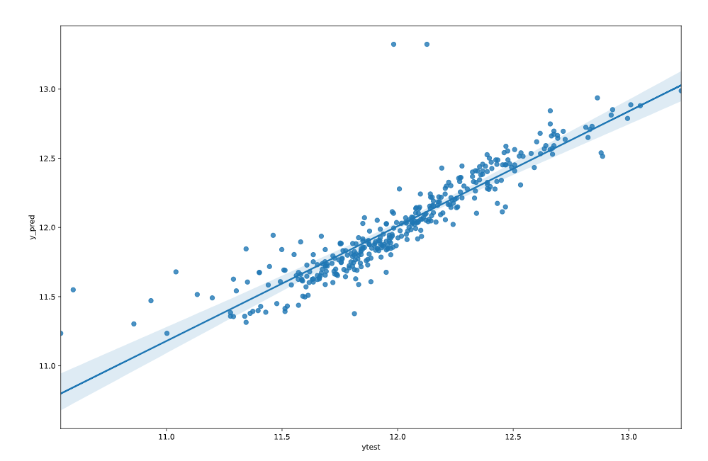

생성된 voting 모델로 예측 데이터 생성 후 케글에 제출

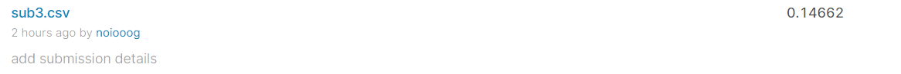

=> 위에서 교차 검증한 값(0.1393503452724426)보다 값이 크게 나왔다.


## RandomForest

### 원리

배깅의 일종

단일 분류 알고리즘(DT) 사용

포레스트 구축 : 무작위로 예측 변수 선택하여 모델 구축

결과 결합 : 투표(분류) , 평균화 (예측)

나무구조로 표현 ( X ) -> 변수의 중요도 제공 

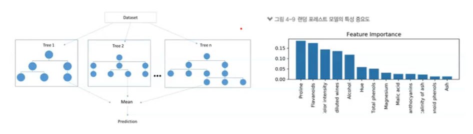

RandomForestRegressor로 분류모델 구축

```
xtrain,xtest,ytrain,ytest = train_test_split(x,log_y)
rfr = RandomForestRegressor(n_estimators= 1000,n_jobs=-1,random_state= 42)
rfr.fit(xtrain,ytrain)
y_pred = rfr.predict(xtest)
score = np.sqrt(-cross_val_score(rfr,xtrain,ytrain,cv = kfold,scoring =score_rmse) )
```

평가 RMSE로 scoring 하여 교차검증 CV = 10

```
score
score.mean()
```

```
array([0.11647239, 0.20030607, 0.11974345, 0.1434742 , 0.11000723,
       0.1174242 , 0.16629923, 0.15595033, 0.12583501, 0.15070607])
0.1406218167623414
```


테스트 데이터와 예측 데이터 비교

```
plt.figure(figsize=(15,10))
sns.regplot(ytest,y_pred,ci=100)
plt.xlabel('ytest')
plt.ylabel('y_pred')
```

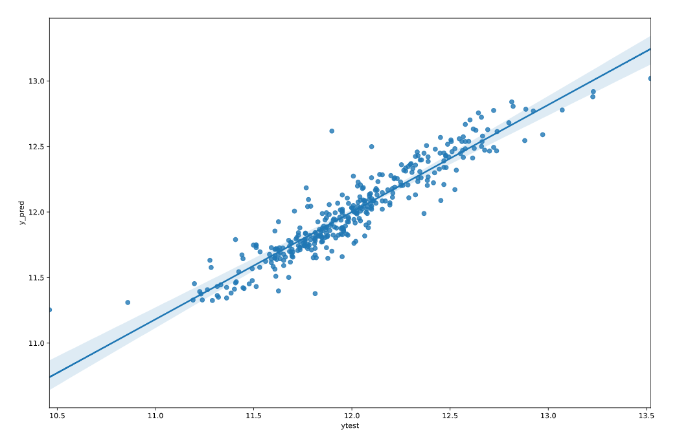

생성된 RandomForestRegressor모델로 예측 데이터 생성 후 케글에 제출

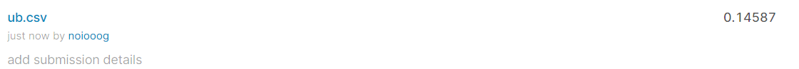

=> 위에서 교차 검증한 값(0.1406218167623414)보다 값이 크게 나왔다.


- 그래프로 얻을 수 있는 정보
  - 예측값이 작은 yPred와 ytest 데이터 분포를 보면 regression 선에 가까이 모여있는 것을 확인 가능
  - 선과 멀어질 수록, 극단치가 많아질 수록 RMES 값이 증가 

- 한계점
  - 머신러닝 알고리즘을 다양하게 사용하지 못해 비교하기 어려움
  - 데이터 전처리에 따라 RMES 값이 달라진다는 점 => 머신러닝 알고리즘에 따라서 전처리할 필요성이 있다.