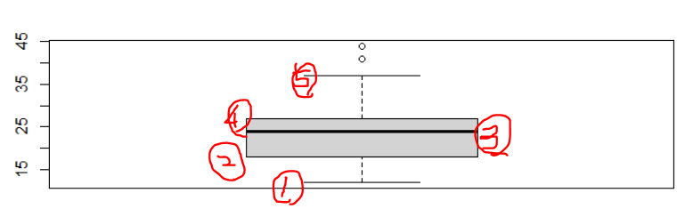
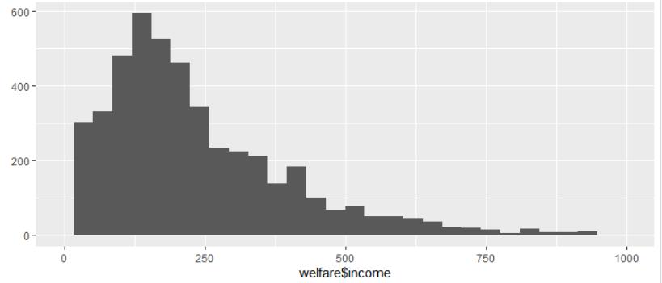
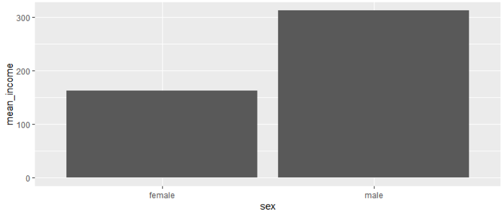
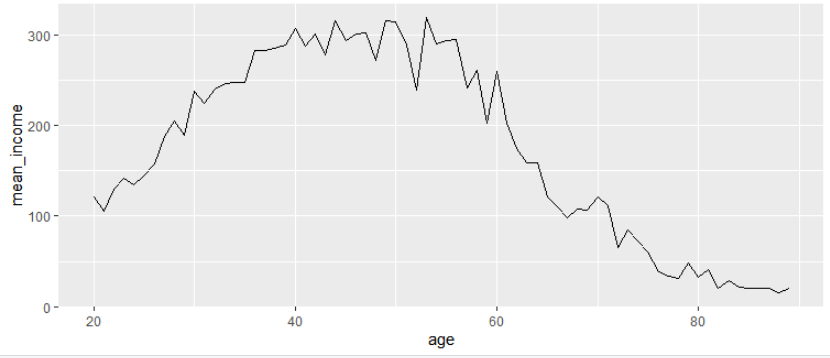
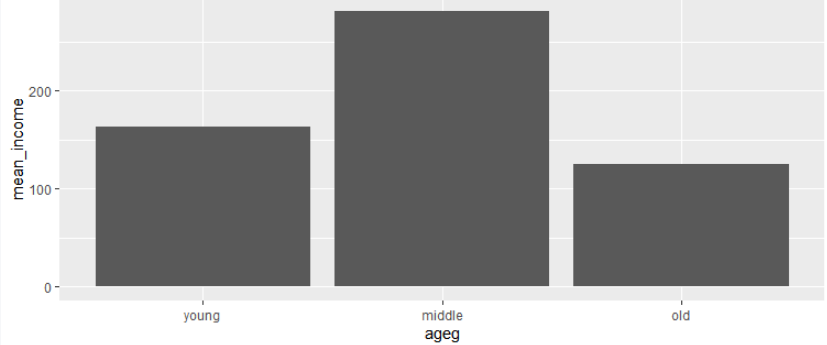
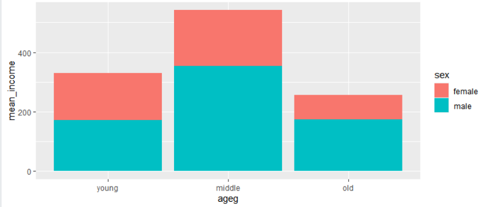
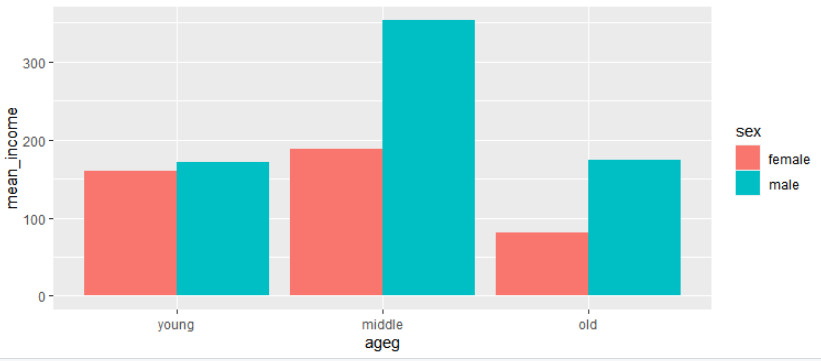

# 1007

## R언어 

> is.na() , na.omit() , sum(data,na.rm = T) , dataframe[c(n1,n2,n3...),'컬럼 이름'] 
>
> data.frame( 컬럼이름1 = c(n1, n2, n3 ...), 컬럼이름2 = c(n1, n2, n3,,,,)) , boxplot(데이터프레임$컬럼) 
>
> qplot(데이터$컬럼) , ggplot(data=데이터, aes(x=컬럼, y=컬럼))+geom_col() 

### 결측값

>NA 는 결측값이다. na, Na라고 쓰면 인식하지 못한다. 


is.na() : 데이터 값이 NA이면 True 아니면 False를 반환한다 

- [p] : isnull()


na.omit(데이터 프레임) : NA값이 있는 행을 제외한 값을 돌려준다. 

- [p] : drop_duplicates()


sum(data,na.rm = T) : sum함수에서 NA값을 무시하고 계산한다.


dataframe[c(n1,n2,n3...),'컬럼 이름'] : 데이터 프레임 컬럼에서 n1,n2,n3..행을 추출한다. 

- [p] : df.loc['인덱스','컬럼']  , df.iloc['인덱스','컬럼'']


data.frame( 컬럼이름1 = c(n1, n2, n3 ...), 컬럼이름2 = c(n1, n2, n3,,,,)) : 데이터 프레임 생성 

- [p] : pd.DataFrame( {'컬럼이름' : np.array() ,'컬럼이름' : np.array() })


boxplot(데이터프레임$컬럼) : 데이터 프레임 내에 컬럼 boxplot 생성



boxplot(데이터프레임$컬럼)$stats : boxplot의 아웃라이어 2개, iqt 2개 , 중위수 1개 출력

```
     [,1]
[1,]   12 2.5% 
[2,]   18 25% 
[3,]   24 중위수
[4,]   27 75%
[5,]   37 97.5%
```


qplot(데이터프레임$컬럼) + xlim(0,1000) : x축 범위 한정 xlim(0,1000)




ggplot(data=, aes(x=, y=))+geom_col()  : 막대 그래프 geom_col() 



ggplot(data=, aes(x=, y=))+geom_line() : 선그래프 옵션 geom_line()




ggplot(data=, aes(x=, y=))+geom_col()+  scale_x_discrete(limits=c("young", "middle", "old"))

: 막대그래프 x축 이름을 알파벳 순이아니라 임의로 설정하고 싶을 떄 scale_x_discrete



ggplot(data=, aes(x=, y=, fill=))+geom_col()+  scale_x_discrete(limits=c("young", "middle", "old"))

: fill 옵션 




ggplot(data=, aes(x=, y=, fill=sex))+geom_col(position = "dodge")+ scale_x_discrete(limits=c("young", "middle", "old"))

: 막대그래프 중 닷지 옵션 geom_col(position = "dodge")

