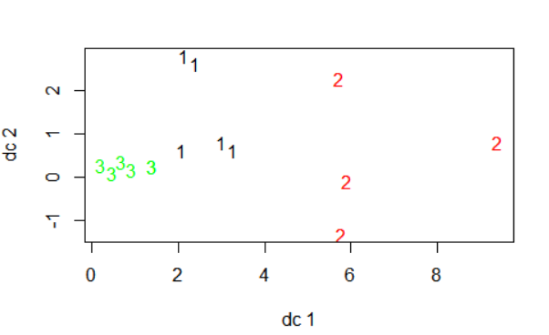
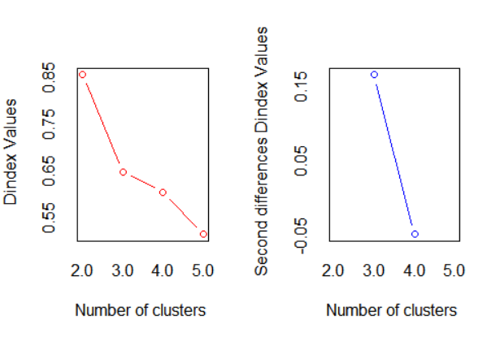
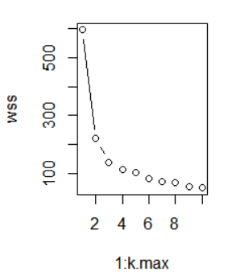
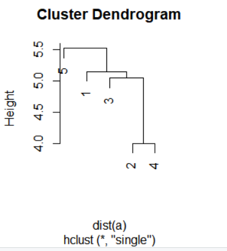

# 1012

## R 언어

> 패키지
>
> ggplot2, proxy, dplyr, readxl, fpc

### kmeans( 클러스터링 )


```
member <- data.frame(spent=c(10,1,1,17,4,6,1,15,22,3,0,3,7,0,2),
           time=c(15,2,10,7,5,7,1,10,18,3,1,3,7,10,2))
res <- kmeans(member,3)
fpc::plotcluster(member, res$cluster)
```



- 클러스터 중심 값 

```
res$centers
```

```
      spent time
1  3.600000  7.8
2 16.000000 12.5
3  1.666667  2.0
```


- total sum of square : 각 (클러스터와 데이터간 거리 제곱의 합) 의 전체 합

```
res$totss
```

```
1028.667
```


-  withinss : 데이터 응집력

```
res$withinss
```

```
88.22222   0.50000 147.00000
```


- 응집력의 총합 : 작을수록 좋은 수치 ( 유사 데이터 끼리 잘 몰려있다. )

```
res$tot.withinss
```

```
235.7222
```


- 클러스터간 떨어져 있는 거리 : 클수록 좋은 수치 ( 데이터 군 끼리 거리가 멀어야 분류 잘됭)

```
res$betweens
```

```
792.9444
```


- 각 클러스터에 소속된 데이터의 수

```
res$betweenss
```

```
9 2 4
```


- 클러스터링에 있어서 몇번 반복되었나 k

```
res$iter
```

```
2
```


- 데이터가 속하는 클러스터 

```
member$cluster <- res$cluster
```

```
   spent time cluster
1     10   15       2
2      1    2       3
3      1   10       1
4     17    7       2
5      4    5       1
6      6    7       1
7      1    1       3
8     15   10       2
9     22   18       2
10     3    3       3
11     0    1       3
12     3    3       3
13     7    7       1
14     0   10       1
15     2    2       3
```


- 클러스터에 속하는 데이터 값이 가장 큰 spent 데이터

```
aggregate(data=member,spent~cluster,max)
```

```
  cluster spent
1       1     7
2       2    22
3       3     3
```


- 4차원 이상의 데이터에 대해서는 일반적인 시각화가 불가능하기 때문에 NbClust 패키지 활용

클러스터 개수에 따른 응집도 : 클러스터가 많아지면 응집도 감소

```
library(NbClust)
```

```
nb <- NbClust(iris[,1:4],min.nc = 2,max.nc = 5,method = 'kmeans')
```




- 데이터가 속하는 클러스터 출력 

```
nb$Best.partition
```

```
  [1] 1 1 1 1 1 1 1 1 1 1 1 1 1 1 1 1 1 1 1 1 1 1 1 1
 [25] 1 1 1 1 1 1 1 1 1 1 1 1 1 1 1 1 1 1 1 1 1 1 1 1
 [49] 1 1 2 2 2 2 2 2 2 1 2 2 2 2 2 2 2 2 2 2 2 2 2 2
 [73] 2 2 2 2 2 2 2 2 2 2 2 2 2 2 2 2 2 2 2 2 2 1 2 2
 [97] 2 2 1 2 2 2 2 2 2 2 2 2 2 2 2 2 2 2 2 2 2 2 2 2
[121] 2 2 2 2 2 2 2 2 2 2 2 2 2 2 2 2 2 2 2 2 2 2 2 2
[145] 2 2 2 2 2 2
```


- 데이터 플랏의 엘보 포인트

```
iris_scale <- scale(iris[,-5])
k.max=10
wss <- rep(NA,k.max)
nClust <- list()

for(i in 1:k.max){
  iris_res <- kmeans(iris_scale,centers=i)
  wss[i] <- iris_res$tot.withinss
  nClust[[i]] <- iris_res$size
}
wss
nClust
plot(1:k.max,wss,type='b')
```

```
> wss
 [1] 596.00000 220.87929 138.88836 113.64981 104.76771
 [6]  80.94468  71.62170  69.15523  54.68037  49.90989
```



- h-clustering : hclust(거리행렬,method=거리 구하는 방법,members=)
- single : 클러스터간 가장 가까운 데이터 사이의 거리

```
h <-hclust(dist(a),method = 'single')
plot(h)
```





### knn

- 가장 가까운 거리에 있는 k개의 데이터를 추출하여 레이블링 

```
wbcd <- read.csv("wisc_bc_data.csv",stringsAsFactors = T)
# default = False
# 범주형에 대해서는 chr 보다는 카테고리형(R에서는 factor) 로 불러오는것이 옳다.
# stringsAsFactors는 모든 문자컬럼에 대해 적용하므로 섞여있을 때는 as.Type() 으로 개별처리 해줘야한다.
```

```
wbcd$diagnosis <- factor(wbcd$diagnosis,levels=c('B','M'),
       labels = c('Benign', 'Malignant'))
```


knn 모델링

```
wbcd[c('radius_mean','area_mean','smoothness_mean')]

wbcd <- wbcd[-1]

# 정규화

normalize <- function(x){
  return ((x-min(x))/(max(x)-min(x)))
}

normalize(c(1,2,3,4,5))

wbcd_n <- as.data.frame(lapply(wbcd[2:31],normalize))

wbcd_train <- wbcd_n[1:469,]
wbcd_test <- wbcd_n[470:569,]

wbcd_train_labels <- wbcd[1:469,1]
wbcd_test_labels <- wbcd[470:569,1]

library(class)

wbcd_test_pred <- knn(train=wbcd_train ,
                      test=wbcd_test ,
                      cl=wbcd_train_labels , k=21)

wbcd_test_pred

install.packages('gmodels')
library(gmodels)

CrossTable(x=wbcd_test_labels,y=wbcd_test_pred)

# 표준화

wbcd_z <- as.data.frame(scale(wbcd[-1]))
wbcd_train <- wbcd_z[1:469,]
wbcd_test <- wbcd_z[470:569,]
wbcd_test_pred <- knn(train=wbcd_train ,
                      test=wbcd_test ,
                      cl=wbcd_train_labels , k=21)
CrossTable(x=wbcd_test_labels,y=wbcd_test_pred)

for(i in c(5,11,15,27)){
  cur_pred <- knn(train=wbcd_train ,
                        test=wbcd_test ,
                        cl=wbcd_train_labels , k=i)
  CrossTable(x=wbcd_test_labels,y=cur_pred)
}
predict.kmeans <- function(x, newdata){
 
}
data(iris)
mydata <- iris
m <- mydata[1:4]
train <- head(m,100)
xNew<- head(m,10)
xNew

norm_eucl <- function(train){
  print(train/apply(train,1,function(x)sum(x^2)^.5))
}
m_norm <- norm_eucl(train)
```


