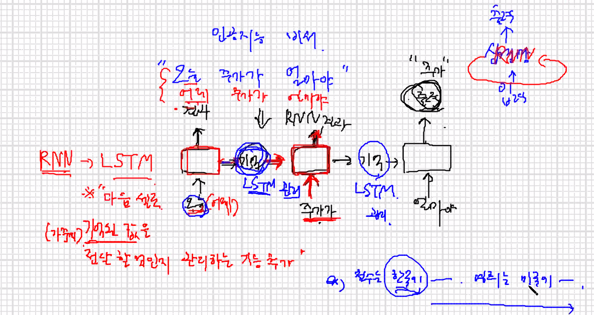

# 1109

RNN -> LSTM (다음 셀로 기억된 값을 전달할 건지 관리하는 기능 추가)

1. 구조 : 다수 대 1

- 밥은 + 먹고 + 다니니 -> 안부인사 

2. 구조 : 1 대 다수 

- 

3. 구조 : 다수 대 다수 

- 번역 :  예+그게+다예요 -> yes + that's + all

셀 방향

단방향, 양방향 가능

층

단층, 다층 가능 

많은 조합이 가능하다 => 헷갈린다.