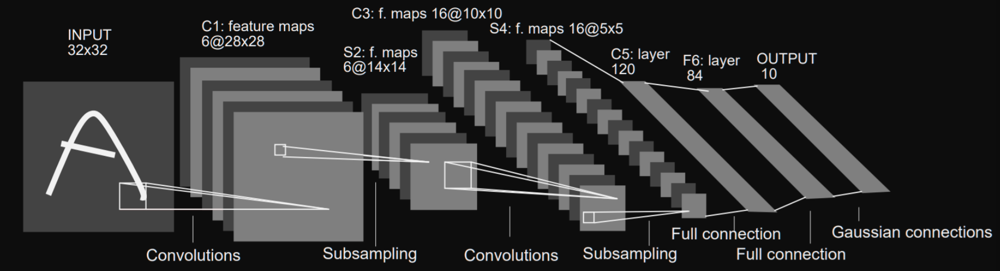

# 1117

## CNN 알고리즘 종류 

1. LeNet : 오래동안 사용되어진 cnn 

LeNet - 5 구조

특징 : 필기 특히 MNIST에 탁월한 기능을 한다. 

2. AlexNet 

이미지 분류 // 1000개 이미지 중 하나로 분류해준다.

[ImageNet](http://www.image-net.org/)약 22,000 개 범주에 속하는 1,500 만 개 이상의 레이블이 지정된 고해상도 이미지로 구성된 데이터 세트입니다. 이미지는 웹에서 수집하고 Amazon의 Mechanical Turk 크라우드 소싱 도구를 사용하여 라벨링 담당자가 라벨을 지정했습니다. 2010 년부터 Pascal Visual Object Challenge의 일환으로 ImageNet Large-Scale Visual Recognition Challenge (ILSVRC)라는 연례 대회가 열렸습니다. ILSVRC는 1000 개 범주 각각에 약 1000 개의 이미지가있는 ImageNet의 하위 집합을 사용합니다. 전체적으로 약 120 만 개의 훈련 이미지, 50,000 개의 검증 이미지, 150,000 개의 테스트 이미지가 있습니다. ImageNet은 가변 해상도 이미지로 구성됩니다. 따라서 이미지는 256x256의 고정 해상도로 다운 샘플링되었습니다. 직사각형 이미지가 주어지면 이미지의 배율이 조정되고 결과 이미지에서 중앙 256x256 패치가 잘립니다

3. VGC - NET

4. GooleNet

5. ResNet

7. UNet