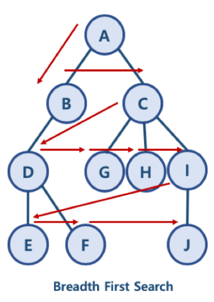
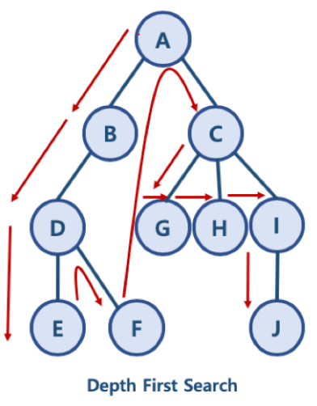
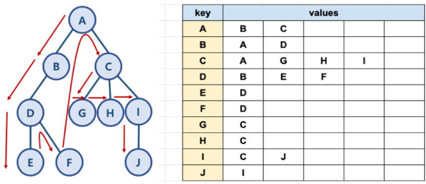

# 깊이  우선 탐색 (Depth First Search)

## 1. DFS와 BFS란

> 대표적인 그래프 탐색 알고리즘
>
> 루트 노드 ( 혹은 다른 임의의 노드 ) 에서 시작해서 다음 분기로 넘어가기 전에 해당 분기를 완벽하게 탐색하는 방법
>
> - 너비 우선 탐색(BFS) : 정점들과 같은 레벨에 있는 노드들을 먼저 탐색하는 방식
> - 깊이 우선 탐색(DFS) : 정점의 자식들을 먼저 탐색하는 방식

## 2. 깊이 우선 탐색의 특징

- 자기 자신을 호출하는 **순환 알고리즘 형태**를 가지고 있다.
- 전위 순회를 포함한 다른 형태의 트리 순회는 모두 DFS의 한 종류이다. (전위순회, 중위순회, 후위순회)
- 이 알고리즘을 구현할 때 가장 큰 차이점은 그래프 탐색의 경우 어떤 노드를 **방문했었는지 여부**를 반드시 검사해야 한다는 것이다. ( 하지 않을 시 **무한루프**에 빠질 가능성이 있다. )

### 1. DFS의 장점

1.1 현재 경로 상의 노드들만 기억하면 되므로, 저장 공간의 수요가 비교적 적음

1.2 목표 노드가 깊은 단계에 있는 경우 해를 빨리 구할 수 있음

1.3 구현이 너비 우선 탐색보다 간단함

### 2. DFS의 단점

2.1 단순 검색 속도는 너비 우선 탐색보다 느림

2.2 해가 없는 경우 빠질 가능성이 있음

- 사전에 임의의 깊이를 지정한 후 탐색하고, 목표 노드를 발견하지 못할 경우 다음 경로를 탐색하도록 함

2.3 깊이 우선 탐색은 해를 구하면 탐색이 종료되므로, 구한 해가 최단 경로가 된다는 보장이 없음 ( 목표에 이르는 경로가 다수인 경우 구한 해가 최적이 아닐 수 있다. )

## 3. DFS / BFS 방식의 예제

### BFS 방식

- A B C D G H O F J

- 한 단계씩 내려가면서, 해당 노드와 같은 레벨에 있는 노드들을 먼저 순회함



### DFS 방식

- A B D E F C G H I J
- 한 노드의 자식을 타고 끝까지 순회한 후, 다시 돌아와서 다른 형제들의 자식을 타고 내려가며 순회함



## 4. 파이썬으로 그래프를 표현하는 방법

- 파이썬에서 제공하는 딕셔너리와 리스트 자료구조를 활용하여 그래프를 표현할 수 있음

```python
graph = dict()

graph['A'] = ['B','C']
graph['B'] = ['A','D']
graph['C'] = ['A','G','H','I']
graph['D'] = ['B','E','F']
graph['E'] = ['D']
graph['F'] = ['D']
graph['G'] = ['C']
graph['H'] = ['C']
graph['I'] = ['C','J']
graph['J'] = ['I']

```



## 5. DFS 알고리즘 구현

### 구현방식

1. 순환 호출 이용 ( 재귀함수 ) => 구현이 간단하다.
2. 명시적 스택사용

### 1. 순환 호출 이용 (재귀함수)

```python
graph = [
    [],
    [2,3,8],
    [1,7],
    [1,4,5],
    [3,5],
    [3,4],
    [7],
    [2,6,8],
    [1,7]
]
visited = [False]*(len(graph)-1)
```

```python
def dfs(graph,v,visited):
    visited[v] = True
    print(v,end = ' ')
    
    for i in graph[v]:
        if not visited[v]:
            dfs(graph,i,visited)
```

```python
dfs(graph,1,visited)
```

```python
1 2 7 6 8 3 4 5
```


### 2. 명시적 스택 사용

- 자료구조 스택과 큐를 활용함
  - need_visit 스택과 visited 큐, 두 개의 자료구조를 생성
- BFS 자료구조는 두 개의 큐를 활용하는 데 반해, DFS는 스택과 큐를 활용한다는 차이가 있음을 인지해야함
- 큐와 스택 구현은 별도의 라이브러리를 활용할 수도 있지만, 간단히 파이썬 리스트를 활용할 수도 있음

```python
def dfs(graph, start_node):
    visited, need_visited = [],[]
    need_visit.append(start_node)
    
    while need_visit:
        node = need_visit.pop()
        if node not in visited:
            visited.append(node)
            need_visited.extend(graph[node])
   return visited
```


```python
dfs(graph,'A')
```

```python
['A','C','I','J','H','G','B','D','F','E']
```


## 5. 시간 복잡도

- 일반적인 DFS 시간 복잡도
  - 노드 수 : V
  - 간선 수 : E
    - 위 코드에서 while need_visit은 V+E 번 만큼 수행함
- 시간 복잡도 : O(V + E)


