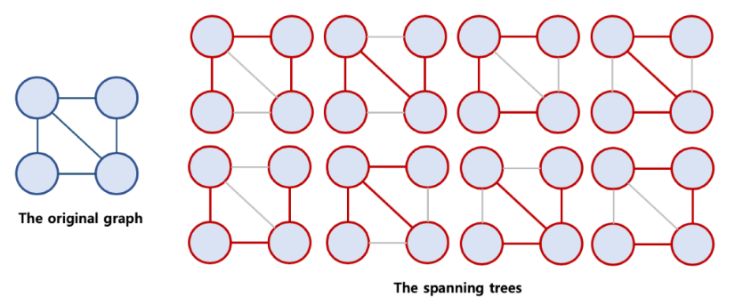
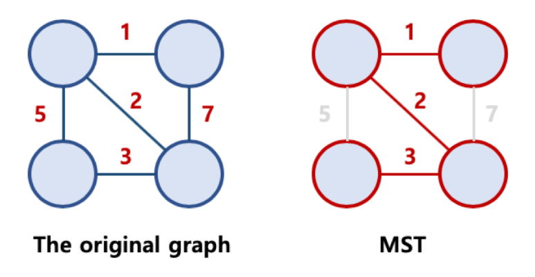
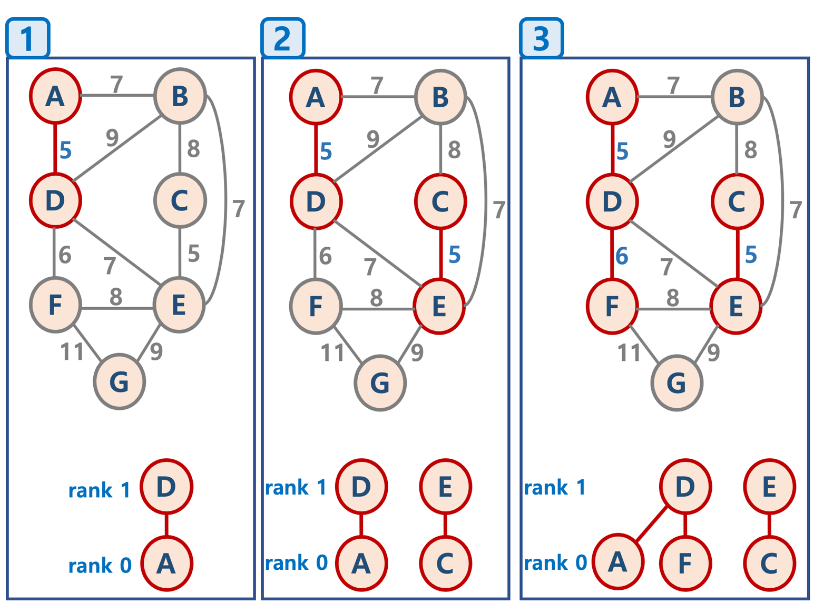
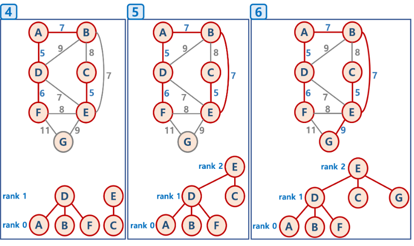
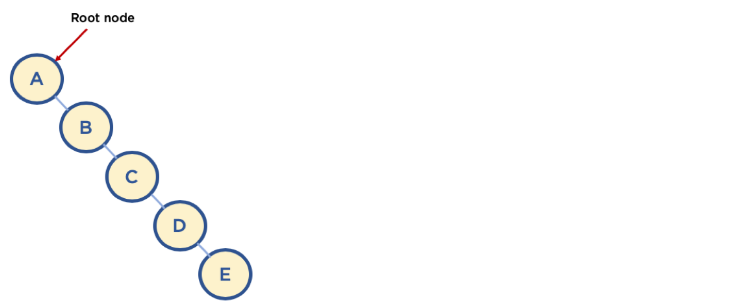
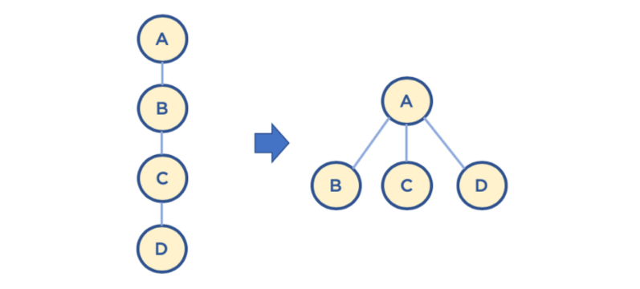
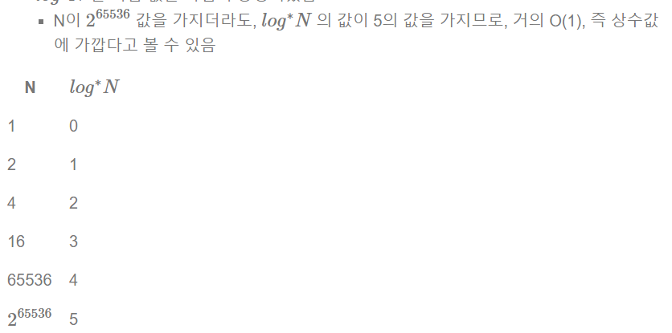
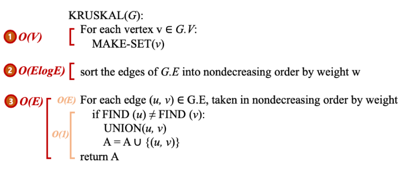

# 유니언 파인드, 크루스칼 ( 최소 신장 트리 )

## 최소신장트리

### 1. 신장 트리란?

- Spanning Tree, 또는 신장 트리라고 불린다.

- 원래의 그래프의 모든 노드가 연결되어 있으면서 트리의 속성을 만족하는 그래프
- 신장 트리의 조건
  - 본래의 그래프의 모든 노드를 포함해야함
  - 모든 노드가 서로 연결
  - 트리의 속성을 만족시킴 ( 사이클이 존재하지 않음 )

### 2. 최소 신장 트리

- minimum spanning tree, MST 라고 불림
- 가능한 Spanning Tree 중에서 간선의 가중치 합이 최소인 Spanning Tree를 사용함

### 3. 최소 신장 트리 알고리즘

- 그래프에서 최소 신장 트리를 찾을 수 있는 알고리즘이 존재함
- 대표적인 최소 신장 트리 알고리즘
  - Kruskal's algorithm ( 크루스칼 알고리즘 ) , prim's algorithm ( 프림 알고리즘 )

### 4. 크루스칼 알고리즘

1. 모든 정점을 독립적인 집합으로 만든다.
2. 모든 간선을 비용 기준으로 정렬하고 비용이 작은 간선부터 양 끝의 두 정점을 비교한다. 
3. 두 정점의 최상위 정점을 확인하고, 서로 다를 경우 두 정점을 연결한다. ( 최소 신장 트리는 사이클이 없으므로, 사이클이 생기지 않도록 하는 것임)

> 탐욕 알고리즘을 기초로 하고있다. 당장 눈 앞의 최소 비용을 선택해서 결과적으로 최적의 솔루션을 찾는다.

### 5, 유니언 파인드 알고리즘

- Disjoint set을 표현할 때 사용하는 알고리즘으로 트리구조를 활용하는 알고리즘
- 간단하게, 노드들 중에 연결된 노드를 찾거나, 노드들을 서로 연결할 때 사용

#### Disjoint Set이란

- 서로 중복되지 않는 부분 집합들로 나눠진 원소들에 대한 정보를 저장하고 조작하는 자료 구조
- 공통 원소가 없는 상호 배타적인 부분 집합들로 나눠진 원소들에 대한 자료구조를 의미한다.
- Disjoint Set = 서로소 집합 자료구조

#### 유니언 파인드 방식

1. 초기화

   n 개의 원소가 개별 집합으로 이뤄지도록 초기화

   

2. Union

   두 개별 집합을 하나의 집합으로 합침, 두 트리를 하나의 트리로 만듬

   

3. Find

   여러 노드가 존재할 때 두 개의 노드를 선택해서 현재 두 노드가 서로 같은 그래프에 속하는지 판별하기 위해, 각 그룹의 최상단 원소를 확인

- Union Find 알고리즘의 고려할점
  - Union 순서에 따라서 최악의 경우 링크드 리스트와 같은 형태가 될 수 있다.
  - 이때는 Find/ Union 시 계산량이 O(N)이 될 수 있으므로 해당 문제를 해결하기 위해, union-by-rank, path compression 기법을 사용한다.

#### Union-by-rank 기법

- 각 트리에 대해 높이를 기억해두고, Union 시 두 트리 높이가 다르면, 높이가 작은 트리를 높이가 큰 트리에 붙인다. ( 즉, 높이가 큰 트리의 루트 노드가 합친 집합의 루트 노드가 되게 함)

- 높이가 h-1 인 두 개의 트리를 합칠 때는 한 쪽의 트리 높이를 1 증가시켜주고, 다른 쪽의 트리를 해당 트리에 붙여줌

- 초기화 시, 모든 원소는 높이(rank)가 0인 개별 집합인 상태에서, 하나씩 원소를 합칠 때, Union by rank 기법을 사용한다면
  - 높이가 h인 트리가 만들어지려면, 높이가 h-1 인 두개의 트리가 합쳐져야함
  - 높이가 h-1 인 트리를 만들기 위해 최소 n개의 원소가 필요하다면, 높이가 h인 트리가 만들어지기 위해서는 최소 2n개의 원소가 필요함
  - 따라서 union by rank 기법을 사용하면, Union/Find 연산의 시간 복잡도는  O(N) 이 아닌, O(logN) 으로 낮출 수 있다.

#### Path compression

- Find 를 실행한 노드에서 거쳐간 노드를 루트에 다이렉트로 연결하는 기법
- Find를 실행한 노드는 이후부터는 루트 노드를 한번에 알 수있다.

- union by rank 와 path compression 기법 사용 시 시간 복잡도는 다음 계산식을 만족한다.
  - O(Mlog*N)
  - log*N은 다음값을 가짐이 증명되었다.

### 6. 시간복잡도

- 크루스칼 알고리즘 시간 복잡도는 O(E logE)

  - 다음 단계에서는 2번, 간선을 비용 기준으로 정렬하는 시간에 좌우됨(즉, 간선을 비용 기준으로 정렬하는 시간이 가장 큼)

  1. 모든 정점을 독립적인 집합으로 만든다.
  2. 모든 간선을 비용을 기준으로 정렬하고, 비용이 작은 간선부터 양 끝의 두 정점을 비교한다.
     - 퀵 소트를 사용한다면 시간 복잡도는 O(nlogn)이며 간선이 n 이므로 O(E log E)
  3. 두 정점의 최상위 정점을 확인하고 서로 다를 경우 두 정점을 연결한다. (최소 신장 트리는 사이클이 없으므로 사이클이 생기지 않도록 하는 것임 )
     - union by rank 와 path compression 기법을 사용 시 시간 복잡도가 결국 상수값에 가까움 O(1)

