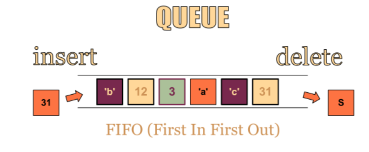
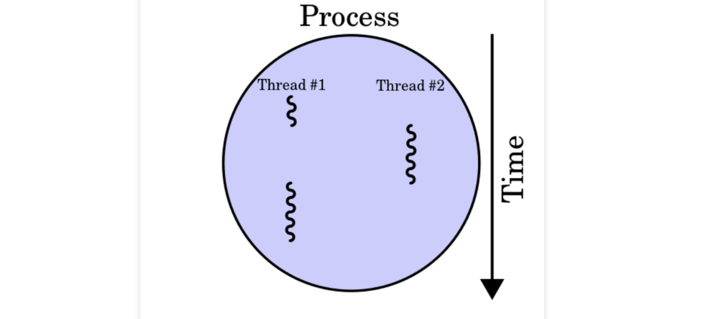

# 큐(Queue)

1. 큐 구조

> - 줄 서기
> - 가장 먼저 넣은 데이터를 가장 먼저 꺼낼 수 있는 구조
>   - FIFO( First-In, First-Out), LILO(Last-In, Last-Out)
>   - 스택과 반대

2. 용어

> Enqueue : 큐에 데이터 넣기
>
> Dequeue : 규에서 데이터 꺼내기

3. 파이썬 queue 라이브러리 활용해서 큐 자료구조 사용하기

- queue 라이브러리에는 다양한 큐 구조로 Queue(), LifoQueue(), PriorityQueue() 제공
- 프로그램을 작성할 때 프로그램에 따라 적합한 자료구조 사용
  - Queue() : 가장 일반적인 큐 자료 구조
  - LifoQueue() : 나중에 입력된 데이터가 먼저 출력되는 구조(스택)
  - PriorityQueue() : 데이터 마다 우선순위를 넣어서 우선순위가 높은 순으로 데이터가 출력

## python3 에서 큐 자료구조 사용하기

> 1. list
> 2. collection 모듈의 deque
> 3. queue 모듈의 Queue

### list

- 파이썬에서 큐를 사용하는 가장 간단한 방법은 범용 자료 구조를 사용
- 정방향
  - 데이터 제거 : pop(0) 함수 호출
  - 데이터 추가 : append()
- 반대 방향 
  - 데이터 제거 : pop()
  - 데이터 추가 : insert(0,x)

> 성능 측면에서 추천되지 않는다.
>
> 파이썬의 list는 다른 언어의 배열처럼 무작위 접근에 최적화된 자료구조이기 때문에 pop(0) 또는 insert(0,x) 는 성능적으로 불리한 연산 
>
> 시간 복잡도 O(N)이기 때문에 데이터의 개수가 많아질 수록 느려진다.
>
> why?
>
> 첫번째 데이터를 제거한 후에 그 뒤에 있는 모든 데이터를 앞으로 한칸씩 당겨줘야하고, 맨 앞에서 데이터를 삽입하려면 그 전에 모든 데이터를 뒤로 한칸씩 밀어줘야하기 때문 => 데이터 shift로 인한 시간 소모

### deque

- collection 모듈의 deque
- double-ended queue의 약자로 데이터를 양방향에서 추가하고 제거할 수 있는 자료구조
- popleft()는 첫번째 데이터를 제거
- appendleft(x)는 데이터를 맨 앞에서 삽입

> deque의 popleft()와 appendleft() 메서드는 O(1)의 시간 복잡도를 가지고 있기 때문에 list의 pop(0), insert(0,x) 보다 성능 상에 이점
>
> deque의 단점
>
> 무작위 접근의 시간 복잡도가 O(N)
>
> 내부적으로 linked list를 사용하고 있기 때문에 i 번째 데이터에 접근하려면 맨 앞/뒤 부터 i번 순회(iteration)가 필요

파이썬 collection.deque document 참고

https://docs.python.org/3.8/library/collections.html#collections.deque

### Queue

- queue 모듈의 Queue 클래스 
- 주로 멀티 스레딩(threading) 환경에서 사용
- 내부적으로 락킹(locking)을 지원하여 여러 개의 스레드가 동시에 데이터를 추가하거나 삭제할 수 있다.
- deque와 달리 방향성이 없어 데이터 추가와 삭제가 하나의 메서드로 처리
- 데이터 추가 : put(x)
- 데이터 삭제 : get()

> Queue의 성능은 deque와 마찬가지로 데이터 추가/삭제는  O(1)
>
> 데이터 접근은 O(N)의 시간 복잡도를 가짐

queue.Queue doc

https://docs.python.org/3/library/queue.html

---

### 모르는 용어

스레드 : 프로세스 내에서 실행되는 흐름의 단위

멀티 스레딩 : 여러 작업을 한 번에 하는 개념

락킹 : 파이썬에서는 **하나의 프로세스** 안에 **모든 자원**의 **락(Lock)**을 글로벌(Global)하게 관리함으로써 한번에 하나의 스레드만 자원을 컨트롤하여 동작

( cpu 작업에서 하나의 쓰레드만 사용, I/O 작업에서는 동시작업)