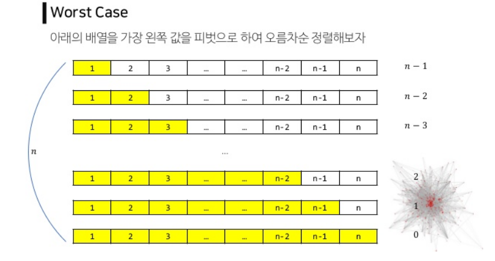

# QUICK SORT

1. 퀵 정렬이란?

   > 기준점(pivot)을 정해서, 기준점 보다 작은 데이터는 왼쪽 큰 데이터는 오른 쪽으로 모으는 함수를 작성함
   >
   > 각 왼쪽 오른쪽은 재귀 용법을 사용해서 다시 동일한 함수를 호출하여 위 작업을 반복함
   >
   > 함수는 왼쪽 + 기준점 + 오른쪽을 리턴

2. 코드 구현

   > quicksort 함수 만들기
   >
   > - 만약 리스트 개수가 한개이면 해당 리스트 리턴
   > - 그렇지 않으면 리스트 맨 앞의ㅡ 데이터를 기준점으로 놓기
   > - left , right 리스트 변수를 만들고 맨 앞의 데이터를 뺀 나머지 데이터를 기준점과 비교
   >   - 기준점보다 작으면 left.append(해당 데이터)
   >   - 기준점보다 크면 right.append(해당 데이터)
   > - return quicksort(left) + pivot + quicksort(right)

```python
import random
data_list = random.sample(range(100)m,10)

def quick_sort(data_list):
    if len(data_list) <= 1:
        return data_list
    left,right = [],[]
    pivot = data_list[0]
    
    for index in range(1,len(data_list)):
        if pivot > data_list[index]:
            left.append(data_list[index])
        else:
            right.append(data_list[index])
    return quick_sort(left) + [pivot] + quick_sort(right)
```


3. 알고리즘 분석

   >병합정력과 유사 시간 복잡도는 O(nlogn)
   >
   >- 단 최악의 경우, 맨처음 기준점이 가장 크거나 가장 작으면 모든 데이터를 비교하는 상황이 나옴 O(n^2)




# 분할 정복

- 주어진 문제를 작은 사례로 나누고 각각의 작은 문제들을 해결하여 정복하는 방법
- 분할 정복법은 문제의 사례를 2개 이상의 더 작은 사례로 나눈다. 이 작은 사례는 주로 원래 문제에서 따온다.
- 나눈 작은 사례의 해답을 바로 얻을 수 있으면 해를 구하고 아니면 더 작은 사례로 나눈다.
- **해를 구할 수 있을 만큼 충분히 더 작은 사례로 나누어 해결**하는 방법
- 분할 정복은 하향식 접근 방법으로 최상위 사례의 해답에서 아래로 내려가면서 작은 사례에 대한 해답을 구한다.

1. 분할 정복 설계전략

   > 1. 문제 사례를 하나 이상의 작은 사례로 분할한다.
   > 2. 작은 사례들을 각각 정복한다. 작은 사례가 충분히 작지 않은 이상 재귀를 사용한다.
   > 3. 필요하다면 작은 사례에 대한 해답을 통합하여 원래 사례의 해답을 구한다.

사용 예시 : 이분검색, merge sort, quick sort, 최대값 찾기, 임계값의 결정.....

2. 분할 정복의 장단점
   - 장점 : 문제를 나눔으로써 어려운 문제를 해결할 수 있다. 문제를 나누어 해결한다는 특징상 병렬적으로 문제를 해결하는데 큰 강점
   - 단점 : 함수를 재귀적으로 호출한다는 점에서 호출로 인한 오버헤드가 발생하며, 스택에 다양한 데이터를 보관하고 있어야 하므로 스택 오버플로우가 발생하거나 과도한 메모리 사용을 하게되는 단점