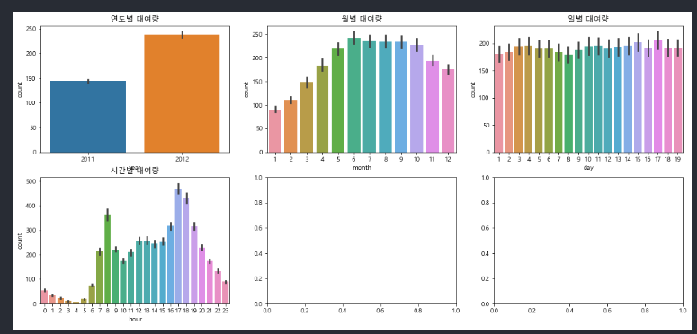
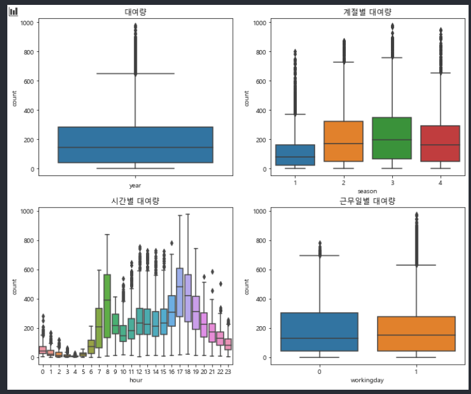
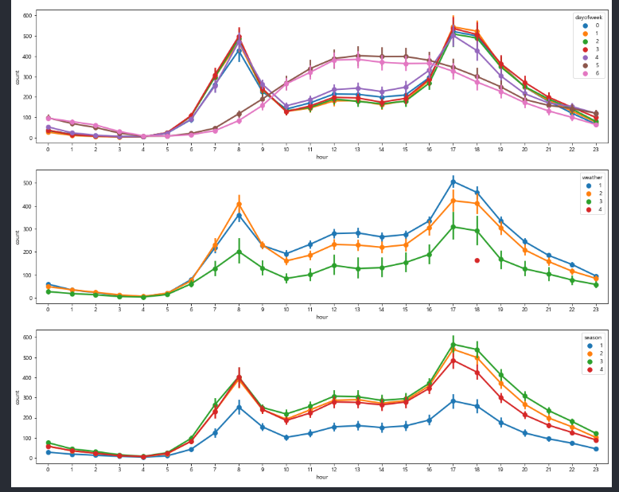
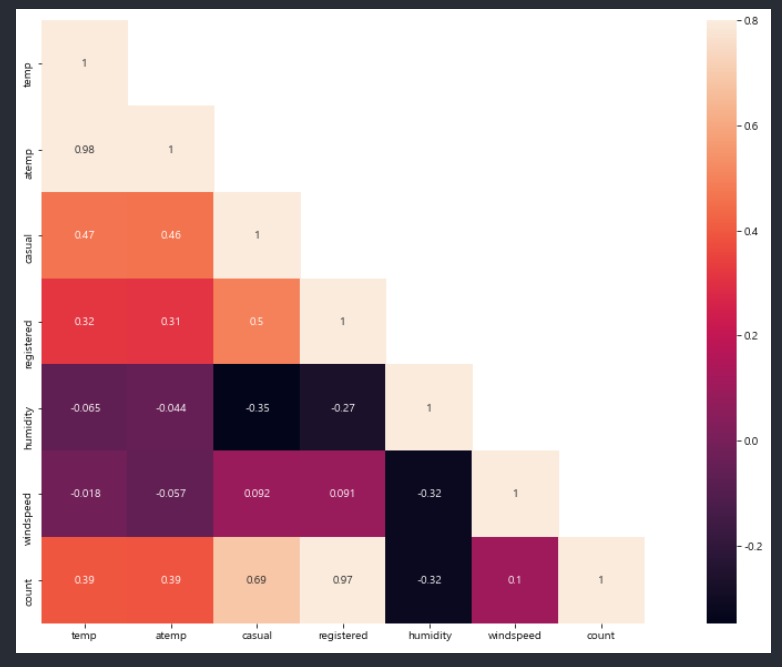
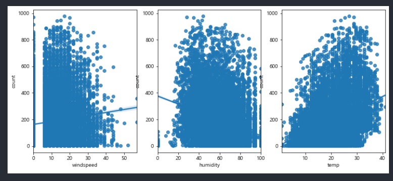
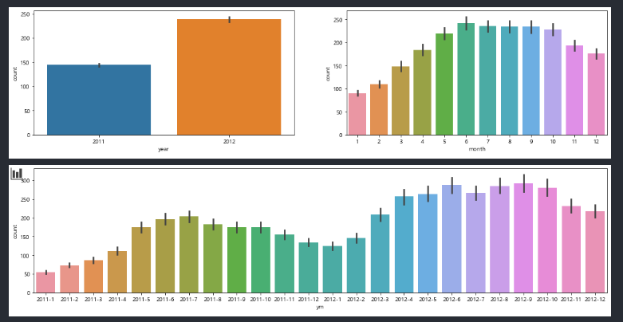

# 9월 4주차 정리

## 09월 21일

```
중복 관련 문법
[pandas] duplicated
.duplicated() # 각 행이 중복인지 아닌지 알려준다 
입력 : 시리즈 / 데이터 프레임 ( 데이터 프레임 경우 행 기준 모두 중복일 경우 연산(T/F) )
출력 : 시리즈 T/F

[pandas] drop_duplicates
.drop_duplicates() # 중복인 행을 drop한다.
입력 : 시리즈 / 데이터 프레임 ( 데이터 프레임의 경우 행 기준 모두 중복일 경우 연산(drop))
출력 : 시리즈 / 데이터 프레임 

>> 내부 옵션1 .drop_duplicates(['열'..]) # 특정 열 기준으로 중복을 제거한다. ( 하나 이상의 열을 인자로 줄 수 있다.)

>> 내부 옵션2 .drop_duplicates(keep ='last') #default : (keep = 'first') 중복된 인자를 유지할 때 처음이냐 마지막이냐를 결정

 
[pandas] lower
시리즈.str.lower()  # 대문자를 소문자로 바꿔준다. 데이터 프레임엔 적용x

[pandas] map
시리즈.map(함수) # 시리즈 인자를 함수를 적용하여 출력한다.
>> 함수 부분에 딕셔너리가 들어올 경우 key : value -> key 값과 일치 여부를 확인하고
value값을 반환한다.

[pandas] replace
시리즈.replace(전 변수,후 변수 ) # 전자에는 하나 또는 둘 이상 가능. 둘일 때는 리스트 형태이다.([전,전],[후,후]) 또는 딕셔너리 형태로 넣어줄 수 있다.( { 전 : 후 , 전 : 후 })

[pandas] cut
pandas.cut(시리즈,bins,label) # bins : 영역을 구분해줄 숫자 대입 범위는 ( ]. label : 구분한 범위가 인덱스로 온 것을 임의로 바꿀 수 있음

[pandas] codes
시리즈.codes : 위에 나온 cut 메소드의 연장으로 구간의 인덱스 번호를 출력
ex) cats.codes 
# Categories (4, interval[int64]): [(18, 25] < (25, 35] < (35, 60] < (60, 100]] ==> 0 , 1 , 2 , 3

[pandas] any, all
불린참조 데이터 프레임.any(0,1) : 데이터 프레임 행에 하나라도 거짓 또는 참이면 출력
반대로 all이 있다. 

np.sign( 데이터 프레임 ) : 음수, 0 ,양수를 -1,0,1 로 바꾸어 데이터 프레임으로 나타낸다.

[pandas] take
데이터 프레임.take([리스트]) : 리스트 순서대로 데이터 프레임의 행 순서가 바뀐다

[numpy] shuffle, permutation
# shuffle은 x 자체가 바뀌었다 . permataion 는 아니다. 
x = np.arange(10)
print(np.random.shuffle(x),x) # 내부에서 배열 x가 변경되었다 .
>>None [6 3 4 8 5 7 2 1 0 9]

x = np.arange(10)
print(np.random.permutation(x),x) # 내부에서 변경되지 않았다 .
>> [3 9 6 4 1 2 5 8 7 0] [0 1 2 3 4 5 6 7 8 9]

[numpy] choice
np.random.choice(배열(정수),size, replace,확률) : 0~n까지 배열, size : 배열 중 개수 추출 ,replace = True (복원 추출)

[missingno] 결측값 시각화 라이브러리

[missingno] 결측값 시각화
msno.matrix(데이터 프레임,figsize=(12,5)) # figsize = (가로크기,세로크기)


[matplotlib.pyplot] 데이터 글씨 깨짐 방지 코드
----------------------------------------------------------------------
import matplotlib
from matplotlib import font_manager, rc
import platform
if platform.system()=="Windows":
    font_name=font_manager.FontProperties(fname="c:/Windows/Fonts/malgun.ttf").get_name()
    rc('font', family=font_name)
matplotlib.rcParams['axes.unicode_minus']=False

import warnings
warnings.filterwarnings("ignore")
-------------------------------------------------------------------------

[matplotlib,seaborn] 다중 그래프. 그리기 막대 그래프, 박스 그래프
barplot(데이터, x축,y축,위치), boxplot(데이터,x축, y축, 위치)

figure, ((axis1,axis2,axis3),(axis4,axis5,axis6)) = plt.subplots(nrows=2,ncols=3) # 2행 3열 

figure.set_size_inches(18,8) # 18,8 사이즈로 변경


axis1.set(ylabel = 'count',xlabel = 'year',title = '연도별 대여량')
axis2.set(ylabel = 'count',xlabel = 'month', title = '월별 대여량')
axis3.set(ylabel = 'count',xlabel = 'day', title = '일별 대여량') #
axis4.set(ylabel = 'count',xlabel = 'hour', title = '시간별 대여량')


sns.barplot(data = train,x='year',y='count',ax=axis1)
sns.barplot(data = train,x='month',y='count',ax=axis2)
sns.barplot(data = train,x='day',y='count',ax=axis3)
sns.barplot(data = train,x='hour',y='count',ax=axis4)

=======================================================
figure, ((axis1,axis2),(axis3,axis4)) = plt.subplots(nrows=2,ncols=2) # 2행 3열 
figure.set_size_inches(12,10) # 18,8 사이즈로 변경
axis1.set(ylabel = 'count',xlabel = 'year',title = '대여량')
axis2.set(ylabel = 'count',xlabel = 'season', title = '계절별 대여량')
axis3.set(ylabel = 'count',xlabel = 'hour of day', title = '시간별 대여량') 
axis4.set(ylabel = 'count',xlabel = 'working day', title = '근무일별 대여량')

sns.boxplot(data = train,y='count',orient='v',ax=axis1)
sns.boxplot(data = train,x='season',y='count',ax=axis2)
sns.boxplot(data = train,x='hour',y='count',ax=axis3)
sns.boxplot(data = train,x='workingday',y='count',ax=axis4)

-----------------------------------------------------------------
[matplotlib, seaborn] 점그래프
pointplot(데이터, x축,y축,hue=열이름,위치)


fig,(ax1,ax2,ax3,ax4,ax5)= plt.subplots(nrows=5)
fig.set_size_inches(18,25)

sns.pointplot(data= train , x ='hour',y = 'count',ax = ax1)
sns.pointplot(data= train , x ='hour',y = 'count',hue =  'workingday',ax = ax2)
sns.pointplot(data= train , x ='hour',y = 'count',hue =  'dayofweek',ax = ax3)
sns.pointplot(data= train , x ='hour',y = 'count',hue =  'weather',ax = ax4)
sns.pointplot(data= train , x ='hour',y = 'count',hue =  'season',ax = ax5)

-----------------------------------------------------------
[matplotlib,seaborn] 히트맵
heatmap(데이터,square(정사각형), annot(수치표시),mask(하삼각행렬 여부))

fig,ax1 = plt.subplots()
fig.set_size_inches(20,10)
mask = np.array(corrMatt)
mask[np.tril_indices_from(mask)] = False
sns.heatmap(corrMatt,square=True,annot = True,vmax = 0.8,mask= mask)


---------------------------------------------------------
[matplotlib,seaborn] 점, 회기 그래프
regplot(x축,y축, 데이터,위치)

fig,(ax1,ax2,ax3) = plt.subplots(ncols = 3) # nrow =3 디폴트
fig.set_size_inches(12,5)
sns.regplot(x='windspeed',y= 'count',data=train, ax = ax1)
sns.regplot(x='humidity',y= 'count',data=train, ax = ax2)
sns.regplot(x='temp',y= 'count',data=train, ax = ax3)

----------------------------------------------------------
[matplotlib,seaborn] 막대그래프

def cym(datetime):
    return '{0}-{1}'.format(datetime.year ,datetime.month)
# {0}-{1}은 각 format함수의 인수의 위치 

train['ym'] = train['datetime'].apply(cym)
train[['datetime','ym']]
fig,(ax1,ax2) = plt.subplots(ncols = 2)
fig.set_size_inches(18,4)
sns.barplot(data= train,x = 'year',y='count',ax= ax1)
sns.barplot(data= train,x = 'month',y='count',ax= ax2)


fig,ax3 = plt.subplots()
fig.set_size_inches(18,4)
sns.barplot(data= train,x = 'ym',y='count',ax= ax3)

```











