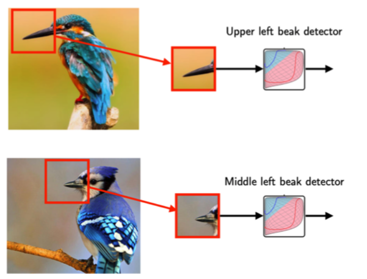
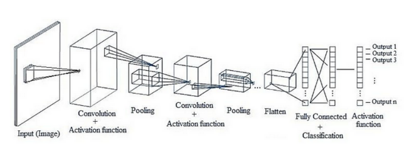
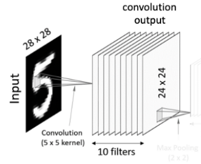
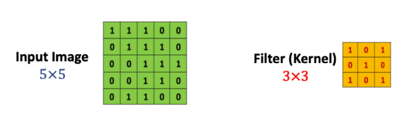
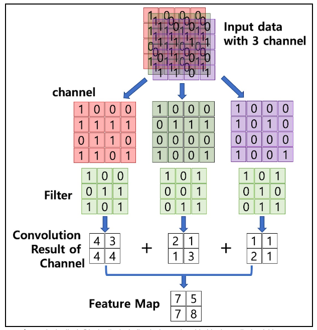
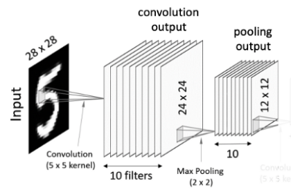
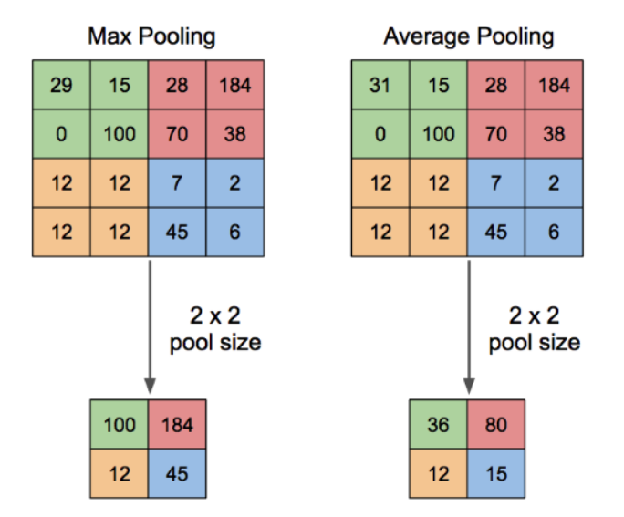
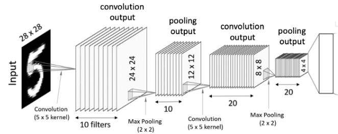
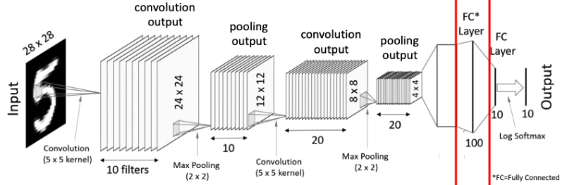
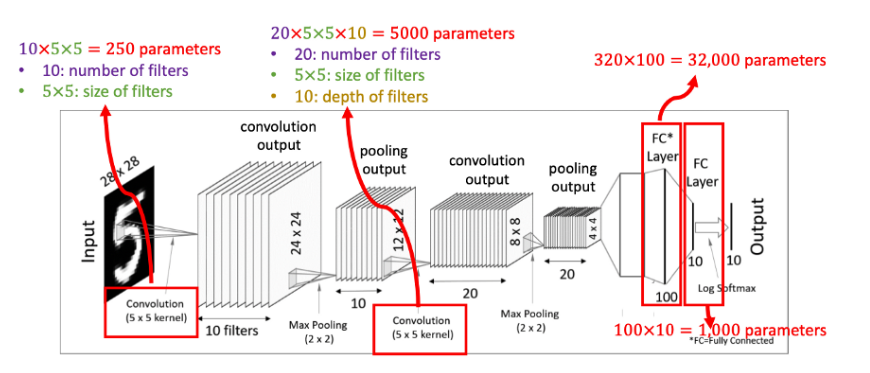

# Convolution Neural Network

- CNN을 쓰는 이유

> 일반적인 Deep Neural Network(DNN)은 기본적으로 1차원 데이터를 입력데이터로 사용한다. 반면 이미지 데이터는 2차원 형태의 입력 데이터로 DNN에서 사용하기 위해서는 1차원 데이터 형태로 만들어야하는 데 이 과정에서 **이미지의 공간적/지역적 정보(spatial/topological information)가 손실**되게 된다. 또한 **추상화 과정없이 바로 연산 과정이 진행되기 때문에 학습시간과 효율성이 저하**된다.
>
> 
>
> 그래서 이러한 문제점을 해결한 것이 **Convolution Neural Network(CNN)**이다.
>
> 
>
> CNN은 이미지를 입력 데이터로 그대로 받기 때문에 공간적/ 지역적 정보를 유지한 채로 **특성(feature)**들의 **계층을 빌드업**한다. 그리고 CNN의 중요한 특징은 **이미지의 전체보다는 부분을 보는 것**, 그리고 **이미지의 한 픽셀과 주변 픽셀의 연관성을 살리는 것**이다. 

- 어떤 식으로 CNN이 쓰이는지 예시

> 이미지가 주어졌을 때 새의 이미지가 맞는지 결정하는 모델을 만들 경우, 새의 부리가 중요한 특징이 될 수 있다. 모델은 이미지에 새의 부리가 있는지 없는지를 확인하는 것이 중요한 척도가 될 것이다. 하지만 전체 이미지에서 새의 부리는 일부분으로 전체 이미지를 보는 것보다 새의 부리가 있는 이미지를 잘라보는 것이 더 효율적이다. 또한 위의 두 이미지에서 새의 부리 부분은 이미지에 다른 위치에 있어 전체 이미지 보다는 이미지 일부분을 확인하는 것이 중요하고 효율적이다.

## Convolution Neural Network의 전체적인 네트워크 구조

### 1. Convolution Layer

5x5 사이즈 입력 이미지가 있을 때 **필터(filter)**를 반복 적용하여 패턴을 찾아 처리한다. 입력 이미지와 필터의 **합성곱**을 하여 **특징**을 찾아내는 것

**필터**는 이미지의 특징을 찾아내기 위한 공용 파라미터이다. 필터 또는 커널(Kernel)이라고도 한다. 

**스트라이드(stride)**는 필터를 순회하는 간격이다. 위에서 stride는 1이다. 

stride값이 커질 경우 필터가 이미지를 건너뛰는 칸이 커짐을 의미하므로 결과 이미지의 크기는 작아지는 것을 의미한다.

입력 이미지 사이즈 : hx , wx

필터 사이즈 : hy, wy

스트라이드 : s

결과값 : ( ( hx - hy ) / s + 1) x ( ( wx - wy ) / s + 1)

**Zero Padding** : 위에서 보면 입력 이미지와 필터의 합성곱 결과는 입력 이미지 사이즈보다 작아지는 것을 확인할 수 있다. 즉, **손실되는 부분**이 발생한다. 이러한 문제점을 해결하기 위해서 **0으로 구성된 테두리**를 이미지 가장자리에 감싸준다. 

- Convolution 후 아웃풋 이미지의 크기를 유지할 수 있다.
- Edge 쪽 픽셀 정보를 더 잘 이용할 수 있다.

**Chennel** : 이미지 픽셀 하나 하나는 실수이다. 컬러 사진은 색을 표현하기 위해서 각 픽셀을 RGB 3개의 실수로 표현한 3차원 데이터이다. 컬러 이미지는 3개의 채널, 흑백 이미지는 1개의 채널로 구성된다. 

**Feature Map** : 입력 데이터를 필터가 순회하며 합성곱을 통해서 만든 결과이다.

**Activation Map** : Feature Map에 **활성함수**를 적용한 결과이다. 즉, Convolution  layer의 최종 결과물이다.

### 2. Pooling Layer

> Convolution  layer의 결과 10개의 필터가 10개의 feature map을 생성하게 되어 값이 너무 많아지는 문제가 발생하게 된다.
>
> 이 문제를 해결하기 위해 각 feature map의 차원을 축소합니다.
>
> pooling size  = ( input_size - pool_size )/stride + 1
>
> **오버 피팅을 줄여주고 연산 속도를 올려준다**.
>
> 대표적으로 2가지 방식이 있다.

### 3. Flatten ( Vectorization )

- Flatten 또는 Vectorization : pooling 결과 4x4x20의 텐서가 출력되고 이 텐서를 1차원 데이터 펼쳐준다.
-  pooling 결과는 이미지라기 보다 입력된 이미지에서 얻어온 특이점 데이터기 때문에 1차원 형태로 변형시켜도 무관한 상태가 된다.

### 4. Fully Connected Layers

- 마지막에 하나 이상의 Fully connected layer를 적용시키고 softmax 활성함수 적용해주면 최종 결과물 출력.

#### 부록 튜닝가능한 하이퍼 파라미터

- Convolutional layers: 필터의 갯수, 필터의 크기, stride값, zero-padding의 유무
- Pooling layers: Pooling방식 선택(MaxPool or AvgPool), Pool의 크기, Pool stride 값(overlapping)
- Fully-connected layers: 넓이(width)
- 활성함수(Activation function): ReLU(가장 주로 사용되는 함수), SoftMax(multi class classification), Sigmoid(binary classification)

아래는 손실함수, 옵티마이저

- Loss function: Cross-entropy for classification, L1 or L2 for regression
- 최적화(Optimization) 알고리즘과 이것에 대한 hyperparameter(보통 learning rate): SGD(Stochastic gradient descent), SGD with momentum, AdaGrad, RMSprop
- Random initialization: Gaussian or uniform, Scaling