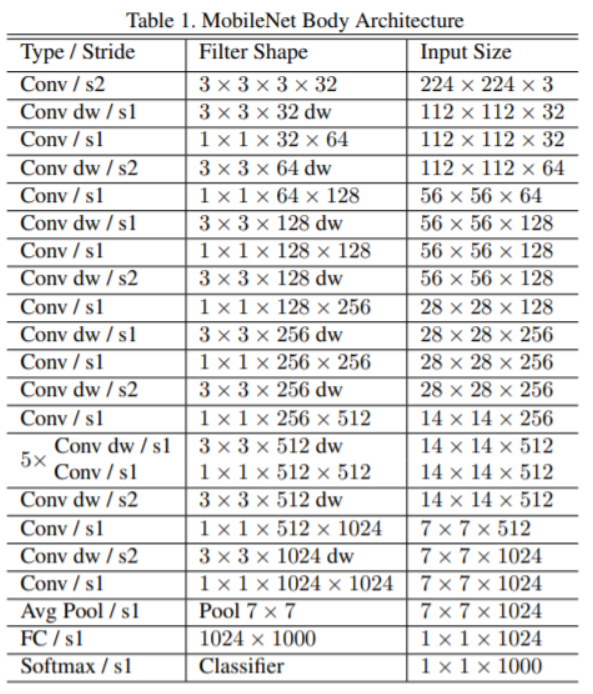
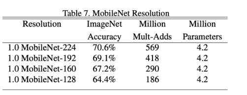

# Mobilenet v1

논문 : https://arxiv.org/abs/1704.04861

### MobileNet v1 특징

**자동차, 드론, 스마트폰과 같은 환경**에서는 CPU를 하나 정도 가지고 있는 경우도 많고, GPU가 없을 수도 있으며 메모리도 부족하다. 또한 배터리를 사용하는 경우가 많기 때문에 성능을 높일 경우 전력 소모 증가 ==> **환경적 제약이 크다.** 

**MobileNet**은 컴퓨터 성능이 제한되거나 배터리 퍼포먼스가 중요한 곳에서 사용될 목적으로 설계된 CNN


Depthwise Seperable Convolution


**Depthwise Convolution과 Pointwise Convolution**을 합쳐놓은 것

Depthwise Conv는 각 채널만의 Spatial Feature 만 보고 Pointwise Conv는 각 채널들에 대한 연산을 진행한다. 

이 둘을 합치게 되면 Channel과 Spatial한 특징을 모두 보기 때문에, 기존의 CNN과 유사하게 작동하지만, **파라미터의 수와 연산량이 훨씬 적어지게 되어 빠른 동작**을 할 수 있게 된다.


- Depthwise Seperable Convolution의 파라미터와 연산량

 파라미터의 수 : k x k x C + C x M = ( k x k + M ) C

 연산량 : (k x k + M ) C x H x W

기존 Conv2D 와 연산량을 비교했을 때 Depthwise Seperable Convolution이 약 K^2 배 빠르다고 할 수 있다.


## 아키텍처




## 구현

tensorflow에 있는 CIFAR 10으로 학습 시켜보았다. 32 x 32

MobileNet v1에서 224 x 224 사이즈로 학습 시켰다.

이미지 사이즈가 작아질 수록 정확도가 낮게 나오는 것을 확인할 수 있다.



논문에서는 옵티마이저가 RMSprop, learning rate= 0.1이었지만  정확도가 잘 나오지 않아서 ndam, learning rate = 0.01으로 바꿔서 함. 그 결과 논문과 비슷한 정확도 63.5% 가 나왔다.


```
Model: "model"
_________________________________________________________________
Layer (type)                 Output Shape              Param #   
=================================================================
input_1 (InputLayer)         [(None, 32, 32, 3)]       0         
_________________________________________________________________
conv2d (Conv2D)              (None, 16, 16, 32)        896       
_________________________________________________________________
batch_normalization (BatchNo (None, 16, 16, 32)        128       
_________________________________________________________________
activation (Activation)      (None, 16, 16, 32)        0         
_________________________________________________________________
depthwise_conv2d (DepthwiseC (None, 16, 16, 32)        320       
_________________________________________________________________
batch_normalization_1 (Batch (None, 16, 16, 32)        128       
_________________________________________________________________
activation_1 (Activation)    (None, 16, 16, 32)        0         
_________________________________________________________________
conv2d_1 (Conv2D)            (None, 16, 16, 64)        2112      
_________________________________________________________________
batch_normalization_2 (Batch (None, 16, 16, 64)        256       
_________________________________________________________________
activation_2 (Activation)    (None, 16, 16, 64)        0         
_________________________________________________________________
depthwise_conv2d_1 (Depthwis (None, 16, 16, 64)        640       
_________________________________________________________________
batch_normalization_3 (Batch (None, 16, 16, 64)        256       
_________________________________________________________________
activation_3 (Activation)    (None, 16, 16, 64)        0         
_________________________________________________________________
conv2d_2 (Conv2D)            (None, 8, 8, 128)         8320      
_________________________________________________________________
batch_normalization_4 (Batch (None, 8, 8, 128)         512       
_________________________________________________________________
activation_4 (Activation)    (None, 8, 8, 128)         0         
_________________________________________________________________
depthwise_conv2d_2 (Depthwis (None, 8, 8, 128)         1280      
_________________________________________________________________
batch_normalization_5 (Batch (None, 8, 8, 128)         512       
_________________________________________________________________
activation_5 (Activation)    (None, 8, 8, 128)         0         
_________________________________________________________________
conv2d_3 (Conv2D)            (None, 8, 8, 128)         16512     
_________________________________________________________________
batch_normalization_6 (Batch (None, 8, 8, 128)         512       
_________________________________________________________________
activation_6 (Activation)    (None, 8, 8, 128)         0         
_________________________________________________________________
depthwise_conv2d_3 (Depthwis (None, 8, 8, 128)         1280      
_________________________________________________________________
batch_normalization_7 (Batch (None, 8, 8, 128)         512       
_________________________________________________________________
activation_7 (Activation)    (None, 8, 8, 128)         0         
_________________________________________________________________
conv2d_4 (Conv2D)            (None, 4, 4, 256)         33024     
_________________________________________________________________
batch_normalization_8 (Batch (None, 4, 4, 256)         1024      
_________________________________________________________________
activation_8 (Activation)    (None, 4, 4, 256)         0         
_________________________________________________________________
depthwise_conv2d_4 (Depthwis (None, 4, 4, 256)         2560      
_________________________________________________________________
batch_normalization_9 (Batch (None, 4, 4, 256)         1024      
_________________________________________________________________
activation_9 (Activation)    (None, 4, 4, 256)         0         
_________________________________________________________________
conv2d_5 (Conv2D)            (None, 4, 4, 256)         65792     
_________________________________________________________________
batch_normalization_10 (Batc (None, 4, 4, 256)         1024      
_________________________________________________________________
activation_10 (Activation)   (None, 4, 4, 256)         0         
_________________________________________________________________
depthwise_conv2d_5 (Depthwis (None, 4, 4, 256)         2560      
_________________________________________________________________
batch_normalization_11 (Batc (None, 4, 4, 256)         1024      
_________________________________________________________________
activation_11 (Activation)   (None, 4, 4, 256)         0         
_________________________________________________________________
conv2d_6 (Conv2D)            (None, 2, 2, 512)         131584    
_________________________________________________________________
batch_normalization_12 (Batc (None, 2, 2, 512)         2048      
_________________________________________________________________
activation_12 (Activation)   (None, 2, 2, 512)         0         
_________________________________________________________________
depthwise_conv2d_6 (Depthwis (None, 2, 2, 512)         5120      
_________________________________________________________________
batch_normalization_13 (Batc (None, 2, 2, 512)         2048      
_________________________________________________________________
activation_13 (Activation)   (None, 2, 2, 512)         0         
_________________________________________________________________
conv2d_7 (Conv2D)            (None, 2, 2, 512)         262656    
_________________________________________________________________
batch_normalization_14 (Batc (None, 2, 2, 512)         2048      
_________________________________________________________________
activation_14 (Activation)   (None, 2, 2, 512)         0         
_________________________________________________________________
depthwise_conv2d_7 (Depthwis (None, 2, 2, 512)         5120      
_________________________________________________________________
batch_normalization_15 (Batc (None, 2, 2, 512)         2048      
_________________________________________________________________
activation_15 (Activation)   (None, 2, 2, 512)         0         
_________________________________________________________________
conv2d_8 (Conv2D)            (None, 2, 2, 512)         262656    
_________________________________________________________________
batch_normalization_16 (Batc (None, 2, 2, 512)         2048      
_________________________________________________________________
activation_16 (Activation)   (None, 2, 2, 512)         0         
_________________________________________________________________
depthwise_conv2d_8 (Depthwis (None, 2, 2, 512)         5120      
_________________________________________________________________
batch_normalization_17 (Batc (None, 2, 2, 512)         2048      
_________________________________________________________________
activation_17 (Activation)   (None, 2, 2, 512)         0         
_________________________________________________________________
conv2d_9 (Conv2D)            (None, 2, 2, 512)         262656    
_________________________________________________________________
batch_normalization_18 (Batc (None, 2, 2, 512)         2048      
_________________________________________________________________
activation_18 (Activation)   (None, 2, 2, 512)         0         
_________________________________________________________________
depthwise_conv2d_9 (Depthwis (None, 2, 2, 512)         5120      
_________________________________________________________________
batch_normalization_19 (Batc (None, 2, 2, 512)         2048      
_________________________________________________________________
activation_19 (Activation)   (None, 2, 2, 512)         0         
_________________________________________________________________
conv2d_10 (Conv2D)           (None, 2, 2, 512)         262656    
_________________________________________________________________
batch_normalization_20 (Batc (None, 2, 2, 512)         2048      
_________________________________________________________________
activation_20 (Activation)   (None, 2, 2, 512)         0         
_________________________________________________________________
depthwise_conv2d_10 (Depthwi (None, 2, 2, 512)         5120      
_________________________________________________________________
batch_normalization_21 (Batc (None, 2, 2, 512)         2048      
_________________________________________________________________
activation_21 (Activation)   (None, 2, 2, 512)         0         
_________________________________________________________________
conv2d_11 (Conv2D)           (None, 2, 2, 512)         262656    
_________________________________________________________________
batch_normalization_22 (Batc (None, 2, 2, 512)         2048      
_________________________________________________________________
activation_22 (Activation)   (None, 2, 2, 512)         0         
_________________________________________________________________
depthwise_conv2d_11 (Depthwi (None, 2, 2, 512)         5120      
_________________________________________________________________
batch_normalization_23 (Batc (None, 2, 2, 512)         2048      
_________________________________________________________________
activation_23 (Activation)   (None, 2, 2, 512)         0         
_________________________________________________________________
conv2d_12 (Conv2D)           (None, 1, 1, 1024)        525312    
_________________________________________________________________
batch_normalization_24 (Batc (None, 1, 1, 1024)        4096      
_________________________________________________________________
activation_24 (Activation)   (None, 1, 1, 1024)        0         
_________________________________________________________________
depthwise_conv2d_12 (Depthwi (None, 1, 1, 1024)        10240     
_________________________________________________________________
batch_normalization_25 (Batc (None, 1, 1, 1024)        4096      
_________________________________________________________________
activation_25 (Activation)   (None, 1, 1, 1024)        0         
_________________________________________________________________
conv2d_13 (Conv2D)           (None, 1, 1, 1024)        1049600   
_________________________________________________________________
batch_normalization_26 (Batc (None, 1, 1, 1024)        4096      
_________________________________________________________________
activation_26 (Activation)   (None, 1, 1, 1024)        0         
_________________________________________________________________
global_average_pooling2d (Gl (None, 1024)              0         
_________________________________________________________________
dense (Dense)                (None, 10)                10250     
=================================================================
Total params: 3,250,058
Trainable params: 3,228,170
Non-trainable params: 21,888
_________________________________________________________________
```

