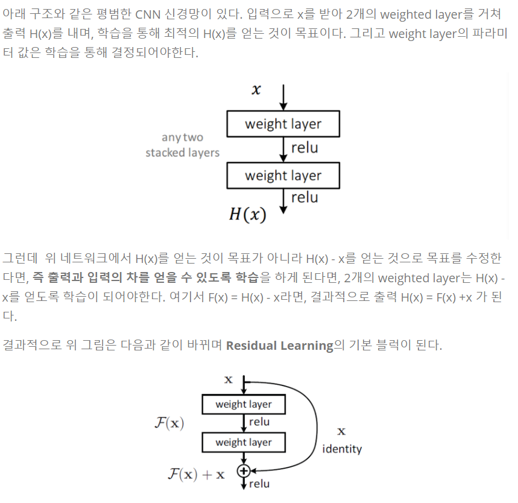
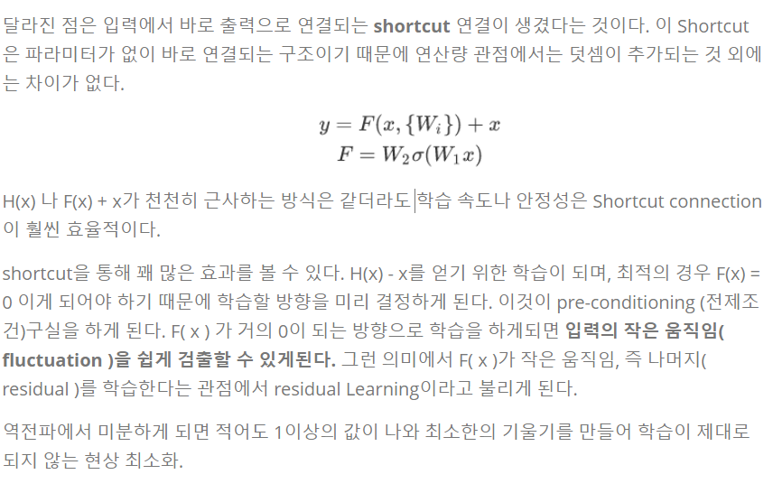
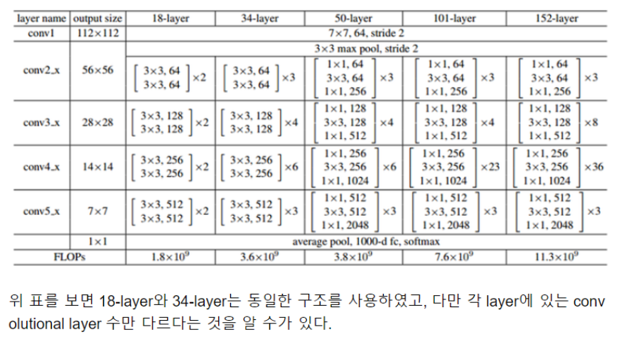
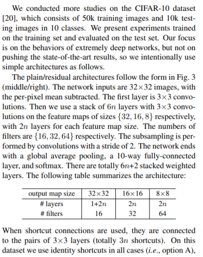
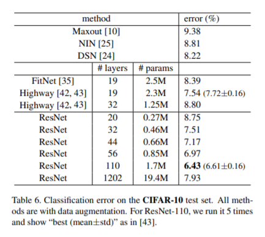

# ResNet20


### Residual Learning

> 깊은 신경망에서 **degradation problem** 발생 
>
> 
>
> 





### 구현

핸드폰이나 드론에 쓰이는 작은 모델을 만들어보려고 ResNet20 구현



데이터는 CIFAR10 을 사용했고 논문을 바탕으로 만들었다.



옵티마이저를 SGD에서 Nadam으로 바꿨다. 모멘텀 기반 옵티마이저일 뿐만 아니라 정확도를 높여보려고 수정했다.

 훈련 정확도 91% 검증 정확도 76% -> 과대적합 

테스트 정확도 74%

```
Model: "model"
__________________________________________________________________________________________________
Layer (type)                    Output Shape         Param #     Connected to                     
==================================================================================================
input_1 (InputLayer)            [(None, 32, 32, 3)]  0                                            
__________________________________________________________________________________________________
zero_padding2d (ZeroPadding2D)  (None, 34, 34, 3)    0           input_1[0][0]                    
__________________________________________________________________________________________________
conv2d (Conv2D)                 (None, 32, 32, 16)   448         zero_padding2d[0][0]             
__________________________________________________________________________________________________
batch_normalization (BatchNorma (None, 32, 32, 16)   64          conv2d[0][0]                     
__________________________________________________________________________________________________
activation (Activation)         (None, 32, 32, 16)   0           batch_normalization[0][0]        
__________________________________________________________________________________________________
conv2d_1 (Conv2D)               (None, 32, 32, 16)   2320        activation[0][0]                 
__________________________________________________________________________________________________
batch_normalization_1 (BatchNor (None, 32, 32, 16)   64          conv2d_1[0][0]                   
__________________________________________________________________________________________________
activation_1 (Activation)       (None, 32, 32, 16)   0           batch_normalization_1[0][0]      
__________________________________________________________________________________________________
conv2d_2 (Conv2D)               (None, 32, 32, 16)   2320        activation_1[0][0]               
__________________________________________________________________________________________________
batch_normalization_2 (BatchNor (None, 32, 32, 16)   64          conv2d_2[0][0]                   
__________________________________________________________________________________________________
add (Add)                       (None, 32, 32, 16)   0           batch_normalization_2[0][0]      
                                                                 activation[0][0]                 
__________________________________________________________________________________________________
activation_2 (Activation)       (None, 32, 32, 16)   0           add[0][0]                        
__________________________________________________________________________________________________
conv2d_3 (Conv2D)               (None, 32, 32, 16)   2320        activation_2[0][0]               
__________________________________________________________________________________________________
batch_normalization_3 (BatchNor (None, 32, 32, 16)   64          conv2d_3[0][0]                   
__________________________________________________________________________________________________
activation_3 (Activation)       (None, 32, 32, 16)   0           batch_normalization_3[0][0]      
__________________________________________________________________________________________________
conv2d_4 (Conv2D)               (None, 32, 32, 16)   2320        activation_3[0][0]               
__________________________________________________________________________________________________
batch_normalization_4 (BatchNor (None, 32, 32, 16)   64          conv2d_4[0][0]                   
__________________________________________________________________________________________________
add_1 (Add)                     (None, 32, 32, 16)   0           batch_normalization_4[0][0]      
                                                                 activation_2[0][0]               
__________________________________________________________________________________________________
activation_4 (Activation)       (None, 32, 32, 16)   0           add_1[0][0]                      
__________________________________________________________________________________________________
conv2d_5 (Conv2D)               (None, 32, 32, 16)   2320        activation_4[0][0]               
__________________________________________________________________________________________________
batch_normalization_5 (BatchNor (None, 32, 32, 16)   64          conv2d_5[0][0]                   
__________________________________________________________________________________________________
activation_5 (Activation)       (None, 32, 32, 16)   0           batch_normalization_5[0][0]      
__________________________________________________________________________________________________
conv2d_6 (Conv2D)               (None, 32, 32, 16)   2320        activation_5[0][0]               
__________________________________________________________________________________________________
batch_normalization_6 (BatchNor (None, 32, 32, 16)   64          conv2d_6[0][0]                   
__________________________________________________________________________________________________
add_2 (Add)                     (None, 32, 32, 16)   0           batch_normalization_6[0][0]      
                                                                 activation_4[0][0]               
__________________________________________________________________________________________________
activation_6 (Activation)       (None, 32, 32, 16)   0           add_2[0][0]                      
__________________________________________________________________________________________________
zero_padding2d_1 (ZeroPadding2D (None, 34, 34, 16)   0           activation_6[0][0]               
__________________________________________________________________________________________________
conv2d_7 (Conv2D)               (None, 16, 16, 32)   4640        zero_padding2d_1[0][0]           
__________________________________________________________________________________________________
batch_normalization_7 (BatchNor (None, 16, 16, 32)   128         conv2d_7[0][0]                   
__________________________________________________________________________________________________
activation_7 (Activation)       (None, 16, 16, 32)   0           batch_normalization_7[0][0]      
__________________________________________________________________________________________________
conv2d_8 (Conv2D)               (None, 16, 16, 32)   9248        activation_7[0][0]               
__________________________________________________________________________________________________
conv2d_9 (Conv2D)               (None, 16, 16, 32)   4640        zero_padding2d_1[0][0]           
__________________________________________________________________________________________________
batch_normalization_8 (BatchNor (None, 16, 16, 32)   128         conv2d_8[0][0]                   
__________________________________________________________________________________________________
batch_normalization_9 (BatchNor (None, 16, 16, 32)   128         conv2d_9[0][0]                   
__________________________________________________________________________________________________
add_3 (Add)                     (None, 16, 16, 32)   0           batch_normalization_8[0][0]      
                                                                 batch_normalization_9[0][0]      
__________________________________________________________________________________________________
activation_8 (Activation)       (None, 16, 16, 32)   0           add_3[0][0]                      
__________________________________________________________________________________________________
conv2d_10 (Conv2D)              (None, 16, 16, 32)   9248        activation_8[0][0]               
__________________________________________________________________________________________________
batch_normalization_10 (BatchNo (None, 16, 16, 32)   128         conv2d_10[0][0]                  
__________________________________________________________________________________________________
activation_9 (Activation)       (None, 16, 16, 32)   0           batch_normalization_10[0][0]     
__________________________________________________________________________________________________
conv2d_11 (Conv2D)              (None, 16, 16, 32)   9248        activation_9[0][0]               
__________________________________________________________________________________________________
batch_normalization_11 (BatchNo (None, 16, 16, 32)   128         conv2d_11[0][0]                  
__________________________________________________________________________________________________
add_4 (Add)                     (None, 16, 16, 32)   0           batch_normalization_11[0][0]     
                                                                 activation_8[0][0]               
__________________________________________________________________________________________________
activation_10 (Activation)      (None, 16, 16, 32)   0           add_4[0][0]                      
__________________________________________________________________________________________________
conv2d_12 (Conv2D)              (None, 16, 16, 32)   9248        activation_10[0][0]              
__________________________________________________________________________________________________
batch_normalization_12 (BatchNo (None, 16, 16, 32)   128         conv2d_12[0][0]                  
__________________________________________________________________________________________________
activation_11 (Activation)      (None, 16, 16, 32)   0           batch_normalization_12[0][0]     
__________________________________________________________________________________________________
conv2d_13 (Conv2D)              (None, 16, 16, 32)   9248        activation_11[0][0]              
__________________________________________________________________________________________________
batch_normalization_13 (BatchNo (None, 16, 16, 32)   128         conv2d_13[0][0]                  
__________________________________________________________________________________________________
add_5 (Add)                     (None, 16, 16, 32)   0           batch_normalization_13[0][0]     
                                                                 activation_10[0][0]              
__________________________________________________________________________________________________
activation_12 (Activation)      (None, 16, 16, 32)   0           add_5[0][0]                      
__________________________________________________________________________________________________
zero_padding2d_2 (ZeroPadding2D (None, 18, 18, 32)   0           activation_12[0][0]              
__________________________________________________________________________________________________
conv2d_14 (Conv2D)              (None, 8, 8, 64)     18496       zero_padding2d_2[0][0]           
__________________________________________________________________________________________________
batch_normalization_14 (BatchNo (None, 8, 8, 64)     256         conv2d_14[0][0]                  
__________________________________________________________________________________________________
activation_13 (Activation)      (None, 8, 8, 64)     0           batch_normalization_14[0][0]     
__________________________________________________________________________________________________
conv2d_15 (Conv2D)              (None, 8, 8, 64)     36928       activation_13[0][0]              
__________________________________________________________________________________________________
conv2d_16 (Conv2D)              (None, 8, 8, 64)     18496       zero_padding2d_2[0][0]           
__________________________________________________________________________________________________
batch_normalization_15 (BatchNo (None, 8, 8, 64)     256         conv2d_15[0][0]                  
__________________________________________________________________________________________________
batch_normalization_16 (BatchNo (None, 8, 8, 64)     256         conv2d_16[0][0]                  
__________________________________________________________________________________________________
add_6 (Add)                     (None, 8, 8, 64)     0           batch_normalization_15[0][0]     
                                                                 batch_normalization_16[0][0]     
__________________________________________________________________________________________________
activation_14 (Activation)      (None, 8, 8, 64)     0           add_6[0][0]                      
__________________________________________________________________________________________________
conv2d_17 (Conv2D)              (None, 8, 8, 64)     36928       activation_14[0][0]              
__________________________________________________________________________________________________
batch_normalization_17 (BatchNo (None, 8, 8, 64)     256         conv2d_17[0][0]                  
__________________________________________________________________________________________________
activation_15 (Activation)      (None, 8, 8, 64)     0           batch_normalization_17[0][0]     
__________________________________________________________________________________________________
conv2d_18 (Conv2D)              (None, 8, 8, 64)     36928       activation_15[0][0]              
__________________________________________________________________________________________________
batch_normalization_18 (BatchNo (None, 8, 8, 64)     256         conv2d_18[0][0]                  
__________________________________________________________________________________________________
add_7 (Add)                     (None, 8, 8, 64)     0           batch_normalization_18[0][0]     
                                                                 activation_14[0][0]              
__________________________________________________________________________________________________
activation_16 (Activation)      (None, 8, 8, 64)     0           add_7[0][0]                      
__________________________________________________________________________________________________
conv2d_19 (Conv2D)              (None, 8, 8, 64)     36928       activation_16[0][0]              
__________________________________________________________________________________________________
batch_normalization_19 (BatchNo (None, 8, 8, 64)     256         conv2d_19[0][0]                  
__________________________________________________________________________________________________
activation_17 (Activation)      (None, 8, 8, 64)     0           batch_normalization_19[0][0]     
__________________________________________________________________________________________________
conv2d_20 (Conv2D)              (None, 8, 8, 64)     36928       activation_17[0][0]              
__________________________________________________________________________________________________
batch_normalization_20 (BatchNo (None, 8, 8, 64)     256         conv2d_20[0][0]                  
__________________________________________________________________________________________________
add_8 (Add)                     (None, 8, 8, 64)     0           batch_normalization_20[0][0]     
                                                                 activation_16[0][0]              
__________________________________________________________________________________________________
activation_18 (Activation)      (None, 8, 8, 64)     0           add_8[0][0]                      
__________________________________________________________________________________________________
global_average_pooling2d (Globa (None, 64)           0           activation_18[0][0]              
__________________________________________________________________________________________________
dense (Dense)                   (None, 10)           650         global_average_pooling2d[0][0]   
==================================================================================================
Total params: 295,306
Trainable params: 293,738
Non-trainable params: 1,568
```

