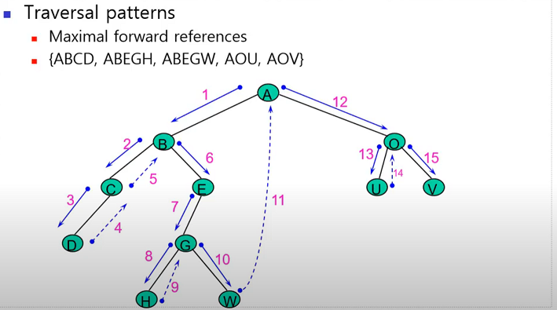

# 연관 규칙

## 1. 연관 규칙 분석

### 1. 연관성 규칙 결과 유형

#### 1. Useful Result

> 마케팅 전략상 유용한 결과가 나온 경우
>
> ex) 주말을 위해, 목요일 소매점에 기저귀를 사러 온 아빠들은 맥주도 함께 구매 -> 주말에 football을 보면서 마심

#### 2. Trivial Result

>기존의 마케팅 전략에 의해 연관성이 높게 나온 경우
>
>ex) 정비 계약을 맺은 소비자들은 많은 설비를 구매 -> 정비 계약은 대개의 경우 따로 맺어지는 것이 아니라, 많은 설비 구입시 함께 제시

#### 3. Inexplicable Result

> #### 의미를 발견하기 위해 많은 고민이 필요한 경우
>
> ex) 새로 철물점을 개업하면, 대개 화장실 문고리를 많이 구매 -> 어떤 의미가 있는지 고민 필요

### 2. 연관성 규칙 생성 과정

#### 1단계 : 지지도(support)

> 빈발(frequent) 항목 집합들에 기초하여 후보 규칙들의 집합 결정
>
> 단일 항목 집합, 2개 항목집합, 3개 항목집합
>
> 통계적 유의성 ( statistic significance)
>
> 전체적인 거래 규모에 대한 값
>
> **값이 클수록 자주 발생하는 거래 ( 한 항목 거래 건수 / 총 항목 거래 건수)**
>
> 지지도에 의해 결정
>
> 대표 알고리즘 : **apriori **알고리즘
>
> -> A와 B가 동시에 장바구니에 담길 확률 = support

### * ariori 알고리즘 원리

### * ariori 알고리즘 설명

- Database를 통해 모든 항목을 포함한 집합군 검색 {A, B, C, D, E}
- 앞의 표에서 최소지지도 2
- 단일항목 지지도 계산 -> L1에서 {D} 제거
- {D} 를 제외한 2개 항목 집합군을 생성한 후 지지도 계산 -> L2에서 {A, B}, {A, E} 제거
- 3개 항목 집합군 생성 -> {A, B, C}, {A, B, E}, {A, C, E} 는 {A, B} = 1, {A, C} = 1, {A,E} = 1 이므로 후보군에서 제외

#### 2단계 : 신뢰도 (confidence)

> 규칙의 불확실성을 평가하기 위해서 신뢰도 사용
>
> 연관 규칙의 강도 ( rule strength )
>
> 선행항목 A를 포함하는 거래 중에서 후행항목 B가 포함된 거래의 비율
>
> A를 구매한 경우, 이 중에서 얼마나 항목 B를 구매할 것인지를 의미
>
> **값이 클수록 A 구매시 B 구매율이 높음**
>
> 최소 기준 신뢰도 값을 설정
>
> -> A가 구매됬을 때 B를 구매하면 어떤 연관성이 있을까 = confidence

#### 3단계 : 향상도 (lift)

> 상대적 관련성은 실제 거래 발생 확률을 각 아이템의 거래가 독립적일 경우에 비해 그 거래가 동시에 발생할 예상기대확률로 나눈것
>
> 항목 B가 임의로 구매될 확률에 비해 항목 A를 구매한 후에 항목 B를 구매할 확률의 비율
>
> 항목 A와 B의 구매 패턴이 독립적인지, 서로 상관성이 있는지 파악
>
> 향상도 > 1
>
> 향상도 : 임의로 조합된 규칙과의 비교를 통해 해당 규칙이 얼마나 실제적인 연관성을 가지고 있는지 파악
>
> **Lift (A=>B) = c (A=>B) / s (A=>B) **
>
> ​				**= 항목 A가 구매된 이후 항목 B가 구매될 확률 / 항목 B가 구매될 확률**

| Lift | 의미                         | 예              |
| ---- | ---------------------------- | --------------- |
| <1   | 두 품목이 서로 음의 상관관계 | 지사제와 변비약 |
| 1 | 두 품목이 서로 독립적인 관계 |과자와 후추|
|>1 | 두 품목이 서로 양의 상관관계 | 빵과 버터 |

#### 의미 파악

연관규칙

> {맥주 -> 콜라} : 지지도 = 50 , 신뢰도 = 1.00 향상도 1.50
>
> 지지도 : 맥주와 콜라를 동시에 구매한 사람은 전체 구매 중 절반이다. (50%)
>
> 신뢰도 : 맥주를 구매한 사람들은 모두 콜라도 같이 구매한다.(100%)
>
> 향상도 : 맥주 구매 시 콜라를 구매하게 될 가능성은 그냥 콜라를 구매할 때보다 1.5배나 높아진다.

### 2. 고려사항

- 신뢰도 값이 크면 좋지만 신뢰도가 크다고 최선의 연관성 규칙이라고 볼 수는 없음
  - 두 항목의 기본적인 구매율이 어느 정도 수준이 되어야만 의미가 있음
  - 즉, 지지도가 어느 정도 수준에 도달해야만 한다.

- 신뢰도와 지지도는 자주 구매되는 항목에 대해서는 연관성 때문이 아니라 우연히 높게 나올 수도 있음
  - Lift 확인

- 신뢰도가 높을 경우에는 X => Y 에서 항목 Y의 확률이 커야지 이 연관성 규칙이 의미가 있음
  - Lifit 값이 1보다 커야 유용한 정보가 됨

### 3. 연관 규칙 장점과 단점

#### 1. 장점

- 수 많은 품목 간에 유의한 연관성을 갖는 구매 패턴을 찾아주고, 이를 바탕으로 또 다른 연구 가설을 탐지할 수 있는 가능성 제공
- 자료구조와 계산과정이 간단하며, 결과가 명확하고 이해하기 쉬움
- 사전에 특별한 분석 방향이나 목적이 없는 경우, 비 목적성 데이터 마이닝 분석기법으로 매우 효과적임

#### 2. 단점

- 연관 규칙에서 얻어지는 결과가 상당히 많기 때문에 실무적인 활용도가 떨어질 수 있음
- 항목의 수를 결정하기 어려움ㄴ
- 드물게 발생하는 항목에 대해서 처리가 어려움
- DBMS 등과 같은 전산화 작업이 없을 시는 동일한 거래를 추적하기가 어려움
- 항목의 수가 증가하면 계산시간이 급격히 증가

## 2. 순차 패턴 분석 ( Sequence Association Rules Discovery)

- 한 트랜잭션 안에서 발생하는 항목들 간의 연관 규칙에 시간의 변이를 추가한 방법

-  A ---> B : A 라는 사건이 발생한 후 B가 발생

  > 수강 신청 : 웹 디자인 (1학기) --> 웹 프로그래밍 (2학기) --> 정보 시스템 프로젝트 (3학기)
  >
  > 주가 변동 패턴 : 삼성전자 주가 상승 --> LG전자 주가 상승 --> 보해양조 주가 상승
  >
  > 구매 패턴  : 컴퓨터 --> 프린터 --> 화상캠 -->?
  >
  > 환자 치료에서 진료 및 투약 패턴 

## 3. 순회 패턴 탐사 ( Path Traveling behavior : Web Mining)

- Web과 같은 분산된 정보환경 하에서의 user access patterns를 이해하기 위한 Mining 기법
  - system 및 screen design 향상에 도움
  - 더 좋은 marketing decision에 도움
- user access patterns 추출
  - user access tree 구성
  - Tree 상의 path 검색을 통하여 user traveling behavior 추출
  - 그 중에서 가치 있는 path 를 user traveling havior 선택

