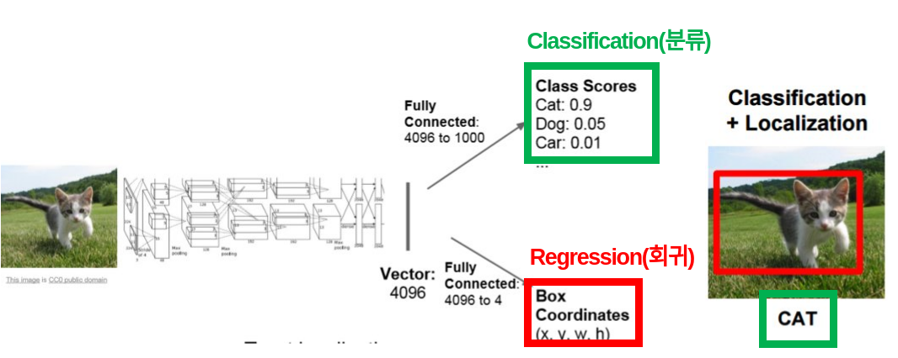
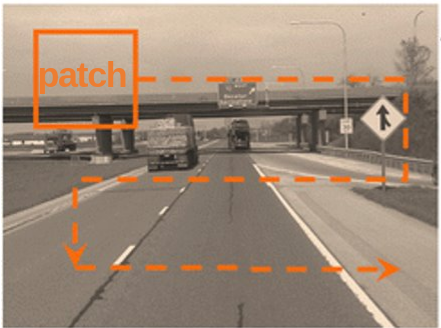

# Object Detection(객체 검출) 이란?

> Object detection(객체 검출)은 입력 영상이 주어질 때, 영상 내에 존재하는 모든 카테고리에 대해서 classification(분류)과 localization(지역화)를 수행
>
> **object detection = classification + localization**
>
> Localization = bounding box를 찾는 regression(회귀)
>
> classification =  bounding box 내 물체가 무엇인지 분류

입력 영상에 따라 존재하는 물체의 개수가 일정치 않고, 0~N개로 변하기에 난이도가 높은 문제입니다.

## 전통적인 object detection

전통적인 computer vision, image processing에서의 object detection

가장 간단히 생각해 볼 수 있는 방법은 **물체가 존재할 수 있는 모든 크기의 영역에 대해 sliding window 방식으로 이미지를 모두 탐색**하는 방식입니다. 사용자가 patch(영역)의 크기를 지정해 모든 영역을 탐색합니다.

그렇지만 이 방식은 탐색 영역의 수가 너무 많고, 겹치는 patch에 대해 feature(특징)를 공유하지 않아 computational cost(연산 시간, 비용)이 많이 소모됩니다.

> 가장 간단한 방법 - sliding window

## semantic segmentation

Object detection과 유사한 문제로는 semantic segmentation 문제가 존재합니다. semantic segmentation은 각 픽셀에 대해 클래스를 정해주는 문제입니다. 각 픽셀마다 클래스를 예측하기에 semantic segmentation은 dense prediction이라고도 불립니다.

Semantic segmentation은 같은 클래스의 instance(물체)를 구별하지 않지만, instance segmentation의 경우 같은 class의 다른 instance(물체)를 구분합니다.

> 각 task별 차이점

