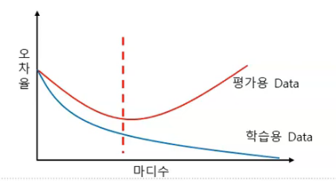
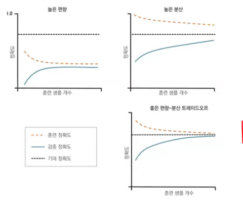
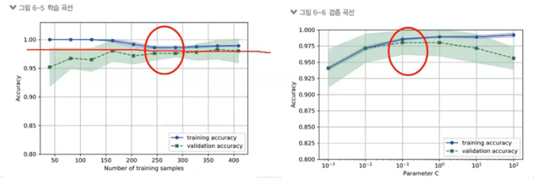

# 과소 과대 적합

### 과적합(overfitting)

- 학습용 데이터에 완전히 적합
- 학습용 집합에서 잡음(noise)도 모형화하기 때문에 평가용 집합에서 전체 오차는 일반적으로 증가

### 모델 개발의 목적

- 학습용 Data에서는 높은 성과 => 평가용 Data에서는 낮은 성과 ( x )
- 현재 데이터의 설명 => 미래 데이터 예측 ( O )

\> 오차율이 아니라 정확도가 y 축 레이블이 되면 그래프가 뒤집혀 출력된다.

\> 학습용 데이터와 평가용 데이터의 가장 적은 오차율, 높은 정확도를 구하려면 두 데이터가 갈라지는 부분의 마디를 캐치 

## 과적합 문제

### 과소적합 ( 높은 편향 )

- 훈련, 검증 정확도 모두 낮음
- 학습곡선
- 데이터가 작거나 많이 돌리지 않았다.

### 과대 적합(높은 분산)

- 훈련 데이터에 비해 모델이 너무 복잡할 경우
- 검증곡선
- 너무 많이 훈련을 돌려 훈련 데이터에만 맞아지는 경우

### 학습곡선 (Learning Curve)

- 샘플 데이터의 수에 따른 정확도 변화

### 검증 곡선 (Validation Curve)

- 하이퍼 파라미터에 따른 정확도

(첫번째) 데이터가 작아서 과소 적합부분이 보인다. \> 훈련 데이터 개수를 늘려야한다.

(두번째) 훈련 데이터에 적합이 되버린다. 두 선의 분기가 되기 전의 점이 최대 정확도

파이썬에서는 가치치기 개수에 따라서 ( depth) 

## 과적합 방지

### 성장 멈추기 (stopping Tree Growth)

- 나무 모델을 성장시키면서 특정 조건에서 성장을 중단
- 나무모델의 깊이 : 복잡도 파라미터
- 노드 내의 최소 관측치의 수
- 불순도의 최소 감소량
  - CHAID 에서 사용
  - 나무모델 생성시에 통계적으로 유의하지 않으면 종료
  - 가지치기 사용하지 않고 종료

=================>>> 하지만 잘 안쓰인다.

### 가지치기 ( Pruning the Tree)

- 나무 모델 생성 후 필요없는 가지 제거
- 성장을 멈추기 보다 더 성능 우수
- C4.5 : 학습 데이터를 이용하여 나무 모델 성장과 가지치기에 사용
- CART : 학습 데이터는 나무모델 성장에, 검증 데이터는 가지치기에 사용

====> 처음부터 다 한 후 가지치기로 골라낸다.

