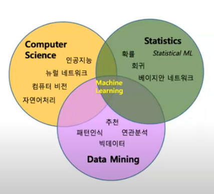
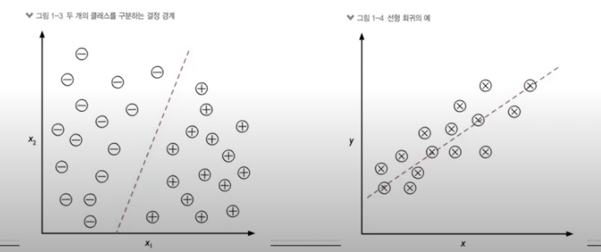
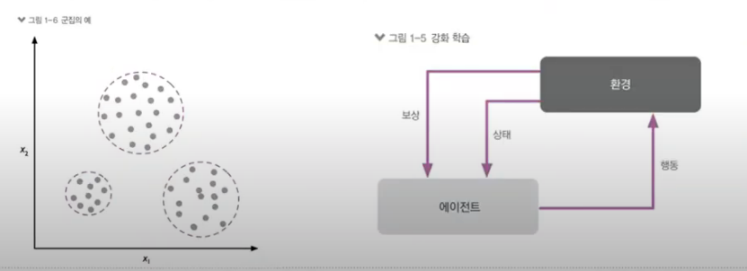
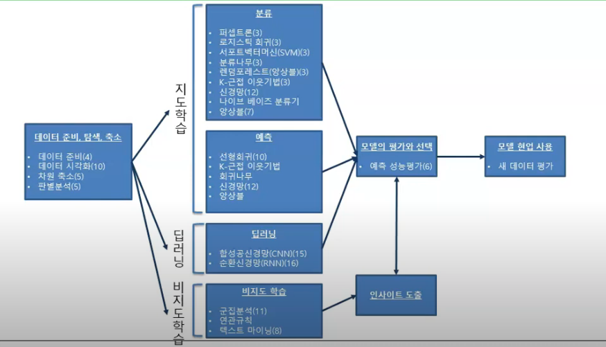
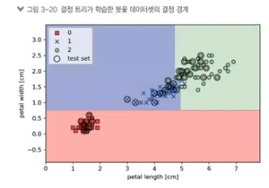
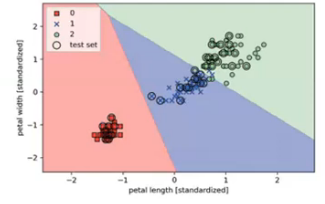
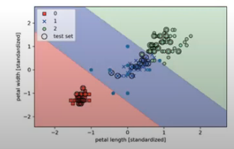
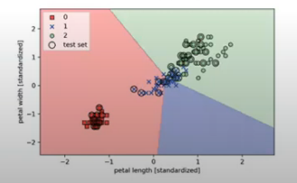

# 기계학습 기초

## 기계 학습의 차이

### 통계( 통계학 )

- **표본 데이터**를 이용하여 모집단에 대해 **추론**

### 기계학습 ( 컴퓨터공학 )

- **전체 데이터**를 이용해 개별값 **예측**
- 기존 데이터로 모델을 학습시킨 후 새로운 데이터를 입력했을 때 예측값을 알아내기 위한 목적

### 데이터 마이닝(경영)

- 가지고 있는 데이터에서 일정한 패턴이나 특성을 발견
- 데이터 베이스의 지식 발견부분의 **분석 절차**

## 지도학습의 목적

- 예측 변수를 기반으로 결과를 분류하거난 예측
- 분류 : 목표 변수가 범주형 변수
- 예측 : 목표 변수가 수치형 변수

## 분석 방법

- 비지도학습
  - 데이터가 어떻게 구성되었는지를 알아내는 문제
- 강화학습
  - 어떤 환경 안에서 정의된 에이전트가 현재의 상태를 인식하여, 선택 가능한 행동들 중 보상을 최대화하는 행동 혹은 행동 순서를 선택하는 방법

## 분석방법 로드맵

- 차원축소 = 변수가 너무 많으면 PCA 같은 것으로 차원 축소 // 전처리

## 분류 분석 방법 차이

#### 데이터 결정 경계

- 의사 결정 트리

- 로지스틱 회귀 모델

- SVM 분류기 ( 소프트 벡터 머신)

- 퍼셉트론 모델

