# 기계학습 분석 절차

## 데이터 분석 절차 방법

### SEMA

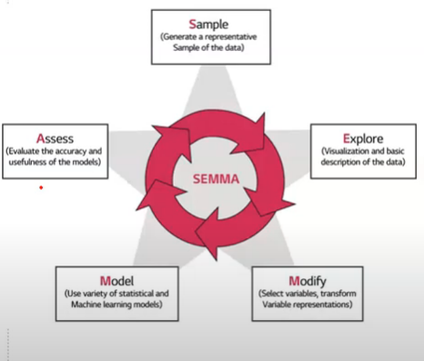

- SAS의 SEMA
- 표본 추출 Sampling
- 데이터 탐색 Exploration
- 데이터 변환 (Modification) 및 변수 선정
- 데이터 모델링 (Modeling)
- 모형 평가 Assessment

### CRISP - DM

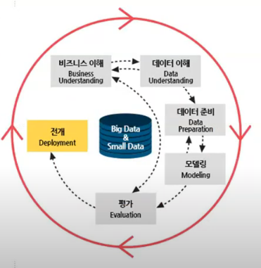

- 비즈니스 이해
- 데이터 이해
- 데이터 준비 및 특징 엔지니어링
- 검증과정을 포함한 모델 프로토타이핑
- 모델 설치

### Python 기계학습 데이터 분석 절차

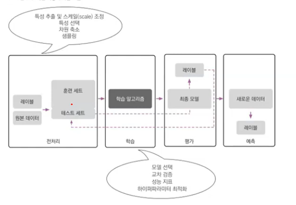

- 하이퍼파라미터 최적화 !! 옵션을 자동으로 찾아내준다. 

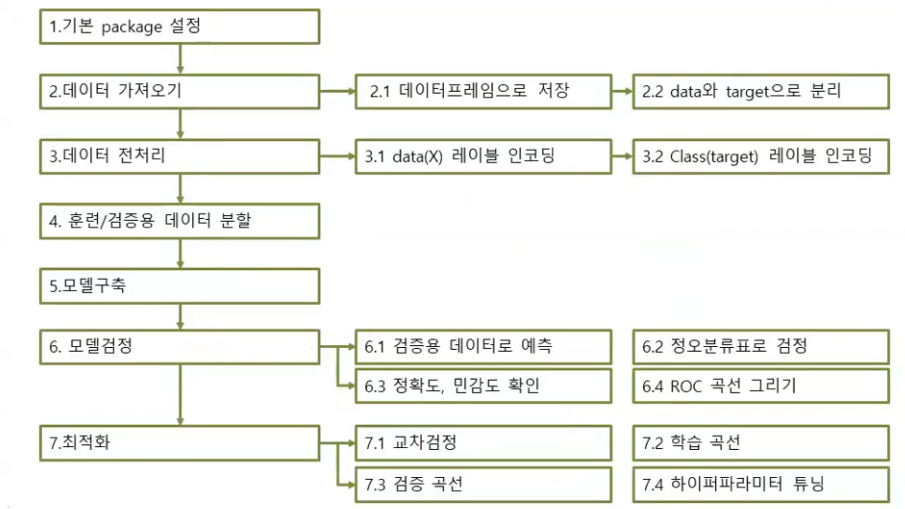

2.2 x와 y를 분리

3.1 문자형 변수 -> 숫자형 / 연속형 변수 -> 표준화... 

# 데이터분석 절차

## 범주형 자료를 숫자로 변환

### 순서형 변수일 때

- onetime -> 1 twotime -> 2   ..... 

### 범주형 변수일 때

- OneHotEncoder
  - 요일
- LabelEncoder

## 데이터 정규화(표준화)

- StandardScaler

- 숫자형 자료를 표준화로 변환
- 결정나무, 랜덤 포레스트, 나이브 베이즈 분류 : 원본 데이터 그대로 유지
- 로지스틱 회귀분석, 회귀분석, 인공신경망 : 표준화 후 분석
- 군집 분석의 경우 정규화 필요

## 불균형한 클래스 다루기

- 희소 사건에 대한 오버 샘플링
- 관심 있는 데이터가 희귀할 경우 
- 언더 샘플링 : 작은 데이터에 맞춤
- 오버 샘플링 : 큰 쪽 데이터에 맞춤
- SMOTE : 작은 쪽 샘플과 유사한 샘플을 찾아서 (K최근접이웃방법) 추가

## 데이터 전처리와 훈련 데이터 분석

- 데이터 속성이 똑같을 경우에는 변환기를 이용해서 한꺼번에 처리할 수 있음
- 그러나 실제 데이터에서는 범주형 변수와 연속 변수가 혼합되어 있는 경우가 대부분임
- 따라서 훈련/ 테스트 셋을 나눈 후에 전처리를 하기보다는 , 전처리 작업 후에 훈련/ 테스트 셋을 구문하는 것이 필요

### 훈련 및 검증용 세트로 분리

- train_test_split
- test_size : 테스트 세트 비율
- random_state : 무작위 시드 번호
- stratify = y : 결과 레이블의 비율대로 분리

## 모델 훈련

- 모델

## 모델 검증

- 훈련된 모델을 이용해 테스트 데이터 검정 (SVM)
- 정오분류표(confusion matrix)
- 정확도 정밀도 재현율 등 (accuracy_score , precision_score , recall_score. ...)

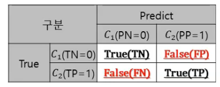

confusionMatrix>>>

## 모델 검정

- ROC (receiver operating characteristic)
  - 보통 1- 특이도로 계산하기 떄문에 민감도(TPR) 높고, 1 - 특이도(FPR)는 낮을 수록 좋은 모델

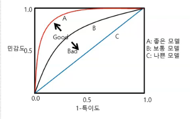

- Pipeline을 이용한 효과적인 워크 플로
  - 파이프 라인으로 변환기와 추정기 연결하기
  - 여러 개의 변환 단계를 거쳐야 할 경우에 사용

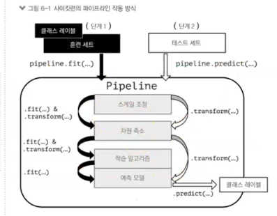

-> 하이퍼 파라메터 할 때는 쓴다. 

## 최적화

- 교차 검정 ( Cross Validation )
  - 모델의 성능을 검증하기 위한 방법
  - 홀드아웃 교차검정
  - K-fold 교차 검정

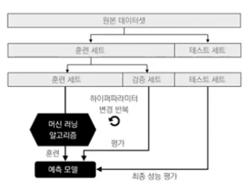

---> 홀드아웃 교차 검증

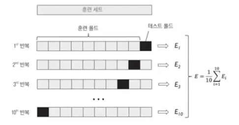

----> K-fold 교차 검증 ( 10 fold  많이 쓰임 )

==> 데이터가 과적합 되었는지! 신뢰도 분석

- 과적합 (overfitting)
  - 학습용 데이터에 완전히 적합
  - 학습용 집합에서 잡음도 모형화하기 때문에 평가용 집합에서 전체 오차는 일반적으로 증가

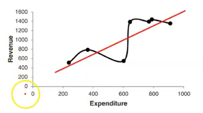

----> 학습 데이터에 특화되버렸다. 

- 모델 개발의 목적
  - 학습용 Data에서는 높은 성과 --> 평가용 Data에서는 낮은 성과 ( X )
  - 현재 데이터의 설명 --> 미래 데이터 예측 ( O )

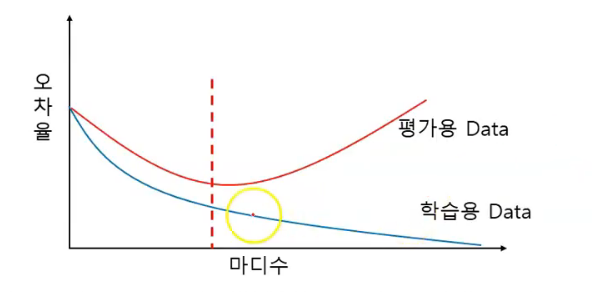

- 과소 적합( 높은 편향 )
  - 훈련, 검증 정확도 모두 낮음
  - 학습 곡선
  - 데이터에 덜 매칭됬다.
  - 예측률이 높은가 

- 과대 적합 (높은 분산)
  - 훈련 데이터에 비해 모델이 너무 복잡한 경우
  - 검증 곡선
  - 갭이 크다. 

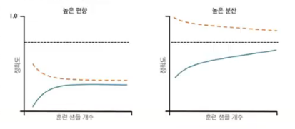

- 하이퍼 파라미터 튜닝

  - GridSearchCv 

  - 그리드 서치를 사용한 머신러닝 모델 세부 튜닝

  - 기계학습 모델의 성능을 결정하는 하이퍼 파라미터 튜닝

    