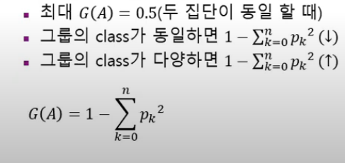
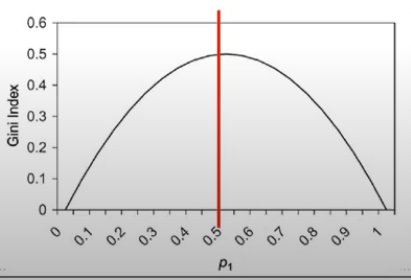
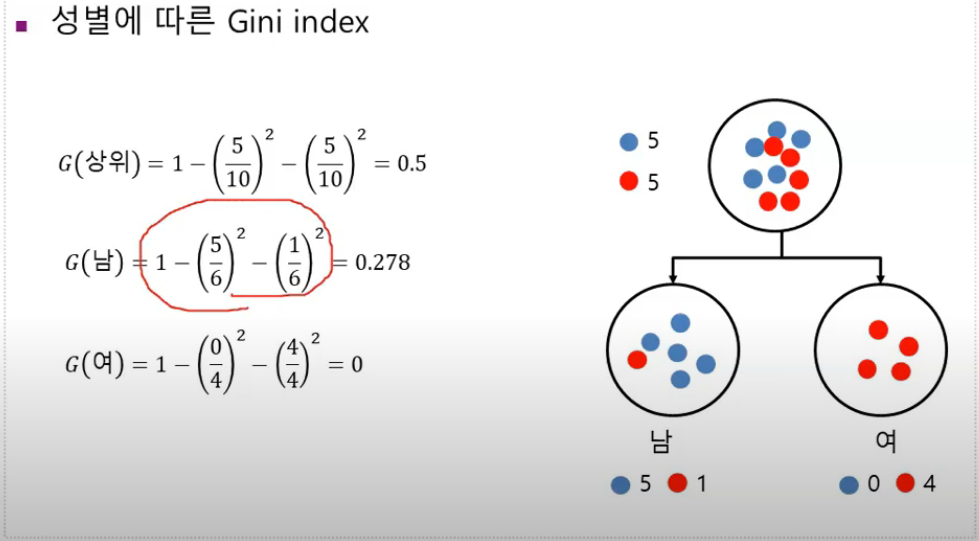

# CART

## Classification And Regression Tree

- 종류 : 분류 나무, 회기나무 가능
- 불순도 알고리즘 : Gini 지수    -  불확실성 up or down 
- 분리 : 이지 분리(binary split)
- 가지치기 : 학습 데이터를 이용하여 나무를 성장시키고, 검증용 데이를 이용하여 가지치리
- 2번 복원 추출했을 때 나올 수 있는 확률

데이터가 동일할 경우 지니지수 0.5

두 그룹이 완전히 나누어 떨어지면 0

0에 가까울 수록 좋다. 

