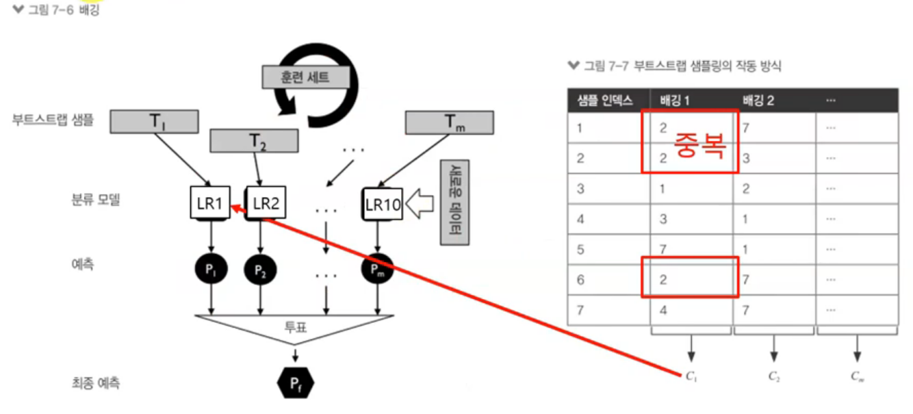
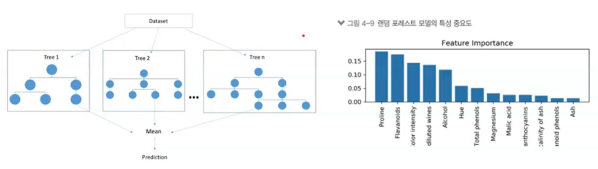
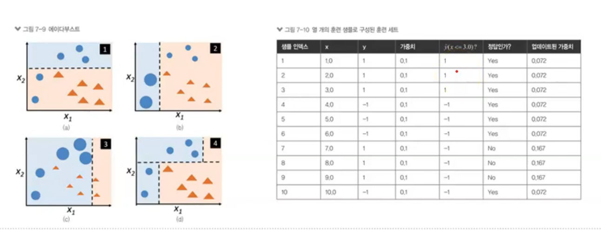

# 앙상블 학습

>1. 앙상블 학습이란
>2. 과반수 투표 분석
>3. 배깅 분석
>4. 랜덤 포레스트 분석
>5. 부스팅 분석

## 1. 앙상블 학습이란

### 목적

- 여러 분류기( 모델 )를 하나의 메타 분류기로 연결( 통합한다는 의미가 강하다) 하여 개별 분류기보다 더 좋은 일반화 성능을 달성

### 방법

- 여러 분류 알고리즘 사용 : 다수결 투표
- 하나의 분류 알고리즘 이용 : 배깅(bagging), 부스팅 (boosting)

### 종류

- 투표 : 동일한 훈련세트
- 배깅 : 훈련 샘플에서 알고리즘 마다 별도의 훈련 세트 추출
  - 랜덤포레스트 : 의사결정 나무
- 부스팅 : 샘플을 뽑을 때 잘못 분류된 data 50%를 재학습, 또는 가중치 이용

### 과반수 투표

- 방법
  - 동일한 훈련세트로 모델 구축

/09_5week/weekend/README.assets/image-20200928182452647.png)

>  최종 예측은 각 훈련 모델에서 예측한 값들을 모으고 투표하여 다수결로 결정한다.
>
>  훈련 세트는 하나만 이용한다. 
>
>  여러 모델에 하나의 데이터를 적용해본다.
>
>   

### 배깅

- 방법
  - 훈련 샘플에서 알고리즘 마다 별도의 훈련 세트를 추출해서 모델 구축 
  - 부트스트랩 실시: 데이터로 부터 복원 추출을(중복 허용)을 이용

> **하나의 분류 모델**이지만 **여러 개의 옵션**을 준다.
>
> 여러 개의 샘플을 모델에 넣고 돌려 결과값을 얻어내고 다수의 결과값을 가지고 모델을 만들어감
>
> 하나의 데이터 샘플에서 몇 개를 뽑아서 샘플 데이터를 만든다.
>
> 분류 모델을 다양하게 쓸 수 있다. (DT, LR...)
>
> DicisionTree와 관련되어있다.

### 랜덤포레스트

- 방법
  - 배깅의 일종
  - 단일 분류 알고리즘(DT) 사용
  - 포레스트 구축 : 무작위로 예측 변수 선택하여 모델 구축
  - 결과 결합 : 투표(분류) , 평균화 (예측)
  - 나무구조로 표현 ( X ) -> 변수의 중요도 제공 

> 트리에서 숲!
>
> 여러개의 트리들에 들어가는 요인들이 바뀐다. -> 다양한 모델 -> 통합 -> BEST
>
> 예측률은 높일 수 있으나 설명력이 약하다. 왜 그렇게 나오고 어떤 의미가 있나? - 앙상블 목적 자체가 정확도를 높이는 거다.
>
> 중요한 변수를 골라낼 수 있지만 어떤 규칙에 의해 어떻게 만들어 졌다고 골라내기 어렵다 => 통합 모델을 만들어내기 때문

### 부스팅 

- 방법
  - 샘플 뽑을 때 잘못 분류된 data 50%를 재학습
  - AdaBoost : 전체 훈련 샘플 사용하고, 잘못 분류된 data에 가중치

> 데이터 반을 재활용하는 방법
>
> 가장 정확도가 높게 나오는 것은 부스팅  but 실제 시스템에서 사용하기에 복잡하고 어렵다... ( 잘못된 것에 가중치를 준다. )

