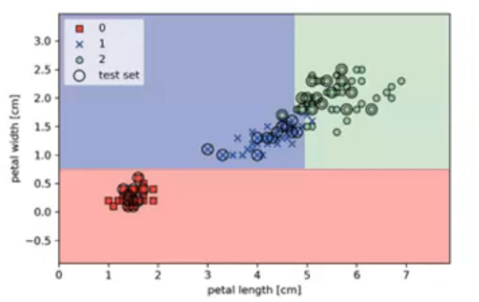
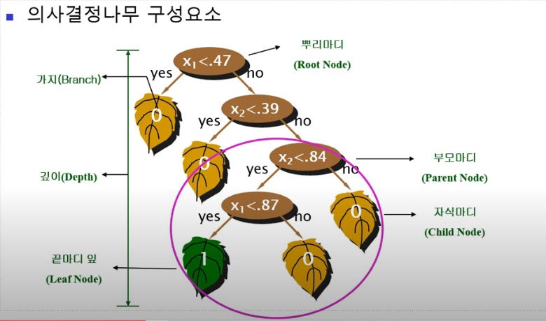
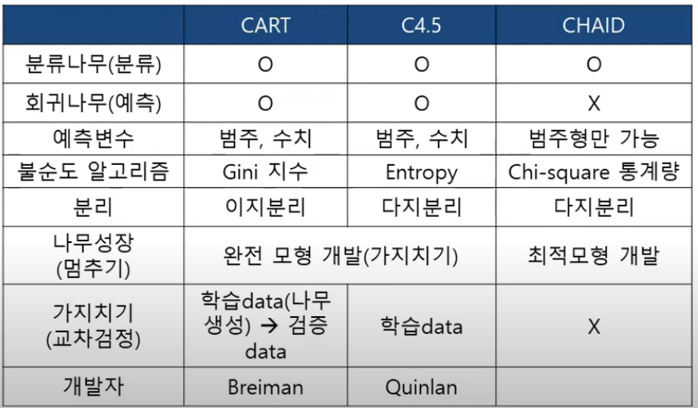

## 의사결정나무( Decision tree)

- 의사결정규칙(decision rule)을 나무 구조로 도표화하여 **분류**(classification)와 **예측**(prediction)을 수행하는 분석 방법

- 적용 분야

  > 은행 대출 : 도산 업체 분류(예측)
  >
  > 카드발급 대상 : 신용 불량자 분류(예측)
  >
  > 통신 : 이탈 고객 분류, 새로운 서비스 대상 고객 선정
  >
  > 쇼핑 : Direct Mailing 대상 고객 선정

### 주요 방법

- Tree and rule 구조
  - 규칙(rule)은 나무 무델로 표현
  - 결과는 규칙으로 표현
- 재귀적 분할 
  - 나무 만드는 과정 -> 계속 쪼개지게 한다.
  - 그룹이 최대한 동질하도록 반복적으로 레코드 하위 그룹으로 분리
- 가지치기
  - 생성된 나무를 자르는 과정 (정교화)
  - 과적합을 피하기 위해 필요없는 가지를 간단히 정리

​				> Decision Tree 특징 

### 재귀적 분할 알고리즘

- CART( Classication And Regression Tree)
- C4.5
- CHAID (Chi - square Automatic Interation Detection)

### 불순도(Impurity) 알고리즘

- 지니 지수
- 엔트로피 지수(Entropu Index), 정보 이익(Information Gain)
- 카이제곱 통계량

#### 분류나무의 장점

- 지도학습(분류 및 예측)의 데이터 마이닝 기법
- 적용 결과에 의해 if - then으로 표현되는 규칙이 생성
- 규칙의 이해가 쉽고 SQL과 같은 DB 언어로 표현
- 좋은 해석력으로 널리 쓰임
- 많은 분야에서는 결정을 내리게 된 이유를 설명하는 능력이 중요함(해석력)
  - 예 : 은행의 대출 심사 결과 부적격 판정이 나온 경우 고객에게 부적격 이류를 설명해야함

어느 규칙이 가장 중요한 규칙인지 알아야 함

규칙(rule)을 어디까지 쓸지 정해야 한다. 

#### 분류나무 (Classification Tree)

- 목표변수 : 범주형(categorical target) - 좋음, 나쁨
- 예측변수 : 범주형, 수치형 가능 --> 표준화 안시켜도 된다.  /// 보통 수치형 데이터는 표준화를 시켜야함

- 재귀적 분할 (Recursive pariting)
  - 그룹이 최대한 동질(순수)하도록 반복적으로 레코드를 하위그룹으로 분리 (순수: 하나의 그룹에 같은 class만 존재)
- 가지치기 (pruning the tree)
  - 과적합을 피하기 위해 필요없는 가지를 간단히 정리

- 분류 알고리즘과 순수도 지표 ( 얼마만큼 그룹을 정확하게 나눠줄 수 있는지 숫자로 표현 )
  - CART : 지니 지수(Gini index)
  - C4.5 : 엔트로피 지수(Entropy index), 정보 이익, 정보이익비율
  - CHAID : 카이제곱 통계량(Chi - Square static)
- 끝마디 : 소속집단
- 경향(랭킹)도 가능

#### 회기나무 (Regression Tree) 

- 잘 안쓰인다. ( 회기분석, 인공지능 등이 더 잘 분석하기 때문 )

- 목표변수 : 연속 변수(Continuous Variables) - 총구매액, 매출액 -> 값을 예측
- 분류 알고리즘 
  -  CART  F통계량 -분산의 감소량
- 끝마디 : 집단의 평균
- 목표변수의 평균에 기초하여 분리
- 분리의 경계점 근방에서는 예측 오류가 클 가능성

  - 예측일 경우 회기나무보다 신경망 또는 회귀분석이 더 좋음

#### 의사결정 나무의 구성 원리

- 일정기준(나무의 최종 node 수 , 자료 수, 나무의 깊이)에 의해 나무의 모양이 결정
- 의사결정 트리의 가지 분리방법(split), 잘라내기(Prune) 방법에 따라 CHAID, CART, C4.5, QUEST 등 여러가지 알고리즘이 사용
- 분리기준 : 순수도(Purity), 불순도(Impurity) 기준
- 정지규칙 : 더 이상 분리가 일어나지 않고 현재의 마디가 끝마디가 되도록하는 규칙
- 잘라내기 : 지나치게 많은 마디를 가지는 의사결정나무는 새로운 자료에 적용될 때 예측 오차가 매우 클 가능성

#### 의사결정나무분석의 과정

1. 나무 모델 생성
   - 재귀적 분할 방법을 이용하여 나무모델 생성
   - CART(Gini) , C4.5(Entropy) , CHAID (Chi-square) 이용
   
   
2. 과적합 문제 해결 (가지치기)
   - 나무모델 생성하면서 최적모델일 때 stop : CHAID
   - 완전 나무모형 생성 후 가지치기 : CART,C4.5
     - 학습 데이터만 C4.5
     - 학습데이터(나무생성) -> 검증 데이터(가지치기) : CART
3. 검증

- 교차 타당성을 이용한 의사결정 나무 평가

4. 해석 및 예측

