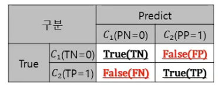
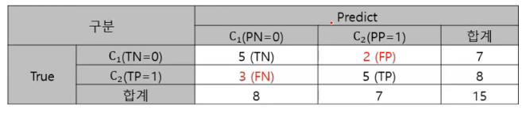
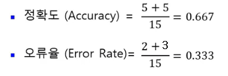
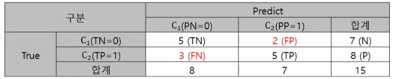
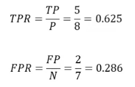
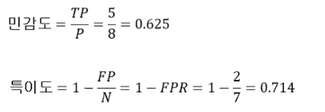
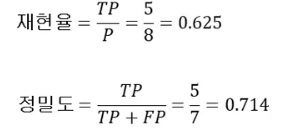
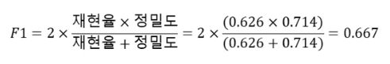
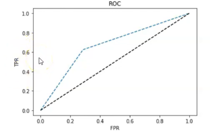

# 모델 검정 and ROC 

## 정오 행렬 (confusion matrix)

- 대칭적 상대적인 표현들

  - 정확도(Accuracy) vs 오류율(Error Rate)  
  - TPR (True Positive Rate) vs FPR ( False Positive Rate)
  - 민감도 vs 특이도
  - 재현율 vs 정밀도

  

- TPR = 민감도 = 재현율 

  - 식이 똑같고 같은 숫자로 나온다.


## 정오 분류표로 검정

```
confmat = pd.DataFrame(confusion_matrix(ydata, y_pred),
						index = ['True[0]','True[1]'],
						columns = ['Predict[0]','Predict[1]'])
```

|         | Predict[0] | Predict[1] |
| ------- | ---------- | ---------- |
| True[0] | 5          | 2          |
| True[1] | 3          | 5          |




### 정확도 vs 오류율

- 정확도  : 클래스 0과 1 모두를 정확하게 분류
- 오류율 : 클래스 0과 1 모두를 정확하게 분류하지 못함






- 정확도는 맞춘 갯수 / 총 갯수 
- 오류율은 틀릿 갯수 / 총 갯수

0 : Negative 

1 : Positive

중요한 변수는 1로 놓고 본다. 

- TN ( True Negative ) / TP (True Positive)
-  PN ( Predict Negative) / PP (Predict Positive)


### 정오 행렬 (Confusiin matrix)

- **TPR** ( True Positive Rate ) : **실제** Class 1 중 잘 맞춘 것  == **민감도** == **재현율**
  - 우리가 관심있는 것을 잘 맞췄는가( 실제값 중에서 잘 맞춘것 )
- **FPR** ( False Positive Rate ) : **실제** Class 0 중 못 맞춘 것
  -  내가 관심이 없는 것 중에 못 맞춘 것 ( 실제 값 중에 못 맞춘 것 )
- **특이도** (Specificity) : **실제** Class 0중에 잘 맞춘것 ( = 1- FPR)
  - 내가 관심이 없는 것 중에 잘 맞춘 것
- **정밀도**( Precision ) : **예측** Class 1 중 잘 맞춘 것
  - 내가 예측한 것 중에 잘 맞춘 것
- **F1** : **실제** 잘 맞춘 것 + **예측** 잘 맞춘 것  ( 재현율 up and 정밀도 up )



\> 나중에 실제값 중에 잘 맞췄나 예측값 중에 잘 맞췄나에 따라 모델을 결정할 수도 있다.










```
classification_report(y_test,y_pred)
```


## 정확도 민감도 확인

- 클래스가 2개일 경우에만 실행 ( 잘못 분류된 샘플의 개수, 정확도는 클래스가 2개 이상에서도 가능)

```
print('잘못 분류된 샘플의 개수 : %d' %(y_test != y_pred).sum())
print('정확도 : %.3f' %accuracy_score(y_test,y_pred))
print('정밀도 : %.3f' %precision(y_true = y_test,y_pred = y_pred))
print('재현율 : %.3f' %recall_score(y_true = y_test,y_pred = y_pred))
print('F1 : %.3f' %f1_score(y_true = y_test, y_pred = y_pred))
```

```
잘못 분류된 샘플의 개수 : 5
정확도 : 0.667
정밀도 : 0.714
재현율 : 0.625
F1 : 0.667
```


## ROC 그래프



\> 검정색 선이 기준선 : 반만 맞춘것 ( 모델을 안돌려도 50%는 맞춘다. )

\> 기준선 보다 얼마만큼 잘 맞추느냐 -> 그래프가 파란색 처럼 좌상향이 되야 잘 맞추는거


```
# decision_function 구현 될때 
fpr, tpr, threshold = roc_curve(y_test, tree.decision_function(X_test))
# decision_function 구현 안될 때
fpr, tpr, threshold = roc_curve(y_test, tree.predict_proba(X_test)[:,1])
```

```
plt.plot(fpr,tpr,'--',label = 'Decision Tree')
plt.plot([0,1],[0,1],'k--',label = 'random guess')
plt.plot([fpr],[tpr],'-r',ms = 10)
plt.xlabel('FPR')
plt.ylable('TPR')
plt.title('ROC')
plt.show()
```

