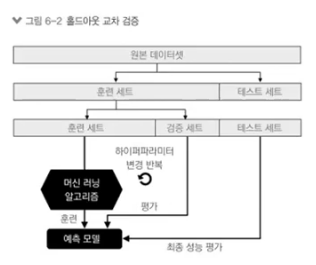
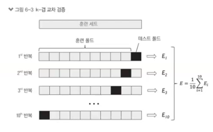
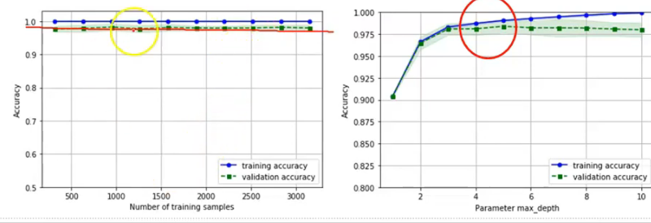

# 최적화

## 교차 검정 ( Cross Validation)

- 모델의 성능을 검증하기 위한 방법
  - 홀드아웃 검정
  - K-fold 검정

- 홀드아웃 검정
  - 훈련 데이터 / 테스트 데이터를 나눈다.
  - 훈련 데이터로 모델을 만든다.
  - 테스트 데이터로 성능 평가

- 문제점 
  - 모델을 변경하는 방법론
  - 최적화 파라미터를 찾기 어렵다. ( max_depth...) 일일이 대입해야한다.

- K-fold 검정

- 방식 
  - 훈련 데이터를 나눈 후 10% 정도를 나눠서 테스트 데이터로 사용 -> 10번 반복
    - 훈련의 검증용 ( 다 만든 후 모델 검증용이 아니다. )
  - 나머지 30% ( 처음에 test / train 나눈 거 ) 최종 테스트

--- > 더 엄격한 방법

- 중간에 훈련 모델을 검증할 필요 -> 모델 변경 여부 확인 
  - 주로 파라미터 검증할 때 사용
  - 최종 모델을 구할 때 파라미터를 조정 ( max_depth 값을 여러번 변경 )
    - 하나의 데이터를 가지고 쓰는 것이 아니고 Cross Validation 데이터를 가지고 바꿔가면서 검증

### 2가지 방법

1. 모델 구축 후 교차 검증을 한다. 

2. 기본 모델을 검증한 다음 최적화를 위해 한번 돌려준다. 
   - 기존 모델과 최적화된 모델을 비교 

- 파이프라인 모델 만들기
  - 파이프라인을 이용하여 최적 모델 만들기
  - 기본 모형은 아무 옵션이 없는 모델로 부터 시작
  - 파라미터 옵션 확인 : pipe_tree.get_params().keys()

- 과적합 문제

  - 검증 곡선으로 과대적합과 과소 적합 조사
    - 과대 적합 : 파라미터가 많음 -> 파라미터 축소
    - 과소적합 : 파라미터가 적음 -> 파라미터 추가

- 학습 곡선 

  - 샘플 데이터의 수에 따른 정확도 변화

- 검증 곡선 

  - 하이퍼 파라미터에 따른 정확도 변화

  

- 하이퍼 파라미터 튜닝 ( 가장 마지막 )
  - 그리드 서치를 사용한 머신러닝 모델 세부 튜닝
  - 기계학습 모델의 성능을 결정하는 하이퍼 파라미터 튜닝