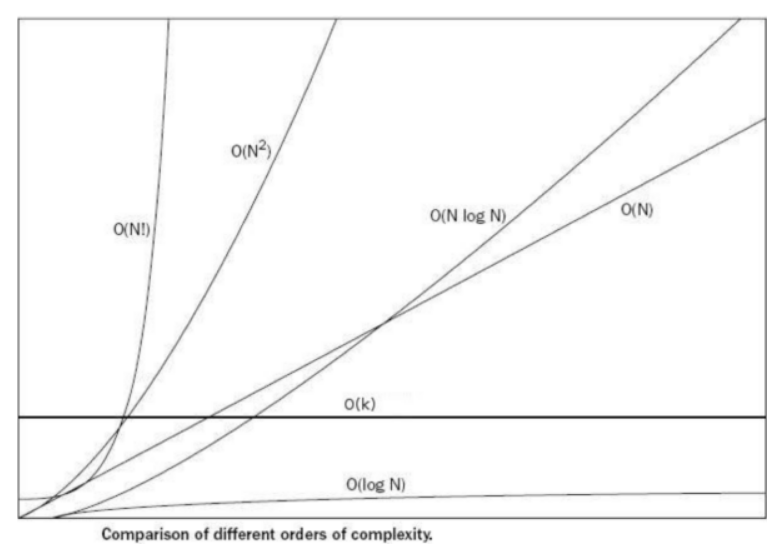
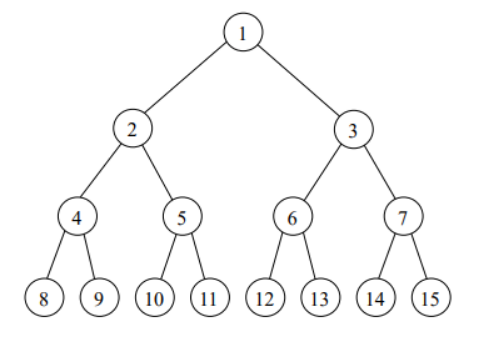

# 데이터 구조( Data Structure)

> 대량의 데이터를 **효율적**으로 관리할 수 있는 데이터 구조, 자료구조라고도 함
>
> 효율적인 데이터를 **처리**하기 위해, 데이터의 **특성**에 따라 체계적으로 데이터를 **구조화**하는 것
>
> 효율적으로 데이터를 관리하는 예
>
> 1. 우편 번호 5자리로 국가의 기초 구역을 제공
>    - 5자리 우편번호에서 앞 3자리는 시,군,자치구를 표기, 뒤 2자리는 일련번호로 구성
> 2. 학생 관리
>    - 학년, 반, 번호를 학생에게 부여해서, 학생부를 관리

# 알고리즘 ( Algorithm)

> 어떤 **문제를 풀기** 위한 **절차 방법**
>
> 어떤 문제에 대해, 특정 **입력**을 넣으면, 원하는 **출력**을 얻을 수 있도록 만드는 프로그래밍
>
> 알고리즘은 프로그래밍으로 되어있고, 결국 컴퓨터가 알아들을 수 있는 비트로 표현


## 알고리즘 복잡도 표현

### 알고리즘 복잡도 계산이 필요한 이유

- 하나의 문제를 푸는 알고리즘은 다양할 수 있다.
- 다양한 알고리즘 중 어느 알고리즘이 더 좋은지 분석하기 위해, 복잡도를 정의하고 계산함
  - 메모리를 많이 사용하는지, 실행 시간이 빠른지

### 알고리즘 복잡도 계산 항목

1. 시간 복잡도 : 알고리즘 실행 속도 (  반복문이 주요 요소 => 많아지면 시간 복잡도 증가 )
2. 공간 복잡도 : 알고리즘이 사용하는 메모리 사이즈

### 알고리즘 성능 표기법

- Big O ( 빅오 ) 표기법
  - 알고리즘 최악의 실행 시간을 표기
  - 가장 많이/ 일반적으로 사용함
  - 아무리 최악의 상황이라도 이 정도 성능은 보장한다는 의미
- Ω ( 오메가 ) 표기법
  - 알고리즘 최상의 실행 시간을 표기
- θ ( 세타 ) 표기법 
  - 알고리즘 평균 실행 시간을 표기

### 대문자 O 표기법

- O ( 입력 )
  - 입력 n에 따라 결정되는 시간 복잡도 함수
  - O(1) , O (logn), O(n) ,O (nlogn), O(n^2), O(2^n), O(n!) 로 표기됨
  - 입력 n의 크기에 따라 기하급수적으로 시간 복잡도가 늘어날 수있다.
    -  O(1) < O(logn) < O(n) < O (nlogn) < O(n^2) < O(2^n) < O(n!)
- 단순하게 입력 n에 따라 몇번 실행되는 지를 계산
  - 표현식에서 가장 큰 영향을 미치는 n의 단위로 표기합니다.
  - n이 1이든 100이든, 1000이든 실행을 
    - 무조건 2회 ( 상수회 ), 실행한다. ===> O(1)
    - n에 따라 , n번 , n + 10, 3n + 10 번 실행한다.===>  O(n)
    - n에 따라, n^2 번, n^2 +1000 번, 100n^2  - 1000 번 실행한다. ===> O(n^2)




- 빅 오 입력값 표기 방법
  - 만약 시간 복잡도가 3n^3 + 2n^2 + 3 이라면 가장 큰 차수 3n^3 에 상수 없애고 O(n^3) 으로 표현


---

추가 설명

- 프로그래의 수행 시간은 사용한 프로그래밍 언어, 하드웨어, 운영체제, 컴파일러까지 수 많은 요소에 의해 바뀔 수 있다.
  - 더 빠르게 동작하던 코드가 다른 컴퓨터에서는 더 느리게 동작하는 일 발생 가능

- 알고리즘 수행 시간을 지배하는 것은 반복문이다
  - 따라서 대개 우리는 알고리즘 수행시간을 반복문이 수행되는 횟수로 측정

```c++
// 예시코드 주어진 배열에서 가장 많이 등장하는 숫자를 반환
// 주어진 배열 A에서 가장 많이 등장하는 숫자를 반환한다.
// 만약 두가지 이상 있을 경우 아무것이나 반환
int majority1(const vector<int>& A){
    int N = A.size();
    int majority = -1, majorityCount = 0;
    for (int i = 0; i < N ; ++i){ // ============ for 문 1
        // A에 등장하는 A[i]의 수를 센다.
        int V = A[i],count = 0;
        for (int j = 0; j < N ; ++j){ // # ======== for 문 2  => N ( N ) == N^2 수행시간
            if(A[j] == V){
                ++count;
            }
        }
        // 지금까지 본 최대 빈도보다 많이 출현했다면 답을 갱신한다.
        if (count>majorityCount){
            majorityCount = count;
            majority = V;
            
        }
    }
    return majority;
}
```

- 위 코드는 N^2 수행 시간을 갖는다.


### 선형시간 알고리즘

- 입력의 크기에 대비해 걸리는 시간이 직선으로 비례한다.
- 대게 우리가 찾을 수 있는 알고리즘 중 가장 좋은 알고리즘일 경우가 많다.
- 주어진 입력을 최소한 한 번씩이라도 보기 때문

```c++
// 예시코드
// 길이가 N인 실수 배열 A가 주어질 떄, 각 위치에서의 M이동 평균 값을 구한다.
vector<double> movingAverage2(const vector<double>& A, int M){
    vector<double> ret;
    int N = A.size();
    double partialSum = 0;
    for (int i =0 ; i < M-1; ++i ){ // for문 하나~
        partialSum +=A[i];
        ret.push_back(partialSum / M);
        partialSum -= A[i-M+1];
    }
    return ret;
}
```

- 위 코드는 N 수행 시간을 갖는다.


### 선형 이하 시간 알고리즘

- 이진 탐색이란?

이진 탐색이란 **데이터가 정렬**되어있는 배열에서 특정한 값을 찾아내는 알고리즘이다. 배열의 중간에 있는 임의의 값을 선택하여 찾고자 하는 값 X와 비교한다. X가 중간 값보다 작으면 중간 값을 기준으로 좌측의 데이터들을 대상으로, X가 중간값보다 크면 배열의 우측을 대상으로 다시 탐색한다. 동일한 방법으로 다시 중간의 값을 임의로 선택하고 비교한다. 해당 값을 찾을 때까지 이 과정을 반복한다.

`17` 을 이진 탐색으로 찾아보자.

*{ 17, 28, 43, 67, 88, 92, 100, 200 }*
*중간 값 : 88 -> 작다 -> { 17, 28, 43, 67 }*
*중간 값 : 43 -> 작다 -> { 17, 28 }*
*중간 값 : 28 -> 작다 -> { 17 }*
*중간 값 : 17 -> 종료*

맨 처음 원소의 개수가 8에서 4, 2, 1 으로 반으로 점차 줄어드는 것을 확인할 수 있다.

일반화하여 생각해보자. N개의 크기 배열을 이진 탐색하면 N, N/2, N/4, N/8, … , 1 으로 실행 될 것이다. 여기서 실행된 탐색의 횟수가 시간 복잡도가 될 것이고 그 값을 K라고 한다면, K는 N에 대해 어떻게 나타낼 수 있을까?
1에 2를 K번 곱하면? N이 된다.
2^K = N
K = log2N

즉, 이진 탐색의 시간 복잡도는 O(logN) 이 된다.


### 지수 시간 알고리즘

#### 다항시간 알고리즘

- 변수 N과 N^2  ,그 외 N의 거듭제곱들의 선형 결합으로 이루어진 식들을 다항식이라고 함
- 반복문의 수행횟수를 입력 크기의 다항식으로 표현할 수 있는 알고리즘들
- 대다수 알고리즘들은 다항 시간


#### 지수시간 알고리즘

**재귀 호출 패턴**

아래는 균형 이진 탐색 트리에서 모든 노드의 값을 더하는 간단한 코드입니다.



```
int sum(Node node){
    if(node == null){
        return 0;
    }
    return sum(node.left) + node.value + sum(node.right);
}
```


**재귀호출 패턴분석**

위의 코드가 단지 이진 트리라는 이유로, 또는 재귀호출이라는 이유로 시간복잡도에 로그가 들어간다고 생각하면 안됩니다. 

**실제로 재귀 함수에 분기가 여러 개 존재한다면 수행 시간은 일반적으로 O(분기^깊이)가 됩니다. 즉, 두 개의 분기만 존재하는 재귀함수라면 일반적으로 O(2^깊이)의 시간 복잡도를 가지게 됩니다.**

그렇다면 깊이는 어떻게 될까요? 위의 코드에서 나온 트리는 균형 이진 탐색 트리입니다. 즉, 총 N개의 노드가 있다면 깊이는 대략적으로 log N 의 값을 가지게 됩니다.

그럼 수식에 따라 시간복잡도는 O(2^(log_2 N))이 되는 것을 알 수 있습니다.

하지만 조금 더 살펴보도록 합시다.

결과에 나온 log_2 N 는 과연 무엇을 의미할까요?

*2^(log_2 N) = P* 라고 생각해본다면, 양변에 로그를 취해

*log_2 2^(log_2 N) = log_2 P* 가 됩니다. 그러면 로그의 특징에 따라서,

*log_2 N \* log_2 2 = log_2 P*

*log_2 N = log_2 P*

*N = P*

가 됩니다.

**따라서 총 시간복잡도는 O(N) 이 됩니다.**


---

수행시간 어림 짐작하기

- 어떤 알고리즘이 이 문제를 해결할 수 있는지 알기 위해서는 프로그램을 작성하기 전에 입력의 최대 크기와 알고리즘의 시간복잡도를 보고 수행 시간을 어림짐작할 수 있어야합니다.

**주먹구구식**

> 입력의 크기를 시간 복잡도에 대입해서 얻은 반복문 수행 횟수에 대해 1초당 반복문 수행 횟수가 1억(10^8)을 넘어가면 시간 제한을 초과할 가능성이 있다.

- 하지만 시간 복잡도와 입력의 크기 외의 요소들이 프로그램의 수행 속도를 10배 정도는 쉽게 바꿔 놓기 때문에 충분한 여유를 두는게 좋습니다.
- 고려해야할 요소
  - 시간 복잡도가 프로그램의 실재 수행 속도를 반영하지 못하는 경우 : 빅오 표기법은 최고차항을 제외하고 모두 제거되어있기 때문에 실제 프로그램이 수행하는 반복문의 수는 이 계산의 다섯배나 절반이 될 수도 있다.
  - 반복문 내부가 복잡한 경우 : 반복문 내부가 길거나, 시간이 많이 걸리는 연산( 실수 연산, 파일 입출력 등 )
  - 메모리 사용 패턴이 복잡한 경우 
  - 언어와 컴파일러 차이
  - 구형 컴퓨터를 사용하는 경우


## 알고리즘 설계 Tip

- 일반적으로 CPU 기반의 개인 컴퓨터나 채점용 컴퓨터에서 연산 횟수가 5억을 넘어가는 경우

  - C언어를 기준으로 통상 1 ~ 3초 가량의 시간이 소요됨

  - Python을 기준으로 통상 5 ~ 15초 가량의 시간이 소요됨

    - PyPy의 경우 때때로 C언어보다도 빠르게 동작하기도 함

  - O(*N³*)의 알고리즘을 설계한 경우 N의 값이 5000이 넘는다면 천이백오십억이 연산횟수
    Python 이 1초에 5천만번 정도의 계산을 처리할 수 있다고 하면 약 2500초 정도가 소요됨
    채점용 서버에서는 Python이 1초에 2천만번 정도의 연산만 처리할 수 있다고 가정하고 문제를 접해야함

  - 코딩 테스트 문제에서 시간제한은 통상 1 ~ 5초가량

    이라는 점에 유의

    - 혹여 문제에 명시되어 이씾 않은 경우 대략 5초 정도라고 생각하고 문제를 푸는 것이 합리적임


## 요구사항에 따라 적절한 알고리즘 설계학

- 문제에서 가장 먼저 확인해야 하는 내용은 **시간제한(수행시간 요구사항)**임
- 시간제한이 1초인 문제를 만났을 때 일반적인 기준은 다음과 같습니다
  - N의 범위가 500인 경우: 시간 복잡도가 O(*N³*)인 알고리즘을 설계하면 문제를 풀 수 있음
  - N의 범위가 2,000인 경우: 시간 복잡도가 O(*N²*)인 알고리즘을 설계하면 문제를 풀 수 있음
  - N의 범위가 100,000인 경우: 시간 복잡도가 O(*NlogN*)인 알고리즘을 설계하면 문제를 풀 수 있음
  - N의 범위가 10,000,000인 경우: 시간 복잡도가 O(*N*)인 알고리즘을 설계하면 문제를 풀 수 있음