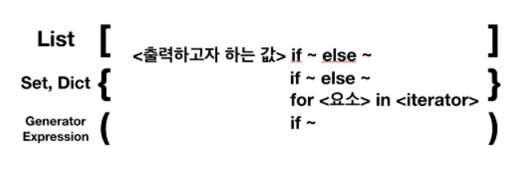

# 배열(Array)

- 대표적인 자료구조
  - 데이터를 나열하고, 각 데이터를 인덱스에 대응하도록 구성한 데이터 구조
  - 파이썬에서는 리스트 타입이 배열 기능을 제공

1. 배열이 필요한 이유

> - 같은 종류의 데이터를 효율적으로 관리
> - 같은 종류의 데이터를 순차적으로 저장
>
> 1. 배열의 장점
>
> - 빠른 접근 가능
>
> 2. 배열의 단점
>
> - 추가/삭제가 쉽지 않음
> - 미리 최대 길이를 지정해야함


## 파이썬 배열

- 리스트 list

1차원 배열

```
data = [1,2,3,4]
```

2차원 배열

```
data = [[1,2,3,4],[5,6,7,8]]
```


배열 접근 방법은 인덱스

```
print(data[0])
```

```
[1,2,3,4]
```


## 파이썬 리스트

1. 정의

   > 시퀸스 데이터 : 데이터의 순서가 정해진 것 ( 슬라이싱 가능!) [],'',()
   >
   > ex) list, string, tuple
   >
   > 시퀸스 데이터가 아닌 것 : 데이터 순서가 없다. {}
   >
   > ex) set,dict

2. 저장 특성

   - c++ 과 다르게 모든 자료형을 저장할 수 있다.
     - person =['james',17,175.2,True] 가능

3. 기능 : 요소 추가, 삭제, 정보 조회

   1. 요소 추가 

      >append(요소 하나) : 요소 하나 추가
      >
      >append(리스트) : 리스트 안에 리스트 추가
      >
      >extend(리스트) : 리스트를 연결하여 **확장**
      >
      >insert(인덱스,요소): **특정 인덱스**에 요소 추가 ( 요소에 리스트 가능)
      >
      >슬라이싱 
      >
      >```
      >a = [10,20,30]
      >a[1:1] = [500,600]
      >a
      >```
      >
      >```
      >[10,500,600,20,30]
      >```

   2. 요소 삭제

      > pop() : 마지막 요소 삭제
      >
      > pop(인덱스) : 특정 인덱스 요소 삭제
      >
      > remove(값) : 리스트에서 특정 값을 찾아서 삭제

   3. 특정 인덱스 구하기

      > index(값) : 리스트에서 특정 값의 인덱스 출력(같은 값이 여러 개일 때 처음 것 출력)

2. 이외 기능 ( 개수, 순서, 변경)
   1. 특정 값 개수 구하기

      > count(값) : 리스트에서 특정 값의 개수를 구함

   2. 순서 뒤집기

      > reverse() : 요소의 순서를 반대로 뒤집음

   3. 요소 정렬

      > sort() : 리스트의 요소를 작은 순서대로 정렬( 오름차순 )
      >
      > sort(reverse=True) : 내림차순
      >
      > sorted(리스트) : 오름차순 정렬( 새로운 리스트 반환)

   4. 리스트 요소 삭제

      > clear() : 리스트의 모든 요소 삭제 ( 빈 리스트 )
      >
      > del 리스트[:] : 리스트 모든 요소 삭제

   5. 리스트 값 변경

      > 슬라이싱
      >
      > ```
      > a =[10,20,30]
      > a[len(a):] = [500]
      > a
      > ```
      >
      > ```
      > [10,20,30,500]
      > ```
      >
      > 특이점 : 리스트 범위를 벗어난 인덱스 사용가능

   6. range 객체 변경

      > ```
      > a = range(10)
      > a
      > ```
      >
      > ```
      > range(0,10) => range 객체
      > ```
      >
      > 리스트로 변경
      >
      > ```
      > list(range(10))
      > ```
      >
      > ```
      > [0,1,2,3,4,5,6,7,8,9]
      > ```
      >
      > 

4. 유용한 기능

   1. List comprehension ( list, set, dict 가능 )

      > ```
      > a =[]
      > for i in range(10):
      > 	a.append(i)
      > a
      > ```
      >
      > ```
      > [0,1,2,3,4,5,6,7,8,9]
      > ```
      >
      > 위 아래 결과는 같다
      >
      > ```
      > a = [i for i in range(10)]
      > a
      > ```
      >
      > ```
      > [0,1,2,3,4,5,6,7,8,9]
      > ```
      >
      > 
      >
      > 조건문 사용 가능 ( 두개도 가능 if문 뒤에 덧붙이면 됨)
      >
      > ```
      > [i for i in range(10) if >5]
      > ```
      >
      > ```
      > [6,7,8,9]
      > ```
      >
      > else 조건문도 가능
      >
      > ```
      > ['True' if i>2 else 'False' for i in range(5)]
      > ```
      >
      > ```
      > ['False','False','False','True','True']
      > ```
      >
      > 
      >
      > for문 두 개도 가능 ( 앞에 for문이 나중 뒤에 for문이 처음)
      >
      > ```
      > [i+j for i in ['a','b'] for j in ['c','d']]
      > ```
      >
      > ```
      > ['ac','ad','bc','bd']
      > ```

5. Generator Expression

   1. 리스트 말고 ()를 사용하면 Generator Expression이 됨

      > ```
      > a = (i for i in range(5))
      > print(a)
      > ```
      >
      > ```
      > <generator object <genexpr> at 0x10b8ebd00>
      > ```
      >
      > 제너레이터 객체 출력
      >
      > ```
      > print(next(a))
      > ```
      >
      > ```
      > 0
      > ```
      >
      > ```
      > print(next(a))
      > ```
      >
      > ```
      > 1
      > ```
      >
      > next(제너레이터 객체) 형식으로 출력 가능
      >
      > 객체 내부에 모든 값이 빠져나오게 되면 Stop Iteration 오류 출력
      >
      > ```
      > print(next(a))
      > ```
      >
      > ```
      > Trackback (most recent call laset):
      > 	File "<stdin>", line 1, in <module>
      > StopIteration
      > ```

