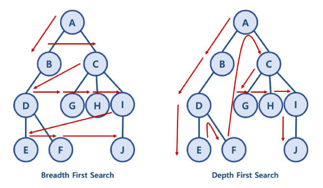
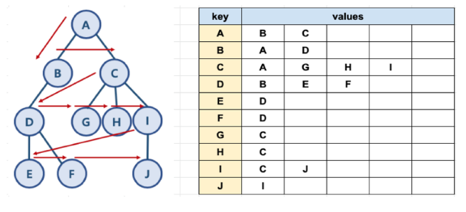
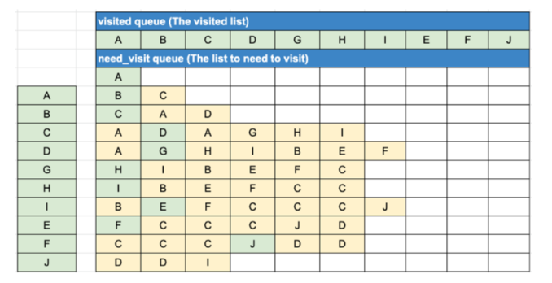

# 너비우선탐색 (Breadth First Search)

## 1. BFS와 DFS란?

- 대표적인 탐색 알고리즘
  - 너비 우선 탐색 (BFS) : 정점들과 같은 레벨에 있는 노드들을 먼저 탐색하는 방식
  - 깊이 우선 탐색 (DFS) : 정점의 자식들을 먼저 탐색하는 방식
- BFS와 DFS 방식 이해를 위한 예제
  - BFS 방식 :  A B C D G H I E F J
    - 한 단계씩 내려가면서, 해당 노드와 같은 레벨에 있는 노드들을 먼저 순회함
  - DFS 방식 : A B D E F C G H I J
    - 한 노드의 자식을 타고 끝까지 순회한 후, 다시 돌아와서 다른 형제들의 자식을 타고 내려가며 순회함



## 2. 파이썬으로 그래프를 표현하는 방법

- 파이썬에서 제공하는 딕셔너리와 리스트 자료구조를 활용하여 그래프를 표현할 수 있음

### 그래프 예 



### 파이썬 표현

```python
graph = dict()

graph['A'] = ['B','C']
graph['B'] = ['A','D']
graph['C'] = ['A','G','H','I']
graph['D'] = ['B','E','F']
graph['E'] = ['D']
graph['F'] = ['D']
graph['G'] = ['C']
graph['H'] = ['C']
graph['I'] = ['C','J']
graph['J'] = ['I']
```

## 3. BFS 알고리즘 구현

- 자료구조 큐를 활용함
  - need_visit 큐와 visited 큐, 두 개의 큐를 생성



- 큐의 구현은 간단히 파이썬 리스트를 활용

```python
data = [1,2,3]
data.extend([4,5])
data
```

```python
[1,2,3,4,5]
```


```python
def bfs(graph,start_node):
    visited = list()
    need_visited = list()
    need_visited.append(start_node)
    
    while need_visited:
        node = need_visited.pop(0)
        if node not in visited:
            visited.append(node)
            need_visited.extend(graph[node])
            
    return visited
```


```python
bfs(graph,'A')
```

```python
['A','B','C','D','G','H','I','E','F','J']
```


## 4. 시간 복잡도

- 일반적인 BFS 시간 복잡도
  - 노드 수 : V
  - 간선 수 : E
    - 위 코드에서 while need_visit 은 V + E 번 만큼 수행함
  - 시간 복잡도 :  O(  V + E )

```python
def bfs(graph,start_node):
    visited = list()
    need_visited = list()
    need_visited.append(start_node)
    count = 0
    while need_visited:
        count +=1
        node = need_visited.pop(0)
        if node not in visited:
            visited.append(node)
            need_visited.extend(graph[node])
    print(count)
    return visited
```


```python
bfs(graph,'A')
```

```python
19
```


## 5. 사용하는 경우

- 두 노드 사이의 최단 경로 
- 임의의 경로를 찾고 싶을 때
  - 지구상에 존재하는 모든 친구 관계를 그래프로 표현 후 Ash와 Vanessa 사이에 존재하는 경로를 찾는 경우
  - DFS : 모든 친구 관계를 다 살펴봐야 할지도 모른다.
  - BFS : Ash와 가까운 관계부터 탐색
- BFS가 DFS보다 좀 더 복잡하다.


## 6. 코딩할 때 BFS의 특징

- 직관적이지 않은 면이 있다.
  - BFS는 시작 노드에서 시작해서 거리에 따라 단계별로 탐색한다고 볼 수 있다.
- BFS는 **재귀적으로 동작하지 않는다**

- 이 알고리즘을 구현할 때 가장 큰 차이점
  - 그래프 탐색의 경우 **어떤 노드를 방문했었는지 여부를 반드시 검사해야 한다.**
  - 이를 어길 시 **무한루프에 빠질 수 있다.**
- BFS는 방문한 노드들을 차례로 저장한 후 꺼낼 수 있는 **자료구조인 큐를 사용한다.**
  - 즉, 선입선출(FIFO) 원칙
  - 일반적으로, 큐를 이용해서 반복적인 형태로 구현하는 것이 가장 잘 동작한다.

