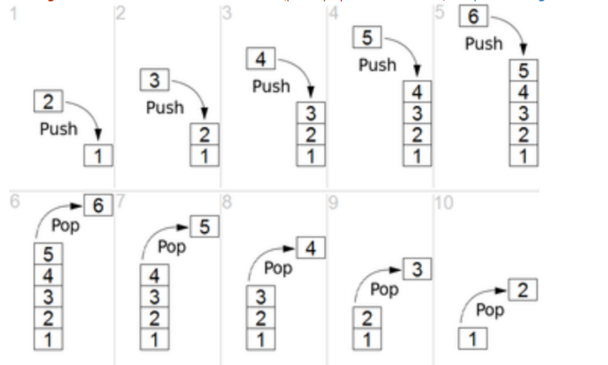

# 스택

>데이터를 제한적으로 접근할 수 있는 구조
>
>- 한쪽 끝에서만 자료를 넣거나 뺄 수 있는 구조
>
>가장 나중에 쌓은 데이터를 가장 먼저 빼낼 수 있는 데이터 구조
>
>- 큐 : FIFO
>
>- 스택 : LIFO

1. 스택 구조

- 스택은 LIFO 또는 FILO 데이터 관리 방식
  - LIFO : 마지막에 넣은 데이터를 가장 먼저 추출하는 데이터 관리 정책
  - FILO : 처음에 넣은 데이터를 가장 마지막에 추출하는 데이터 관리 정책

- 대표적인 스택의 활용
  - 컴퓨터 내부의 프로세스 구조의 함수 동작 방식
- 주요기능
  - push() : 데이터를 스택에 넣기
  - pop() : 데이터를 스택에서 꺼내기





3. 자료 구조 스택의 장단점

- 장점
  - 구조가 단순해서, 구현이 쉽다.
  - 데이터 저장/읽기 속도가 빠르다.
- 단점
  - 데이터 최대 갯수를 미리 정해야한다.
    - 파이썬의 경우 재귀함수는 1000번까지만 호출이 가능함
  - 저장 공간의 낭비가 발생할 수 있음
    - 미리 최대 갯수만큼 저장 공간을 확보해야함

> 스택은 단순하고 빠른 성능을 위해서 사용되므로, 보통 배열 구조를 활용해서 구현하는 것이 일반적임, 이 경우 위에서 열거한 단점이 있을 수 있음


- 파이썬에서 구현

```
data_stack = list()
data_stack.append(1)
data_stack.append(2)
```

```
data_stack
```

```
>> [1,2]
```

```
data_stack.pop()
```

```
2
```


- c에서 스택 구현

  > push() : 스택에 데이터 추가
  >
  > pop() : 스택에 데이터 삭제
  >
  > is_empty(s) : 스택이 공백 상태인지 검사
  >
  > is_full(s) : 스택이 포화상태인지 검사
  >
  > create() : 스택을 생성 
  >
  > peek(s) : 요소를 스택에서 삭제하지 않고 보기만 하는 연산
  - 1차원 배열 stack[]을 이용한다.
  - 스택에서 가장 최근에 입력되었던 자료를 가리키는 top 변수가 필요하다.
  - 가장 먼저 들어온 요소는 stack[0]에, 가장 최근에 들어온 요소는 stack[top]에 저장
  - 스택이 공백상태이면 top은 -1 이다.

- 일반 배열 스택 구현 ( 정적 )

  구조체 안에 필요한 모든 정보를 넣고 스택에 저장되는 요소의 타입은 element라고 가정한다.

  ```c
  #define MAX_STACK_SIZE 100
  typedef int element;
  
  // 스택의 요소 정의 : 스택에 저장되는 데이터를 구조체로 정의
  typedef struct {
      element data[MAX_STACK_SIZE];
      int top;
  }StackType;
  
  // 스택 초기화 함수
  void init_stack(StackType *s){
      s -> top = -1
  }
  
  // 공백 상태 검출 함수
  int is_empty(StackType *s){
      return (s->top == -1);
  }
  
  // 포화 상태 검출 함수
  int is_full(StackType *s){
      return ( s->top == ( MAX_STACK_SIZE -1 ));
  }
  
  // 삽입함수
  void push(StackType *s, element item){
      if (is_full){
          printf("스택 포화 에러\n");
          return;
      }
      else{
          s->data[++(s->top)] = item;
      }
  }
  
  //삭제함수
  element pop(StackType *s){
      if (is_empty(s)){
          printf("스택 공백 에러\n");
          return;
      }
      else{
          return s->Data[(s->top) --];
      }
  }
  
  //main함수 : 스택을 정적으로 생성하였고, 함수 호출 시 스택의 주소를 전달.
  int main(){
      StackType s;
      init_Stack(&s);
      push(&s,1);
      printf("%d\n",pop(&s));
  }
  ```


- 동적 배열 스택 구현

  ```c
  #incluede<stdlib.h>
  
  // 스택 요소 정의
  typeodef struct{
      element *data;
      int capacity;
      int top;
  }StackType;
  
  // 스택 초기화 함수 : 1개 요소를 저장할 수 있는 공간 확보
  void init_stack(StackType *s){
      s->top = -1;
      s->capacity = 1;
      s->data = (element)malloc(s->capacity*sizeof(element));
  }
  
  // 포화상태 검출 함수 : 공간 부족 시 메모리를 2배 확보
  int is_full(StackType *s){
      return (s-> top == s-> capacity);
  }
  
  // 삽입함수 
  void push(StackType *s,element item){
      if(is_full){
          s->capacity *=2;
          data = (element *)realloc(s->data,s->capacity * sizeof(element));
      }
      s ->data[++(s->top)] = item;
  }
  ```

  - malloc 함수 ( void* malloc(size_t size) ): 동적으로 메모리를 할당하는 함수 ( 힙 영역에 메모리를 할당 )

    함수 호출 시 할당하고자 하는 메모리의 크기를 바이트 단위로 전달하면 그 크기 만큼 메모리를 할당하게 된다. 그리고 할당한 메모리의 주소( 첫번째 바이트의 주소 )를 리턴한다. 메모리 할당에 실패하면 NULL이 리턴된다.

  - realloc 함수 ( void* realloc(void* memblock, size_t size) ) : 이미 할당된 공간의 크기를 바꾸는 함수 

    이미 할당된 포인터 변수를 memblock에 넣고 바꾸고 싶은 공간의 크기를 size에 입력하여 사용한다.

