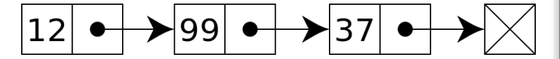

# 링크드 리스트 ( Linked List )

1. 링크드 리스트의 구조

   > - 연결리스트라고도 함
   > - 배열은 순차적으로 연결된 공간에 데이터를 나열하는 데이터 구조이지만 링크드 리스트는 떨어진 곳에 존재하는 데이터를 화살표로 연결해서 관리하는 데이터 구조
   > - 본래 C언어에서는 주요한 데이터 구조이지만, 파이썬은 리스트 타입이 링크드 리스트 기능을 모두 지원

- 링크드 리스트 기본 구조와 용어
  - 노드 (Node) : 데이터 저장 단위 ( 데이터 값, 포인터 ) 로 구성
  - 포인터 (pointer) : 각 노드 안에서, 다음이나 이전의 노드와의 연결 정보를 가지고 있는 공간
- 일반적인 링크드 리스트 형태




2. 간단한 링크드 리스트 

- Node 구현
  - 보통 파이썬 링크드 리스트 구현 시, 파이썬 클래스를 활용함

```
class Node(object):
    def __init__(self,data = None,next = None):
        self.data = data
        self.next = None
```

- 링크드 리스트 자료구조 기능 구현
  - 데이터 추가
  - 데이터 출력
  - 데이터 삭제

```
class Nodemgmt(object):
	def __init__(self,data):
		self.head = Node(data)
		
	def add(self,data):
		if self.head =='':
			self.head = Node(data)
		else:
			node = self.head
			while node.next:
				node = node.next
			node.next = Node(data)
	def desc(self):
		node = self.head
		while node:
			print(node.data)
			node = node.next
		
	def delete(self,data):
		if self.head == '':
			print('해당 값을 가진 노드가 없습니다.')
			return 
		if self.head.data == data:
			temp = self.head
			self.head = self.head.next
			del temp
		else:
			node = self.head
			while node.next:
				if node.next.data == data:
					temp = node.next
					node.next = node.next.next
					del temp
					return
				else:
					node = node.next
			
```


- 이중 연결 리스트
  - 양방향으로 연결되어 있어서 노드 탐색이 양쪽으로 모두 가능

```
class Node:
	def __init__(self,data,prev = None,next = None):
		self.data = data
		self.prev = prev
		self.next = next
		
class nodeMgmt:
	def __init__(self,data):
		self.head = Node(data)
		self.tail = self.head
		
	def insert(self,data):
		if self.head == None:
			self.head = Node(data)
			self.tail = self.head
		else:
			node = self.head
			while node.next:
				node = node.next
			new = Node(data)
			node.next = new
			new.prev = node
			self.tail = new
	def desc(self):
		node = self.head
		while node:
			print(node.data)
			node = node.next
			
	// del 만들어보기

```

