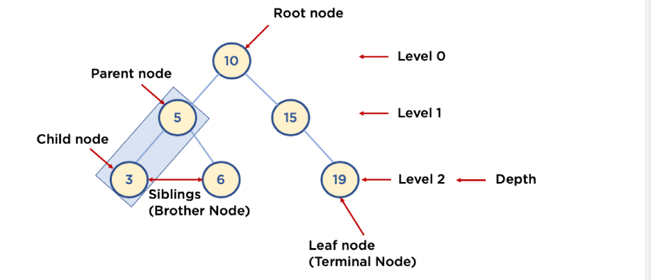
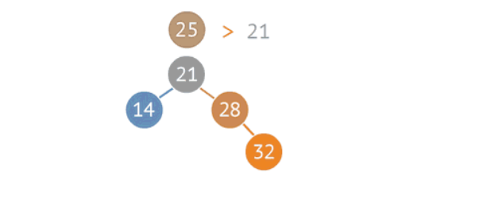
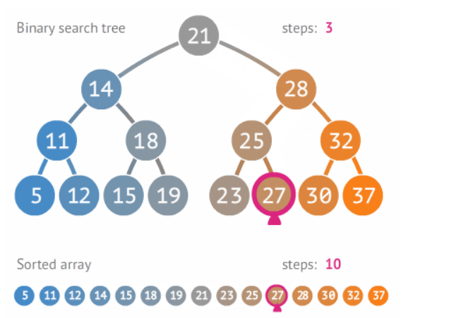
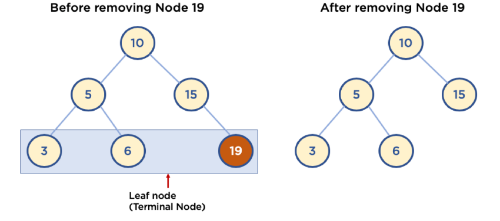
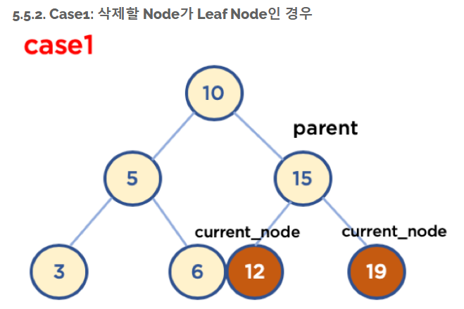
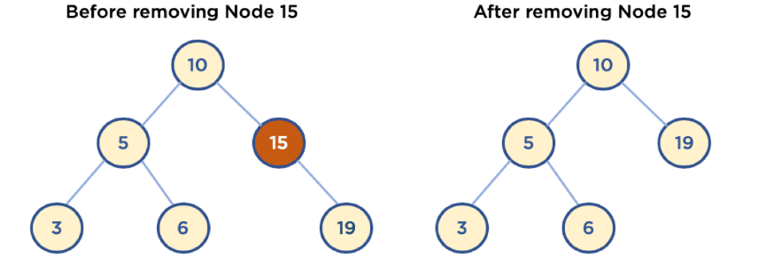
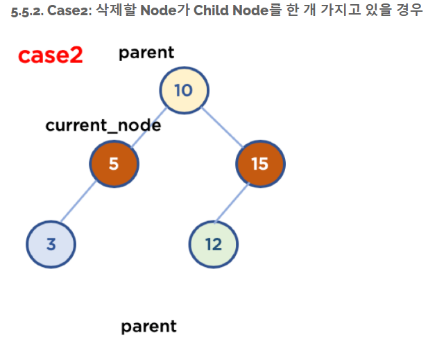
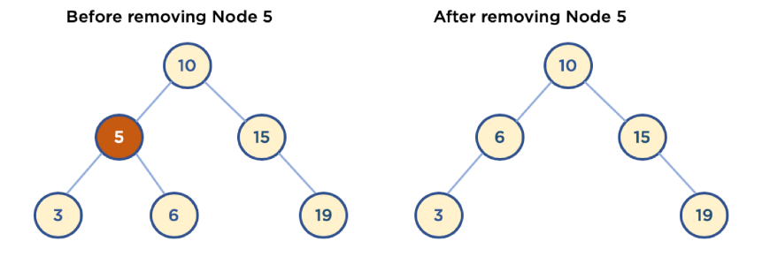
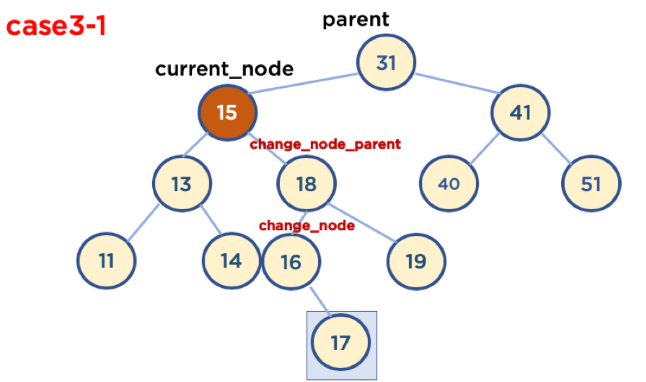
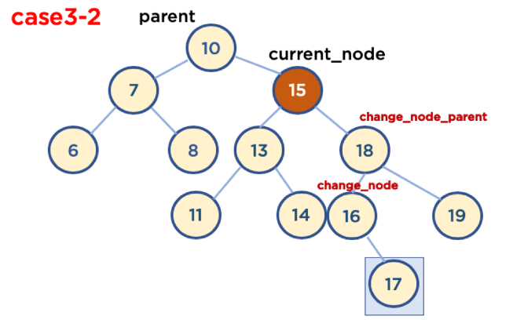

# 자료구조 트리(Tree)

1. 트리(tree) 구조

- 트리 : node와 branch를 이용해서, 사이클을 이루지 않도록 구성한 데이터 구조
- 트리 중 이진 트리(binary tree) 형태의 구조로 탐색(검색) 알고리즘 구현을 위해 많이 사용됨

2. 알아둘 용어

- node : 트리에서 데이터를 저장하는 기본 요소( 데이터와 다른 연결된 노드에 대한 branch 정보 포함)
- Root node : 트리 맨위에 있는 노드
- level : 최상위 노드를 level 0로 하였을 때, 하위 branch로 연결된 노드의 깊이를 나타냄
- parent node : 어떤 노드의 다음 레벨이 연결된 노드
- child node : 어떤 노드의 상위 레벨에 연결된 노드
- leaf node : child node가 하나도 없는 노드
- sibling : 동일한 parent node를 가진 노드
- depth : 트리에서 node가 가질 수 있는 최대 레벨




3. 이진 트리와 이진 탐색 트리

- 이진 트리 : 노드의 최대 브랜치가 2인 트리
- 이진 탐색 트리 : 이진 트리에 다음과 같은 추가적인 조건이 잇는 트리
  - 왼쪽 노드는 해당 노드보다 작은 값, 오른쪽 노드는 해당 노드보다 큰값을 가지고 있음




4. 자료 구조 이진 탐색 트리의 장점과 주요 용도

- 주요 용도 : 데이터 검색
- 장점 : 속도를 개선할 수 있음


4.  이진 트리와 정렬된 배열간 탐색 비교




5. 이진 탐색 트리 삭제

- 매우 복잡함 : 경우를 나누어서 이해하는 것이 좋음

  - leaf node 삭제

    - leaf node: child node가 없는 node
    - 삭제할 node의 parent node가 삭제할 node를 가리키지 않도록한다.

  - 

  - 
    - 현재 노드의 자식 노드가 없을 경우 =>>  부모 노드의 왼쪽 또는 오른쪽 삭제

    ```python
    if self.current_node.left == None and self.current_node.right == None:
    	if value < self.parent.value:
            self.parent.letf = None
        else:
            self.parent.right = None
    ```

    

  - child node 가 하나인 node 삭제

    - 삭제할 node의 parent node가 삭제할 node의 child node를 가리키도록 한다.

  

  

  - 현재 노드의 왼쪽 오른쪽 확인 후 부모 노드와 현재 노드의 자식노드를 이어준다

  

  

  ```python
  if self.current_node.left != None and self.current_node.right == None:
      if value < self.parent.value:
          self.parent.left = self.current_node.left
      else:
          self.parent.right = self.current_node.left
  elif self.current_node.left == None and self.current_node.right != None:
      if value < self.parent.value:
          self.parent.left = self.current_node.right
      else:
          self.parent.right = self.current_node.right
  ```

  

  - child node가 두 개인 node 삭제
  - 
  - **삭제할 노드가 부모노드 왼쪽에 있을 때**
    - 삭제할 node의 오른쪽 자식 중, 가장 작은 값을 삭제할 node의 parent node가 가리키도록 한다. => 이 방식
    - 삭제할 node의 왼쪽 자식 중 가장 큰값을 삭제할 node의 parent node가 가리키도록한다.
  - 
  - 작은 값 삭제 방식에는 두가지 방식으로 분류
    - 삭제할 노드가 부모노드의 왼쪽에 있고, 삭제할 노드의 오른쪽 자식 중 가장 작은 값을 가진 노드의 자식 노드가 없을 때
    - 삭제할 노드가 부모노드의 왼쪽에 있고, 삭제할 노드의 오른쪽 자식중 가장 작은 값을 가진 노드의 오른족에 자식 노드가 있을 때
  - 

  ```python
  if self.current_node.left != None and self.current_node.right != None:
  	if value < self.parent.value:
          self.change_node = self.current_node.right
          self.change_node_parent = self.current_node.right
          while self.change_node.left != None:
              self.change_node_parent = self.change_node
              self.change_node = self.change_node.left
          self.change_node_parent.left = None
          if self.change_node.right != None:
              self.change_node_parent.left = self.change_node.right
          else:
          	self.change_node_parent.left = None
          self.parent.left = self.change_node
          self.change_node.right = self.change_node_parent
          self.change_node.left = self.current_node.left
  ```

  - 삭제할 노드가 자식 노드를 두 개 가지고 있을 경우( 삭제할 노드가 부모노드 오른쪽에 있을 때)

    - 삭제할 노드의 오른쪽 자식 중, 가장 작은 값을 삭제할 노드의 부모 노드를 가르키도록 한다.
      - 삭제할 노드가 부모 노드의 왼쪽에 있고 삭제할 노드의 오른쪽 자식 중 가장 작은 값을 가진 노드의 자식 노드가 없을 때
      - 삭제할 노드가 부모 노드의 왼쪽에 있고, 삭제할 노드의 오른쪽 자식 중 가장 작은 값을 가진 노드의 오른쪽에 자식 노드가 있을 때

    

  ```python
  else : # self.current_node.left == None and self.current_node.right != None:
      if value < self.parent.value:
      self.change_node = self.curent_node.right
      self.change_node_parent = self.current_node.right
      while self.change_node.left != None:
          self.change_node_parent = self.change_node
          self.change_node = self.change_node.left
      self.change_node.right != None:
          self.change_node_parent.left = self.change_node.right
      else:
          self.change_node_parent.left = None
      self.parent.left = self.change_node
      self.change_node.right = self.change_node_parent
      self.change_node.left = self.current_node.left
      
  ```

  

  

