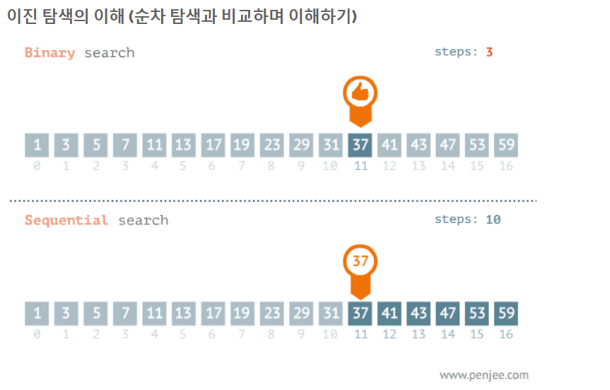
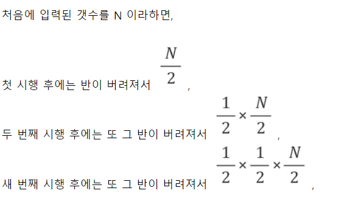
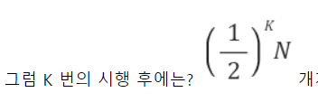
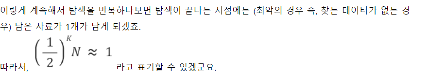
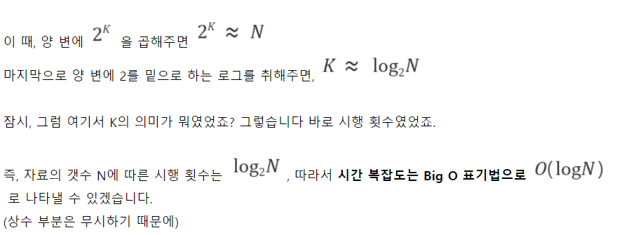

# 이진 탐색( Binary Search )

1. 이진 탐색이란?
   - 탐색할 자료를 둘로 나누어 해당 데이터가 있을 만한 곳을 탐색하는 방법

예시)

> 다음 1번부터 30번까지 병뚜껑에는 각각 1~ 100 사이의 번호가 표시되어있다. 이 중 70이 있을지 없을지를 확인하는 방법을 찾아보세요
>
> 조건:
>
> 1) 가장 적게 병을 따야한다
>
> 2) 각 병뚜껑에 씌여진 번호는 낮은 순으로 기입되어있다.



2. 분할 정복 알고리즘과 이진탐색
   - 분할 정복 알고리즘 
     - Divide : 문제를 하나 또는 둘 이상으로 나눈다.
     - Conquer : 나눠진 문제가 충분히 작고, 해결이 가능하다면, 해결하고그렇지 않다면 다시 나눈다.
   - 이진 탐색
     - Divide : 리스트를 두 개의 서브 리스트로 나눈다.
     - Conquer:
       - 검색할 숫자(search) > 중간값이면 뒷부분의 서브리스트에서 검색할 숫자를 찾는다.
       - 검색할 숫자(search) < 중간값이면 앞부분의 서브리스트에서 검색할 숫자를 찾는다.

3. 코드 구현 방식

   - 이진 탐색은 데이터가 정렬되어 있는 상태에서 진행
   - 데이터가 [ 2, 3, 8, 12, 20 ]
     - binary_search(data_list, find_data) 함수를 만들고
       - find_data : 찾는 숫자
       - data_list : 데이터 리스트
       - data_list의 중간 값을 find_data와 비교해서
         - find_data < data_list의 중간 값이라면 맨 앞부터 data_list의 중간까지 다시 find_data 찾기
         - find_data > data_list의 중간 값이라면 중간부터 data_list의 맨 끝까지 다시 find_data 찾기
         - 그렇지 않다면, data_list의 중간값은 find_data 인 경우로, return data_list 중간 위치

   ````python
   def binary_search(data,search):
       print(data)
       if len(data) == 1:
           if data[0] == search:
               return True
           else:
               return False
       if len(data) == 0:
           return False
       
       medium = len(data)//2
       
       if search == data[medium]:
           return True
       if search > data[medium]:
           return binary_search(data[medium:],search)
       else:
           return binary_search(data[:medium],search)
   ````

   

5. 알고리즘 분석

   - n개의 리스트를 매번 2로 나누어 1이 될 때까지 비교연산을 k회 진행

   







